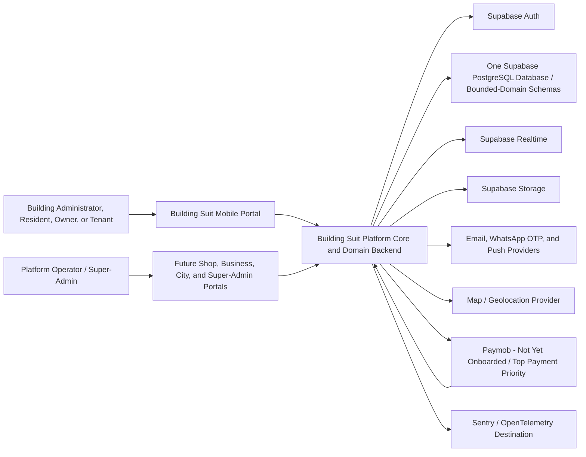
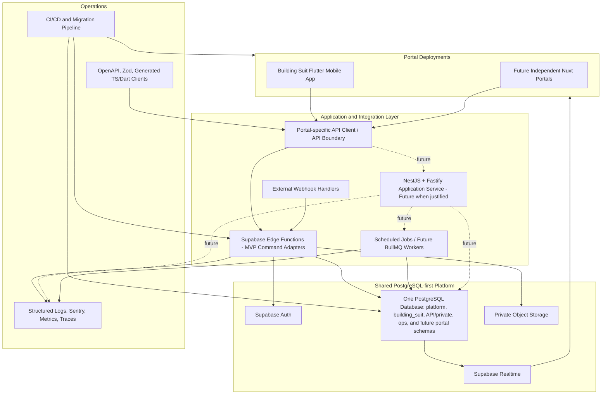
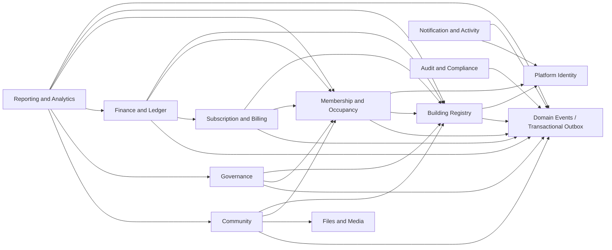
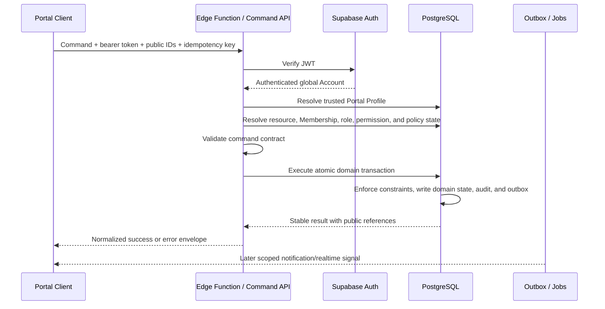
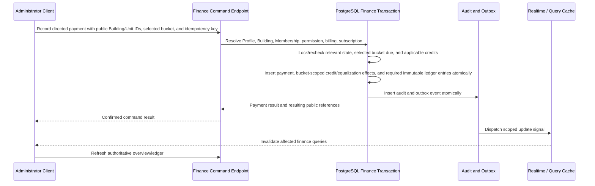
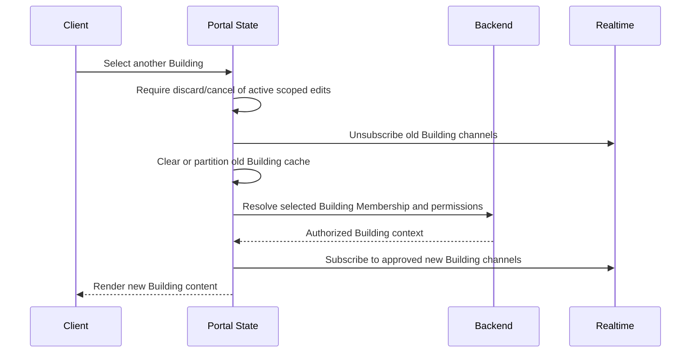
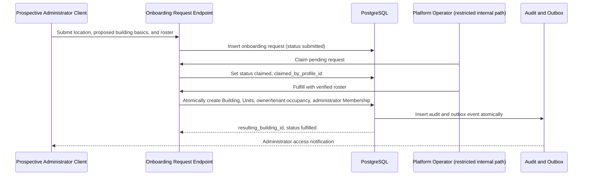

# Building Suit System Architecture Document

**Document type:** System Architecture Document  
**Product:** Building Suit platform  
**Status:** Implementation-ready draft for architecture approval  
**Prepared:** June 13, 2026  
**Primary audience:** AI implementation agents, Founder/CTO, engineering, product, security, operations, and future delivery teams  
**Authoritative product sources:** `01.BUILDING_SUIT_PRD.md`, `02.BUILDING_SUIT_BRD.md`, and `03. BUILDING_SUIT_UX_SPEC.md`
**Implementation mandate:** Build the production Building Suit mobile application in Flutter using this document and the authoritative product sources. Existing prototype applications are reference material only and are not architecture constraints.

---

## 1. Purpose and Scope

### 1.1 Purpose

This document defines how Building Suit must be structured and implemented. It translates the approved product, business, and UX behavior into system boundaries, deployment units, security controls, data-flow rules, integration patterns, and a build sequence.

The architecture is intended to support the Building Suit MVP and pilot while preserving the approved multi-portal platform direction. It deliberately favors a PostgreSQL-first modular architecture over premature microservices.

An implementation agent must treat this document as the technical source of truth. When implementation details are not specified, the agent must follow the architecture decisions and module boundaries defined here, then record any material new decision before implementation.

### 1.2 Architecture Outcome

Building Suit will operate as a **modular, multi-tenant application on a shared platform core**:

- A shared identity hub owns global Accounts, portal registration, and one Profile per Account per Portal.
- Building Suit is an independently deployable portal and product domain.
- A Building is the primary Building Suit tenant and subscription customer.
- PostgreSQL is the source of business truth.
- Supabase provides the MVP runtime for authentication, PostgreSQL, Edge Functions, Realtime, and Storage.
- Important writes execute through authorized command endpoints and atomic PostgreSQL functions or transactions.
- Row Level Security protects tenant-sensitive reads and acts as defense in depth.
- The ledger is the immutable financial source of truth.
- Realtime is an invalidation and freshness mechanism, not an authorization mechanism or source of truth.
- Future portals and the Super-Admin portal remain separately deployed applications with explicit authorization boundaries.

### 1.3 In Scope

This document covers:

- System context and trust boundaries
- Frontend, backend, database, and integration boundaries
- Logical modules and ownership
- Authentication and authorization architecture
- Critical command, query, realtime, and background-job flows
- Security, privacy, reliability, scalability, logging, and monitoring direction
- Environment and deployment direction
- Flutter application structure and implementation sequence

### 1.4 Deferred to Later Documents

This document establishes boundaries and mandatory rules but does not replace:

- The Database Design Document for complete entities, relationships, constraints, indexes, retention rules, and sensitive queries
- The API Contract Document for endpoint-by-endpoint schemas and error definitions
- The Security & Permissions Matrix for exhaustive role and resource permissions
- The Testing Strategy for the full test plan
- The Deployment & Operations Runbook for exact commands, rollback procedures, incident response, backup execution, and maintenance

### 1.5 Normative Language

- **Must** and **must not** are binding architecture requirements.
- **Should** indicates the default direction unless a documented decision approves an exception.
- **Future** describes an approved direction that is not required for the current MVP.
- **Open decision** identifies a dependency that must not be silently invented during implementation.

---

## 2. Architecture Drivers

### 2.1 Business and Product Drivers

| Driver | Architectural Consequence |
|---|---|
| Building financial transparency is the primary trust proposition. | Financial commands must be atomic, auditable, idempotent where retry is possible, and derived from an immutable ledger. |
| A Building is the operational and subscription tenant. | Every Building Suit domain request and record must be scoped to an authorized `building_id` where applicable. |
| A global Account may participate in multiple portals and buildings. | Global identity, portal Profile, building Membership, occupancy, and role must remain separate concepts. |
| The product is mobile-first and initially targets Egypt. | The client must support constrained networks, Arabic/English, RTL, Egyptian phone validation, and permanent external/manual payment behavior. |
| Building operations must survive administrator and resident changes. | Financial, governance, issue, announcement, occupancy, and audit history must be retained according to approved visibility rules. |
| Future portals are separate businesses. | Portal routes, product state, permissions, deployments, and domain models must remain isolated. |
| Manual payment remains permanent and Paymob is the top payment activation priority. | Gateway integration must be isolated behind backend-owned interfaces, start from merchant/KYC/contracting readiness, include both resident collection and SaaS subscription billing in the first Paymob release, and must not distort the manual ledger model. |
| The company is operated initially by a solo CTO. | The MVP must minimize operational complexity and avoid microservices until scaling evidence justifies them. |

### 2.2 Quality Attribute Priorities

The following order guides architecture tradeoffs:

1. **Financial and authorization correctness**
2. **Tenant isolation and privacy**
3. **Auditability and recoverability**
4. **Operational simplicity**
5. **User-perceived reliability on mobile networks**
6. **Performance and scalability**
7. **Extensibility for future portals and integrations**

### 2.3 Binding Product Constraints

- Building Suit uses the approved hub-and-spoke identity model.
- A global session does not grant portal-domain or building-domain access by itself.
- The trusted portal context is selected by deployment or server configuration, never by an arbitrary client-supplied portal code.
- The building is operationally active from creation.
- Missing billing configuration does not block join requests and does not control building activation; it blocks only finance operations that require a configuration.
- Blocked members may retain explicitly supported read access but cannot perform building writes.
- Building writes are allowed during trial and the 14-day `past_due` grace period, and rejected for `locked` or `cancelled` subscriptions. Read access remains available where policy permits.
- Financial, occupancy, governance, and required operational history must not be destructively deleted.
- Paymob browser redirects must never be treated as payment or withdrawal confirmation.
- Building Suit does not own resident or building funds. Each building's balance and withdrawal history must remain separately attributable, auditable, reconcilable, and backed by an independent ledger/audit trail regardless of whether Paymob ultimately provides per-building subaccounts/wallets or one platform account/wallet with internal per-building separation.
- The final Paymob funds-separation, payout-rail, and destination-saving model is capability-gated until onboarding, KYC, contracting, legal/compliance review, technical validation, and payout/reconciliation testing are complete.
- Cross-portal access and data sharing are denied by default.

---

## 3. Architecture Decisions

### 3.1 Decision Summary

| ID | Decision | Status | Rationale |
|---|---|---|---|
| ADR-001 | Use a hub-and-spoke platform with one global Account and one Profile per Portal. | Approved by PRD | Preserves shared identity without merging portal authorization or product domains. |
| ADR-002 | Treat Building as the primary Building Suit tenant and subscription boundary. | Approved by PRD/BRD | Finance, memberships, governance, communication, and subscription behavior are building-scoped. |
| ADR-003 | Use a modular monolith on Supabase/PostgreSQL for MVP and pilot. | Proposed for approval | Gives one transactional source of truth and low operational overhead while retaining clear module boundaries. |
| ADR-004 | Use PostgreSQL as the source of business truth and migrations as the authoritative schema history. | Approved by PRD | Prevents runtime-provider behavior from becoming undocumented business logic. |
| ADR-005 | Route important domain writes through backend command endpoints and atomic database operations. | Approved by PRD | Client writes and multi-request orchestration cannot safely enforce financial and authorization invariants. |
| ADR-006 | Allow direct PostgREST/table reads only where RLS, privacy, payload shape, and performance are explicitly approved. | Proposed for approval | Preserves Supabase efficiency without making table shape the permanent public API. |
| ADR-007 | Use RLS as defense in depth, not as the only authorization layer for privileged commands. | Approved by PRD | Command services using service-role access must still perform explicit authorization. |
| ADR-008 | Use an immutable ledger with compensating entries; prohibit destructive correction of financial history. | Approved by PRD/BRD | Required for trust, reconciliation, and auditability. |
| ADR-009 | Use a transactional outbox or equivalent durable event record for required post-commit side effects. | Proposed for approval | Notifications, audit propagation, and integrations must not be silently lost or roll back committed domain work unpredictably. |
| ADR-010 | Use Supabase Realtime only as an authorized update signal and cache invalidation mechanism. | Approved by PRD/UX | Realtime events may be delayed, duplicated, or disconnected and cannot replace authoritative reads. |
| ADR-011 | Maintain separate deployable applications for every portal. | Approved by PRD/BRD | Prevents route, authorization, bundle, and release-cycle contamination. |
| ADR-012 | Build the Building Suit mobile application in Flutter using Dart, Riverpod 3, go_router, Drift, Freezed, json_serializable, and supabase_flutter. | Approved by PRD | Establishes one production mobile architecture and prevents framework ambiguity. |
| ADR-013 | Introduce NestJS/Fastify, Redis, BullMQ, NATS, or additional services only when measured load or workflow needs justify them. | Approved direction in PRD | Avoids premature distributed-system complexity. |
| ADR-014 | Use versioned OpenAPI 3.1 contracts and generated TypeScript/Dart clients for stable public application APIs. | Approved by PRD | Prevents contract drift across mobile, web, Edge Functions, and future Node services. |
| ADR-015 | Use one PostgreSQL database per environment with physical schemas organized by bounded domain: `platform` for the shared core and one authoritative schema per portal, beginning with `building_suit`. | Approved during Database Design | Preserves cross-domain transactions and operational simplicity while making ownership, grants, migrations, and future extraction boundaries explicit. |
| ADR-016 | Develop all domain logic test-first (Test-Driven Development): a failing test is written before the implementation that satisfies it, applied to validation, authorization, balance/ledger, subscription gating, governance activation, and vote-result logic. | Proposed for approval | Makes the testing requirements (PRD §6.8, NFR-QA-01..07) a build discipline rather than after-the-fact coverage, protecting the financial and authorization invariants the platform depends on. Full cycle defined in the Testing Strategy and enforced via the §19.4 Definition of Done. |

### 3.2 Architecture Style

The MVP architecture is a **modular monolith with serverless command adapters**:

- Bounded domains use one PostgreSQL database per environment and are physically separated by owned schemas.
- `platform` owns shared global identity and portal registry data; `building_suit` owns Building Suit records; future portals own corresponding schemas such as `shop_suit`.
- Supabase Edge Functions serve as the initial command/API adapter layer.
- PostgreSQL functions and transactions enforce atomic invariants.
- Query endpoints, safe views, and approved PostgREST reads provide read access.
- Background jobs handle scheduled and retryable work.
- Domain events and an outbox decouple committed business actions from notifications, analytics, and external integrations.

This architecture does not approve independent portal or microservice databases for the MVP. A separate database requires a later architecture decision based on legal isolation, independent scaling, failure isolation, data residency, or independent product-operation needs.

---

## 4. System Context

### 4.1 Context Diagram



### 4.2 External Actors and Systems

| Actor or System | Responsibility | Trust Level |
|---|---|---|
| Building Suit user | Uses portal features under a resolved Account, Profile, Membership, and permission context. | Untrusted client input |
| Platform operator | Privileged operations through the full Super-Admin portal before pilot launch; temporary mini internal tooling may exist only during development. | Privileged but fully audited |
| Supabase Auth | Authenticates global Accounts and issues/verifies sessions. | Trusted identity provider |
| PostgreSQL | Stores authoritative application and audit data. | Highest-trust source of business truth |
| Supabase Realtime | Delivers change signals to authorized subscribers. | Trusted transport, non-authoritative delivery |
| Supabase Storage | Stores user-uploaded files under access policies. | Trusted storage; object access remains authorization-sensitive |
| Email/WhatsApp/push provider | Delivers verification, invitations, and notifications. | External provider; delivery is not guaranteed |
| Map/geolocation provider | Resolves or displays location information. | External provider; returned data must be validated |
| Paymob | Future payment and disbursement provider. No merchant account, contract, KYC, or integration exists yet. | External financial system; only verified server callbacks are trusted |
| Sentry/OpenTelemetry destination | Receives operational telemetry with PII redaction. | Privileged operational system |

### 4.3 Trust Boundaries

1. **Device boundary:** Mobile/web clients are untrusted. Client validation and route guards improve UX but do not authorize operations.
2. **Portal boundary:** A valid global session must be resolved into the trusted current Portal and its Profile before domain access.
3. **Building boundary:** Every building-scoped operation must validate Membership, status, role, permission, and resource ownership.
4. **Privileged backend boundary:** Service-role credentials exist only in backend runtimes. Any service-role operation must explicitly authorize the caller before access.
5. **Database boundary:** PostgreSQL constraints, RLS, transactions, and immutable history rules protect business truth.
6. **External integration boundary:** Webhooks, OTP delivery results, browser redirects, map data, and provider responses are untrusted until verified and reconciled.
7. **Operations boundary:** Production logs, dashboards, backups, and privileged tools require separate access and audit controls.

---

## 5. Target Container Architecture

### 5.1 Container Diagram



### 5.2 Container Responsibilities

| Container | MVP Responsibility | Approved Evolution |
|---|---|---|
| Building Suit client | Mobile-first Building Suit UX, local state, safe cache, routing, forms, and realtime invalidation. | Flutter app using Riverpod, go_router, Drift, generated clients, and portal-specific design components. |
| Future portal clients | Not active in MVP. | Separate Nuxt 4 deployments with portal-local routes, state, authorization context, and release pipelines. |
| Edge Functions | Authenticate, authorize, validate, execute commands/queries, call database functions, and normalize responses. | Remain for suitable serverless commands and webhooks or be incrementally fronted/replaced by Node services. |
| Future Node application service | Not required for MVP. | Host long-running workflows, richer application services, PostgREST orchestration, and integration-heavy commands when justified. |
| PostgreSQL | One database per environment containing bounded-domain schemas, authoritative domain state, constraints, RLS, transactions, audit records, outbox, read models, and scheduled database work. | Remains authoritative whether managed by Supabase or self-hosted; a domain is extracted only through a documented architecture decision. |
| Realtime | Deliver scoped change signals. | May evolve to additional WebSocket/Pub/Sub infrastructure only if scale requires it. |
| Storage | Store avatars and approved attachments/media. | S3-compatible private storage with signed access and lifecycle controls. |
| Background jobs | Generate recurring charges, close votes, transition subscriptions, dispatch side effects, and reconcile integrations. | Scheduled Edge Functions/database jobs initially; BullMQ/Redis later if needed. |
| Contract packages | Define API and event payloads. | OpenAPI 3.1, shared Zod where applicable, and generated Dart/TypeScript clients. |
| Observability platform | Capture operational errors and telemetry. | Sentry initially; OpenTelemetry and structured Pino-style logs as backend services expand. |

### 5.3 Deployment Units

The following are independent deployment units even when maintained in one monorepo:

- Building Suit mobile application
- Each future web portal
- Supabase Edge Functions
- Database migrations and approved database functions
- Future application API
- Future workers
- Shared contract packages

Database changes are shared infrastructure and must remain backward-compatible with active client and backend versions during rollout.

---

## 6. Logical Modules and Ownership

### 6.1 Module Boundary Rules

- Each module owns its business rules and authoritative tables or logical data set.
- Each portal bounded domain owns a physical PostgreSQL schema; modules inside a portal share that portal schema unless a later database design explicitly justifies further physical separation.
- Shared platform records live in `platform`; portal schemas may reference approved `platform` records, but `platform` must not depend on portal-owned tables.
- Cross-module reads should use stable query services, views, or documented database functions.
- Cross-module writes must use commands owned by the target module.
- A module must not update another module's records directly merely because the records share one database.
- Cross-portal table access is denied by default even when PostgreSQL could technically perform the join or write.
- Critical multi-module operations must execute through one orchestrated transaction or a documented saga with compensating behavior.
- Physical schema boundaries do not imply separate databases or network services.

### 6.2 Module Map

| Module | Owns | Exposes | Must Not Own |
|---|---|---|---|
| Platform Identity | Global users, portals, portal Profiles, Account status, portal profile resolution | Session-to-Profile resolution and portal-access checks | Building roles, unit occupancy, or domain permissions |
| Building Registry | Buildings, location reference, building status, duplicate-proximity decision, join code, company-assisted onboarding requests | Building creation, selection, configuration status, onboarding-request submission/claim/fulfillment | Resident authorization or financial truth |
| Membership and Occupancy | Memberships, invitations/join requests, roles, permissions, units, owner/tenant assignment, occupancy history | Membership authorization context, approval/replacement/removal operations, active-unit calculation | Subscription policy, ledger balances, or vote outcomes |
| Finance and Ledger | Ledger entries, charges, payments, expenses, Special Assessments, deferred equalization, owner obligations, bucket-scoped credits, withdrawal reservations/timelines, financial read models | Atomic finance commands, balances, ledger queries, financial adjustment commands, Special Assessment/equalization read models, per-building withdrawal transparency | Subscription sales policy, cross-building payer scoring, or gateway credentials |
| Subscription and Billing | Building billing configuration, trial policy, pricing policy, billing periods, subscription state, cancellation state, and price basis | Building write eligibility and subscription status | Building activation or governance availability |
| Governance | Ordinary votes/options with structured Money Vote financial authorization, replacement incumbent/self-nominated-challenger snapshots, eligibility, secret ballots, internal exact tallies, and member-safe publication | Vote/cycle lifecycle, financial-authorization lifecycle, final-choice enforcement, open participation-only projection, and result calculation | General Membership lifecycle except the atomic audited replacement handoff; actual Expense/ledger posting remains Finance-owned |
| Community | Issues, comments, announcements, reads, RSVPs, retained/archived state | Issue and announcement lifecycle | General notifications delivery or destructive history deletion |
| Notification and Activity | In-app notifications, delivery requests, localized message keys, activity feed references | Notification timeline and delivery dispatch | Authoritative domain state |
| Future Provider Directory | Future provider profile, category/service, discovery visibility, and location-sharing consent only if approved post-MVP | No active MVP interface | Booking, orders, provider payments, service guarantees, or active MVP provider workflows |
| Files and Media | File metadata, private objects, ownership, scan/moderation status, signed access | Upload authorization and authorized download | Domain authorization decisions |
| Audit and Compliance | Immutable audit events and privileged-action trail | Audit queries for authorized roles and operations | User-facing notification behavior |
| Reporting and Analytics | Derived adoption, activation, usage, and revenue metrics | Internal dashboards and approved reports | Transactional source of truth |

### 6.3 Dependency Direction



The arrows point from a module to a dependency it is allowed to use. Business modules publish through the domain-event/outbox contract rather than directly calling notifications, analytics, or external delivery. Notifications, audit, and reporting consume committed outcomes; they do not decide whether the primary command succeeds unless a required audit record is written as part of the same transaction.

### 6.4 Domain Event Direction

Representative committed events include:

- `building.created`
- `billing_configuration.activated`
- `membership.join_requested`
- `membership.approved`
- `membership.blocked`
- `occupancy.replaced`
- `resident.removed`
- `finance.charge_created`
- `finance.monthly_charges_generated`
- `finance.payment_recorded`
- `finance.expense_recorded`
- `finance.adjustment_posted`
- `finance.special_assessment_created`
- `finance.equalization_credit_created`
- `finance.equalization_credit_settled`
- `finance.owner_obligation_reviewed`
- `finance.owner_obligation_acknowledged`
- `finance.owner_obligation_disputed`
- `subscription.status_changed`
- `vote.opened`
- `vote.cast`
- `vote.closed`
- `administrator.replaced`
- `issue.created`
- `issue.approved`
- `announcement.published`

Event schemas must be versioned. Events carry public references and safe metadata, not unrestricted table snapshots or secrets.

---

## 7. Frontend Architecture

### 7.1 Client Strategy

The production Building Suit client is a Flutter mobile application. The Flutter application must implement the approved UX specification while keeping business truth and authorization on the backend.

Mandatory client technology:

- Flutter and Dart
- Riverpod 3 for dependency injection, application state, and server-state orchestration
- go_router for declarative navigation and route guards
- Drift for durable scoped local cache
- Freezed and json_serializable for immutable models and serialization
- supabase_flutter behind infrastructure adapters
- local_auth for operating-system fingerprint prompts and flutter_secure_storage for device-protected session material
- Material 3 with shared Building Suit design tokens and components
- Flutter flavors for development, staging, and production

### 7.2 Flutter Layer Structure

```text
presentation
  -> screens, widgets, navigation, form state
application
  -> Riverpod providers, use cases, command/query orchestration
domain
  -> entities, value objects, policies, repository interfaces
infrastructure
  -> generated API clients, Supabase adapters, Drift cache, realtime adapter
```

Mandatory rules:

- Widgets must not issue Supabase table queries directly.
- Widgets depend on Riverpod providers and presentation controllers, not repositories or remote clients directly.
- Application use cases coordinate commands and queries without containing UI or provider-specific code.
- Domain entities and policies must not import Flutter, Supabase, Drift, or transport packages.
- API and Supabase-specific behavior must remain behind repository or remote-data-source boundaries.
- Drift stores only authorized, scoped, non-secret cached data.
- Query/cache keys include Portal and Building scope where applicable.
- Switching Buildings clears or partitions prior Building data before rendering the new context.
- Sensitive session material uses platform-secure storage.
- Fingerprint sign-in is a device-local opt-in that may unlock protected session material only after a prior successful password or Google login. Biometric templates never enter application storage, logs, analytics, the database, or API payloads.
- Disabling fingerprint sign-in, explicit logout, invalidated device biometrics, or secure-storage invalidation removes the local biometric unlock path and returns the user to normal password or Google authentication.

### 7.3 Flutter Feature Modules

The Flutter application must use feature-first modules with shared platform foundations:

```text
lib/
  app/
    bootstrap/
    routing/
    theme/
    localization/
  core/
    auth/
    contracts/
    errors/
    networking/
    persistence/
    realtime/
    observability/
    widgets/
  features/
    authentication/
    buildings/
    memberships/
    home/
    finance/
    community/
    governance/
    notifications/
    services/
    profile/
```

Each feature should contain only the layers it needs:

```text
feature/
  presentation/
  application/
  domain/
  infrastructure/
```

Cross-feature imports must go through public feature interfaces or shared `core` contracts. A feature must not import another feature's private infrastructure or presentation code.

### 7.4 Portal and Building Context

The client context is resolved in this order:

```text
global session
  -> trusted current Portal
  -> current Portal Profile
  -> accessible Building memberships
  -> active Building or restricted exploration context
  -> Membership status, role, permissions, and unit relationships
```

No protected Building content may render before the active context is resolved. A client-side context is a convenience and must be revalidated by every protected backend operation.

### 7.5 Navigation and Guards

Client route guards must:

1. Validate or refresh the session.
2. Resolve the current Portal Profile.
3. Resolve the active Building for Building-scoped routes.
4. Remove or redirect inaccessible routes.
5. Hide actions known to be unavailable.

The Empty State / Welcome route is resolved before a no-building user enters the restricted exploration shell. Building selection is not a standalone route; it is contained in the authenticated side menu. Explore mode grants no Building-scoped authorization and therefore cannot satisfy an active-Building guard.

Server authorization remains authoritative. A hidden button or route guard is not a security control.

### 7.6 Client State Categories

| State | Owner | Persistence |
|---|---|---|
| Authentication session | Shared auth adapter | Secure platform storage according to provider rules |
| Portal Profile | Portal-local state | Refreshable local cache |
| Active Building | Building Suit application state | Persist public identifier only; revalidate on startup |
| Permissions and Membership | Portal-local authorization state | Short-lived cache; revalidate on mutations and context changes |
| Server query data | Feature query cache | Scoped by Portal, Building, feature, resource, and filters |
| Form/wizard state | Local feature state | In-memory unless an approved durable-draft requirement is added |
| Realtime connection state | Portal-local realtime service | Not durable |

### 7.7 Offline and Weak-Network Behavior

- Reads may show clearly marked cached data when safe and authorized.
- Finance, membership, voting, and other sensitive writes are online-only unless a future offline-command design is explicitly approved.
- A timeout after mutation submission creates an **uncertain result**, not a failure or success assumption.
- The client must reconcile the command result before allowing a duplicate retry.
- Realtime disconnects must not block authoritative refresh or command execution.

### 7.8 Localization and Accessibility

- All user-facing content supports English and Arabic.
- The database stores no hardcoded user-facing text. Stored user-facing strings are stable chained i18n keys plus parameters, resolved to a language by the client (Database Design §6.7).
- All backend-originated user-facing text — notifications, command success results, and error responses — carries a stable chained message key and parameters, not a localized sentence. The client resolves the key through its i18n catalog.
- Arabic enables RTL without changing domain behavior.
- Dates, numbers, currency, and phone formats use explicit locale-aware formatters.
- Missing translation keys fall back safely on the client and never block content from rendering.
- Accessibility targets remain an open decision and must be defined before claiming conformance.

### 7.9 Flutter Implementation Rules

- Use immutable state and explicit loading, success, empty, error, conflict, and uncertain-result states.
- Map transport and domain errors into stable presentation failures; widgets must not parse raw backend messages.
- Use generated API models at the infrastructure boundary and map them into domain models.
- Use repository interfaces per domain capability rather than one global data service.
- Realtime handlers invalidate or patch scoped Riverpod state and must never mutate unrelated feature state.
- Dispose Building-scoped providers and realtime subscriptions when the active Building changes.
- Do not queue sensitive writes offline.
- Store cached rows with Portal and Building scope and purge inaccessible data after Membership loss.
- Unit, widget, integration, and golden tests must follow the Testing Strategy when defined.

---

## 8. Backend and API Architecture

### 8.1 Command and Query Separation

The architecture distinguishes commands from queries without requiring separate services:

| Type | Purpose | Approved Execution Path |
|---|---|---|
| Command | Changes business state or invokes an external side effect | Portal API client -> Edge Function or future Node command endpoint -> authorization -> validation -> atomic PostgreSQL function/transaction -> audit/outbox |
| Query | Returns authorized state without changing business truth | Portal API client -> query Edge Function, approved view/RPC, or explicitly approved PostgREST read protected by RLS |
| Webhook | Accepts an external system event | Dedicated public endpoint -> signature verification -> idempotency/reconciliation -> atomic transaction |
| Job | Performs scheduled or retryable work | Scheduler/worker -> claimed job -> idempotent command or database function -> telemetry |

### 8.2 Protected Command Flow



### 8.3 Mandatory Command Properties

Important commands must:

- Accept public identifiers at external boundaries.
- Resolve internal identifiers server-side.
- Validate the trusted Portal and current Profile.
- Validate Building membership, status, role, permission, and resource scope.
- Recheck current subscription/billing/occupancy/governance state within the transaction.
- Be atomic where multiple records or balances change.
- Require an idempotency key where duplicate submission, callbacks, or retries are plausible.
- Write the required audit record in the same transaction for high-risk actions.
- Return stable error codes and safe details.
- Never return raw SQL, stack traces, or internal exception details.

### 8.4 Query Architecture

Queries must:

- Enforce RLS or perform equivalent explicit server authorization.
- Return role-appropriate and occupancy-period-appropriate fields.
- Return due-bucket/scope-aware finance fields so Monthly / Occupancy Dues, Owner Obligations / Special Assessments, and Disputed / Under Review are never collapsed into one ambiguous payable number.
- Use bounded results and cursor pagination for large lists.
- Avoid exposing internal IDs or unrestricted joined records.
- Use dedicated read models or views for complex finance, activity, and dashboard queries.
- Set private/no-store cache controls for protected responses unless a safe private caching policy is explicitly defined.

### 8.5 API Contract Direction

The API Contract Document must define:

- Versioned routes and methods
- Request, query, path, response, event, and webhook schemas
- Standard success and error envelopes
- Stable error codes and safe field details
- Stable chained message keys for success and error results, resolved client-side via i18n
- Enumeration value contracts: each status/type/kind/method/scope value maps a stable code to a typed name shared with clients (§8.9); the wire never relies on free-form text
- Pagination, filtering, sorting, and rate limits
- Idempotency semantics
- Authentication and authorization requirements
- Deprecation and compatibility policy

The target response envelope remains:

```json
{
  "success": true,
  "data": {}
}
```

or:

```json
{
  "success": false,
  "error": {
    "code": "stable_error_code",
    "message_key": "error.stable_error_code",
    "params": {},
    "message": "Safe English fallback summary",
    "details": {}
  }
}
```

### 8.6 Atomicity and Transactions

Critical operations must move from application-orchestrated multi-insert behavior to PostgreSQL functions or application-service transactions. This includes:

- Building creation with units/administrator/subscription/optional occupancy
- Occupant approval and explicit replacement
- Resident removal with final-admin protection, occupancy ending, warning/audit of old occupancy-period credit or debt, and no automatic settlement posting
- Charge, directed payment, wallet-method payment, Occupancy Credit, Owner Obligation Credit, Equalization Credit, Unit Settlement Expense, Past Resident Payment / Late Settlement, expense, adjustment, refund, chargeback, and reversal posting
- Monthly charge auto-generation and Admin manual generation/retry with duplicate prevention and active-occupancy eligibility
- Special Assessment draft/vote linkage and approved activation, original-funder snapshot, deferred owner-responsibility obligations, delayed payment equalization, Equalization Credit settlement/payout, old owner obligation review, Owner acknowledgment, and dispute state changes
- Withdrawal hold and callback settlement
- Ordinary vote close and dedicated Admin-replacement close/atomic transfer
- Subscription status transitions that affect finance eligibility

Deleting a newly created ledger entry after a later insert fails is not an acceptable production transaction model.

### 8.7 Durable Side Effects

Notifications and external delivery are side effects of committed business actions. Required behavior:

1. The domain transaction writes the authoritative result.
2. The same transaction writes the required audit record and an outbox event.
3. A dispatcher claims outbox events safely.
4. Delivery attempts are retried with backoff.
5. Permanent failures are visible in a dead-letter or failed-delivery view.
6. Duplicate dispatch remains safe.

User-facing in-app notifications may be derived from the outbox. Domain command success must not depend on a third-party delivery provider being available.

### 8.8 Background Jobs

MVP scheduled work includes:

- Monthly recurring charge generation at month start, plus duplicate-safe Admin manual generation/retry
- Special Assessment deferred-equalization distribution after delayed obligation payment
- Vote expiry and automatic close
- Ordinary vote-request review deadline detection and reminder scheduling
- Subscription trial/grace/lock transitions
- Notification/outbox delivery
- Future Paymob reconciliation
- Cleanup of approved temporary files or expired invitation artifacts

Jobs must be idempotent, observable, retry-safe, and protected against concurrent duplicate execution.

### 8.9 Shared Enumeration and Type Contracts

Domain enumerations (status, type, kind, method, direction, scope) are not native database enums and are not free-form strings duplicated across layers. They have one source of truth in backend code and are shared with clients through a typed contract:

- The database stores the value as a stable integer-like code (Database Design §6.6).
- Backend code defines the canonical mapping of code → stable name → i18n label key → allowed transitions.
- That definition is published to clients as a typed TypeScript contract (a generated or hand-maintained `shared` package of `enum`/`as const` objects and types). Both server and client import the same names; neither side hardcodes magic numbers or duplicate string literals.
- The API Contract fixes whether each enumeration is serialized on the wire as its integer code or its stable string name; either way both sides resolve it through the shared contract.
- Adding a value is an additive, backward-compatible change. Codes are never reused or renumbered.

The same single-source-of-truth approach applies to request/response model types so the wire schema, server validation, and Flutter/Nuxt generated client models stay aligned.

---

## 9. Data Architecture Boundaries

### 9.1 Database Strategy

Each environment uses one PostgreSQL database. Physical schemas define bounded-domain ownership:

| Schema family | Ownership and purpose |
|---|---|
| `platform` | Shared global Accounts, portal registry, Portal Profiles, and shared authorization reference data |
| `building_suit` | All authoritative Building Suit records, including building operations, finance, governance, community, and portal notifications. Provider tables are not active MVP scope. |
| Future portal schemas | One authoritative schema per implemented portal, such as `shop_suit`, `business_suit`, `city_suit`, or `super_admin` |
| `*_api` | Explicitly exposed security-invoker views and approved RPCs for the owning bounded domain |
| `*_private` | Unexposed privileged helpers and internal functions for the owning bounded domain |
| `ops` | Unexposed cross-platform idempotency, outbox, jobs, delivery attempts, reconciliation, and operational audit data |
| `public` | Temporary compatibility objects only; not the permanent owner of new authoritative records |

Schema boundaries make ownership, privileges, migrations, and future extraction clearer, but they are not authorization boundaries by themselves. Every protected operation still requires explicit grants, RLS where exposed, trusted portal resolution, and tenant authorization.

Portal schemas may reference approved `platform` records through foreign keys. Direct cross-portal foreign keys, reads, or writes are prohibited unless an approved integration contract explicitly owns the relationship. Shared-core tables must not reference portal-domain tables.

The current implementation remains largely in `public`; migration to the target schemas must use an expand-and-contract compatibility plan.

### 9.2 Data Classification

| Classification | Examples | Required Handling |
|---|---|---|
| Public or discoverable | Future provider title/shared phone/city/category only if provider scope is approved post-MVP | Expose only through approved future directory rules |
| Portal-private | Portal Profile, preferences | Require current Portal Profile authorization |
| Building-private | Members, units, issues, announcements, votes | Require authorized Building context |
| Unit-sensitive | Occupancy history, unit financial history | Restrict by role and occupancy period |
| Financial-sensitive | Ledger, payments, wallet transactions, subscription records | Strong authorization, immutable history, audit, reconciliation |
| Identity-sensitive | Email, phone, auth metadata | Minimize exposure and use only for approved purposes |
| Location-sensitive | Building coordinates/address and future provider coordinates/address if provider scope is approved post-MVP | Expose only under approved rules and explicit consent where required |
| Operational-secret | Service-role keys, webhook secrets, signing keys | Server-side secret storage only |

### 9.3 Source-of-Truth Rules

- PostgreSQL domain records are authoritative.
- Ledger entries are authoritative for balances.
- Cached balance/statistics tables and views are derived read models and must be rebuildable.
- Realtime payloads are change signals and are not authoritative records.
- Client cache is never authoritative.
- External gateway status is not authoritative until verified and reconciled into internal state.

### 9.4 Identifiers

- Public APIs and clients use UUID public identifiers.
- Internal numeric identifiers may be used within PostgreSQL for efficient relationships.
- Clients must not rely on internal numeric identifiers.
- Correlation IDs, idempotency keys, external gateway references, and event IDs are distinct identifiers with separate purposes.

### 9.5 Retention and Deletion

- Ledger, required audit, occupancy, governance result, and required operational history are retained and corrected through compensating or ended-state records.
- Soft deletion or archival must not be presented as destructive deletion.
- Account deletion, file retention, notification retention, consent withdrawal, legal-hold behavior, and any future provider deletion behavior remain open decisions for the Database Design and legal review.
- Cascading deletes that can remove retained history must be removed or constrained before production data is accepted.

### 9.6 Storage Architecture

- Production community media and private user files must use private buckets.
- Access must use short-lived signed URLs or authenticated object requests.
- Upload authorization must validate Portal, Building, feature, ownership, file type, and file size.
- File metadata must record ownership, domain reference, content type, size, and lifecycle state.
- Exact building location, future provider location, and sensitive media must never be placed in a public object path.
- Malware scanning and moderation are future controls that must be assessed before broad public uploads.

### 9.7 Read Models and Reporting

Dashboard, finance overview, active-unit, and internal business metrics should use dedicated views or derived read models rather than repeated unrestricted joins from clients. Derived models must:

- Be scoped by Building and Portal
- Be rebuildable from authoritative records
- Record refresh/update time where staleness matters
- Reconcile against source-of-truth calculations

The canonical active-unit read model counts each non-deleted Unit once when it has at least one current approved active owner or tenant membership. Vacant Units and Units with only blocked, pending, rejected, or ended memberships do not count. This model is shared by governance, adoption reporting, and post-trial subscription billing. Each invoice uses a transactionally consistent active-unit snapshot with the EGP 200 minimum; `total_units` remains physical-building/governance context, not the price multiplier.

Pricing-policy changes are Super-Admin controlled and audited. When a pricing policy applies to existing buildings, the architecture must produce recipient-scoped in-app notice records and external-notice delivery evidence for every affected active Building Suit profile through the company-configured external delivery channel(s), without making Admin-only notice sufficient.

Leadership reporting is owned by Finance / Revenue Operations and Product Leadership. Approved Platform Operators may consume it through temporary restricted internal tooling during development, but the full separate Super-Admin portal is required before pilot launch. The reporting path is read-only for Building Suit domain state and audited.

---

## 10. Authentication and Authorization

### 10.1 Identity Model

```text
Supabase auth.users
  -> public application user
  -> Profile for trusted current Portal
  -> Building Membership
  -> role and permissions
  -> optional unit occupancy and operation-specific eligibility
```

Terms:

- **Account:** global authenticated identity.
- **Profile:** Account identity within one Portal.
- **Membership:** Profile participation in one Building with role and status.
- **Occupancy:** owner or tenant relationship to a Unit.
- **Permission:** capability assigned through a role or future explicit grant.

These concepts must not be collapsed.

### 10.2 Authentication

- Supabase Auth is the MVP identity provider.
- Egyptian-phone/password, Google authentication, optional profile email verification, and WhatsApp phone verification are approved MVP scope and must follow the PRD/UX behavior. Email/password login is not part of this checkpoint.
- Registration always requires a valid unique Egyptian phone and always shows optional email beside it; no credential-method selector exists. Phone verification is mandatory. Missing or unverified email never blocks core product access and is verified only before email-dependent notifications or messages. Email recovery is not part of this checkpoint.
- Every Google callback routes through the Google-only One Last Step screen to complete any outstanding required phone verification, Profile fields, and terms acceptance.
- Fingerprint sign-in is unavailable on first login and can be enabled or disabled only by an authenticated user in Security settings after a successful password or Google login. The operating system performs biometric verification; the server continues to validate the resulting session normally.
- Egyptian phone numbers are normalized to canonical `+20` format and uniquely resolved by a backend adapter; clients must not implement identity lookup independently.
- A stable application-owned user bridge isolates domain records from the identity provider.
- Refresh tokens and session material must be stored using platform-appropriate secure storage.
- Sensitive account changes should require recent authentication once the policy is approved.
- Authentication rate limits and bot controls must be configured for production.

### 10.3 Portal Resolution

- Every backend deployment or endpoint is configured with its trusted Portal context.
- A client-supplied `portal_id` or `portal_code` must not select authorization context.
- Cross-portal navigation is a handoff to another portal deployment, followed by new Profile resolution.
- Shared identity does not imply shared domain access.

### 10.4 Building Authorization

Every building-scoped command evaluates:

```text
authenticated Account
AND active current Portal Profile
AND resource belongs to requested Building
AND active Membership for writes
AND role has required permission
AND operation-specific policy passes
AND subscription/billing state passes where applicable
```

Blocked Membership may satisfy only explicitly approved read paths.

### 10.5 Operation-Specific Eligibility

Role permission alone is insufficient for:

- Voting, which also requires eligible Unit representation and tenant priority
- Past-resident financial history, which is limited to the occupancy period
- Future provider exact-location disclosure, if provider scope is approved post-MVP, which requires explicit consent
- Building writes, which require permitted subscription state; configuration-dependent finance writes also require active billing setup
- Final-administrator removal, which requires a valid replacement
- Admin-replacement outcomes, whose API-100 normal-result path enforces 50% normal quorum, the fixed deadline, majority, tie/no-quorum continuity, and atomic Admin transfer only when its challenger-majority result wins; API-101 withdrawal and trusted challenger-ineligibility invalidation remain separate terminal exceptions with no winner or Admin transfer

### 10.5.1 Permission Catalogue Source

- The approved Building Suit permission catalogue and role mappings are enumerated in PRD Section 3.4.1 and deployed by `supabase/seed.sql`.
- `admin` receives all Building Suit permissions; `resident` receives the approved limited set. Owner and tenant are occupancy roles and use resident authorization unless a separately approved mapping is introduced.
- Permission codes are API/security contracts. Changes require coordinated PRD, security-matrix, seed, migration, and authorization-test updates.
- Membership status and operation-specific policy remain mandatory even when the role contains the permission.

### 10.6 Service-Role Controls

The service-role key bypasses RLS and therefore must:

- Exist only in backend secret storage
- Never be sent to any client or log
- Be used only after explicit authentication and authorization
- Access only the minimum records needed for the command
- Produce required audit and correlation data
- Be separated from public webhook verification secrets

### 10.7 Super-Admin Boundary

The Super-Admin portal:

- Is a separate deployment and Portal Profile type required before pilot launch
- Must not be mounted in Building Suit
- Requires stronger authentication and privileged access review
- Must not use ordinary Building Membership roles as substitutes
- Must audit every privileged read and write where required
- Should use just-in-time or narrowly scoped operator permissions rather than unrestricted permanent access
- Is the permanent interactive home for internal leadership reporting, onboarding requests, user management, subscription management, support operations, platform-controlled configuration, trial policy configuration, pricing policy configuration, withdrawal-risk configuration, withdrawal-limit policy configuration, and withdrawal operational review.
- Owns the global ordinary vote-request review-duration setting and two separate versioned financial-governance aggregates: Money Vote tolerance/validity constraints that apply prospectively to newly created/opened Votes across all Buildings, and no-vote-limit default/maximum policy whose normal applicability is new Buildings only and whose explicit exceptional propagation excludes locally protected Buildings. Their records, routes, snapshots, and applicability modes cannot be mixed. Checkpoint-10 propagation is a future-dated per-Building schedule with full-member notice and no Building-role mutation authority.
- Owns the restricted operational configuration surface for global daily-limit enabled/disabled state, global daily-limit amount, withdrawal step-up threshold, pending-to-review duration, size/category policies, and building-specific overrides; Building Admins and Residents must never access this as a configuration or override surface.
- Owns the operational review queue for withdrawals that move to `Requires Review`; Platform Operators / Super-Admins may record `Confirmed`, `Failed`, or `Reversed` as primary state changes only with Paymob reference or documented reconciliation evidence. `Still Pending` is a review outcome event only: primary status remains `Requires Review`, reservations remain held, and no final outflow is posted.
- May be preceded by a temporary mini internal queue/reporting UI during development only; that mini UI is not sufficient for pilot operations.

---

## 11. Critical System Flows

### 11.1 Financial Write



### 11.2 Building Context Switch



### 11.3A Future Paymob Resident Payment Settlement

```mermaid
sequenceDiagram
    participant Resident as Resident Client
    participant API as Payment Command
    participant DB as PostgreSQL
    participant Paymob as Paymob
    participant Hook as Verified Callback Endpoint

    Resident->>API: Start Paymob payment
    API->>DB: Create payment attempt from trusted due/overpayment amount and fee data
    API-->>Resident: Redirect/payment key with due, fee, and total charged
    Paymob->>Hook: Signed server callback
    Hook->>Hook: Verify HMAC/signature and replay protection
    Hook->>DB: Reconcile amount, fee, currency, Building, Unit, occupancy period, and status
    DB->>DB: Reduce selected bucket debt / create scoped credit; record collected but not yet available
    Hook-->>Paymob: Acknowledge callback
    Paymob->>Hook: Settlement availability / reversal / refund / chargeback evidence
    Hook->>DB: Idempotently move to available or post compensating operation
```

The first trusted Paymob confirmation is enough to reduce the selected bucket/scope debt and show the payment as confirmed, including `Occupancy Credit` or `Owner Obligation Credit` where the chosen bucket permits overpayment. It is not enough to make the amount withdrawable. The amount remains `Collected but not yet available for withdrawal` until Paymob confirms settlement or withdrawal availability. Resident payment fees are receipt/reconciliation data paid by the resident, not building funds and not building expenses.

Reversal, refund, and chargeback evidence never deletes the original payment. The system posts a compensating operation, restores amount due or reduces the relevant Occupancy Credit / Owner Obligation Credit according to the reversal amount and bucket scope, updates building balances according to the final Paymob result, and emits safe timeline updates. Direct refund actions are not exposed to Building Admins or Residents in MVP; Platform Support / Operations handles refund cases through documented evidence.

### 11.3 Future Paymob Withdrawal Callback

```mermaid
sequenceDiagram
    participant Admin as Administrator Client
    participant API as Withdrawal Command
    participant DB as PostgreSQL
    participant Paymob as Paymob
    participant Hook as Verified Callback Endpoint

    Admin->>API: Request withdrawal
    API->>DB: Authorize, persist Pending, reserve amount + final fee and withdrawal_limit_day
    API->>Paymob: Create disbursement using trusted server data
    API-->>Admin: Pending status; no Admin cancellation
    Paymob->>Hook: Signed server callback
    Hook->>Hook: Verify HMAC/signature and replay protection
    Hook->>DB: Reconcile amount, currency, reference, Building, and status
    DB->>DB: Idempotently confirm, fail, or reverse; release or consume amount + fee reservation
    Hook-->>Paymob: Acknowledge callback
```

If no final Paymob callback arrives within the Super-Admin-configured duration, a job moves the record to `Requires Review` without releasing balance or daily-limit reservations. Browser redirects and client state are not included as confirmation sources.

Operational review can settle a `Requires Review` withdrawal only from Paymob evidence or documented reconciliation evidence. A `Still Pending` review outcome appends a timeline event while leaving the primary record in `Requires Review`, preserving both balance and daily-limit reservations.

Authorized resident reads use resident-safe withdrawal list/detail projections: one primary row per withdrawal, current primary status, masked destination when available, and a chronological safe timeline. These projections never expose full payout destination data, raw Paymob callback payloads/event IDs, gateway secrets, internal reconciliation evidence, private operator notes, or hidden audit metadata.

Withdrawal creation requires a final known payout fee and total reserved amount. If Paymob, a bank, or a provider cannot return the final fee before request creation, that payout method is disabled for MVP. Withdrawal fees, when they exist, are borne by the building and recorded transparently as part of the withdrawal operation.

### 11.4 Realtime Update

1. A committed domain change becomes visible in PostgreSQL.
2. Realtime or an outbox dispatcher emits a scoped signal.
3. The client verifies that the signal matches its active Portal/Profile/Building context.
4. The client patches a safe known field or invalidates the affected query.
5. The client performs an authorized query when authoritative state is required.

Realtime events must not contain sensitive records merely to avoid a follow-up query.

### 11.5 Company-Assisted Building Onboarding Fulfillment



Fulfillment uses the same atomic creation discipline as a self-service Building creation (Section 8.6). During development, it may use temporary restricted internal tooling; before pilot launch, it must use the Super-Admin portal described in Section 10.7. It records ordinary owner/tenant occupancy and does not introduce a parallel activation or billing mechanism: after the assigned zero-charge trial, the subscription price uses the same canonical active-unit snapshot and EGP 200 minimum as self-service Buildings (PRD §3.6; BRD §7.2).

---

## 12. Integration Architecture

### 12.1 Integration Status

| Integration | Current Status | Architecture Rule |
|---|---|---|
| Supabase Auth | Active | Isolate through application auth adapters and stable application-owned user records. |
| Supabase PostgreSQL/PostgREST | Active | PostgreSQL remains source of truth; expose only approved reads/functions. |
| Supabase Edge Functions | Active | Use as MVP command adapters; consolidate shared auth, validation, response, and telemetry behavior. |
| Supabase Realtime | Active | Scope channels and payloads; use as invalidation/freshness only. |
| Supabase Storage | Active for community media | Production sensitive media must be private and access-controlled. |
| Email invitation/notification delivery | Stub or incomplete | Select provider and implement retryable delivery through outbox. |
| WhatsApp OTP | Required by UX, provider unresolved | Use backend-only provider adapter; never expose credentials; track verification separately from delivery. |
| Push notifications | Client capability present, backend delivery unresolved | Add only through a provider adapter and user preference model. |
| Maps/geolocation | UX-required, provider contract unresolved | Validate coordinates and minimize retained location data. |
| Paymob collection/disbursement | Not active; no merchant account, contract, KYC, or integration exists yet | Top payment priority. First release includes both resident-to-building collection and Building Suit SaaS subscription billing. Requires merchant onboarding, KYC, contracting, legal/compliance validation, backend-only integration, signed callbacks/webhooks, idempotency, settlement-availability handling, fee validation/display, reconciliation testing, payout-flow testing, support procedures, and deployment/runbook readiness before activation. Final per-building subaccount/wallet vs platform-account/internal-separation model and destination-saving capability remain unresolved until Paymob validation. |
| Sentry/OpenTelemetry | Required direction, not evidenced as active | Add PII-safe error tracking and correlation before production. |
| Product/business analytics | Owner and reporting home approved; event taxonomy and implementation unresolved | Use temporary internal tooling only during development and the full Super-Admin reporting path before pilot launch; approve event taxonomy and avoid treating analytics as source of truth. |

### 12.2 Integration Adapter Rules

- Domain modules depend on internal interfaces, not provider SDKs.
- Provider credentials exist only in backend secret stores.
- External references are stored separately from internal public IDs.
- Timeouts, retries, circuit breaking, and failure states are explicit.
- Webhooks are signature-verified and idempotent.
- External responses are validated before use.
- Provider outages must degrade gracefully without corrupting domain state.

### 12.3 Paymob Boundary

Paymob activation starts from zero and requires a separate approved integration specification covering:

- Merchant onboarding, KYC, contracting, and legal/compliance validation
- Resident-to-building payment collection and Building Suit SaaS subscription billing in one first release
- Per-building funds separation model: either Paymob-supported building subaccounts/wallets or one platform account/wallet with internal per-building separation, decided only after onboarding, KYC, contracting, legal/compliance review, technical validation, and payout/reconciliation testing
- Supported products and payment methods
- Supported payout rails and any Paymob-provided destination-saving capability
- Final payout, wallet, custody, settlement, and licensing model; the architecture must not assume any regulatory, licensing, custody, or payment-service requirement is absent before Paymob, legal/compliance, finance operations, and engineering validation
- Final fee schedules and fee-quote mechanisms for resident payments and payouts; resident payment fees are paid by the resident and withdrawal fees are borne by the building
- Settlement availability states: trusted confirmed, collected but not yet available, available/settled, reversed/refunded/chargeback
- Trusted server-side amount calculation
- HMAC/signature verification
- Callback replay protection
- Idempotency and exactly-once ledger posting
- Refunds, reversals, disputes, and failures
- Support-only MVP refund workflow; no Building Admin or Resident direct refund action
- Settlement and fee reconciliation testing
- Withdrawal callback/webhook handling, `Requires Review` escalation, and documented reconciliation-evidence workflow
- Operational ownership, support procedures, and deployment/runbook readiness
- Legal and regulatory approval

### 12.4 Notification Delivery

The notification module must separate:

- Authoritative domain event
- In-app notification record
- External delivery request
- Delivery attempt/result
- User read/RSVP state

A failed push, email, or WhatsApp delivery must not erase the in-app notification or reverse the domain command.

Ordinary vote-request overdue reminders use the existing notification/outbox architecture. When the request first becomes `overdue`, the outbox produces one request-author notification and one current-Admin notification; recurring 24-hour reminders target only the current Building Admin. The scheduler resolves the current Admin at each reminder attempt, stops after approval/rejection/withdrawal, and never creates an automatic decision. This checkpoint does not introduce new delivery channels.

---

## 13. Reliability, Consistency, and Concurrency

### 13.1 Consistency Model

- Financial posting, Membership/occupancy transitions, vote close/results, and subscription lock decisions require strong consistency inside PostgreSQL transactions.
- Notifications, analytics, external delivery, and most dashboard projections may be eventually consistent after the authoritative transaction commits.
- Client caches and realtime signals are eventually consistent and must be refreshable.

### 13.2 Idempotency

Idempotency is mandatory for:

- Financial commands submitted from clients
- Batch monthly charge generation
- Special Assessment/equalization distribution
- Owner-obligation review, acknowledgment, and dispute commands
- Resident removal financial adjustment
- Ordinary vote auto-close and replacement announcement/voting deadlines, eligibility invalidation, and terminal transitions
- Subscription transitions
- Webhook callbacks
- Outbox dispatch
- Reconciliation jobs

The Database Design and API Contract documents must define idempotency-key storage, uniqueness scope, retention, request fingerprinting, and duplicate response behavior.

Every vote close path uses the creation-time activation, active-unit, and total-unit snapshots. Auto-close may be triggered when the snapshotted eligible-unit target is satisfied, but it must not recompute result validity from current occupancy.

### 13.3 Concurrency Controls

The system must recheck mutable state at commit time. Representative conflicts include:

- Two administrators resolving the same join request
- Occupant replacement after another occupancy change
- Removing the final administrator
- Recording a financial command against a changed balance or subscription state
- Recording a directed payment after selected bucket due or applicable credit changed
- Registering a new Owner while old owner-obligation review state changed
- Distributing Equalization Credit after another delayed payment settled the same assessment obligation
- Casting two votes for the same Unit
- Closing the same vote more than once
- Confirming the same gateway callback more than once

Use database constraints, unique keys, row locks where appropriate, and transaction-level checks. Return `409` for safe user-resolvable conflicts.

### 13.4 Failure Handling

- A failed command leaves no partial authoritative state.
- A committed command with failed delivery remains committed and produces a retryable side effect.
- Unknown client outcomes are reconciled before retry.
- Jobs record attempts, next retry time, final failure, and correlation data.
- Dead-letter or failed-work views must be available to operations.

### 13.5 Backup and Recovery Direction

- Automated PostgreSQL backups and point-in-time recovery should be enabled for production.
- Backups and point-in-time recovery cover the entire environment database; schemas are not independent disaster-recovery boundaries.
- Storage objects require a documented backup/lifecycle strategy.
- Restore procedures must be tested, not assumed.
- RPO, RTO, backup retention, restore frequency, and disaster-recovery ownership are open decisions for the Operations Runbook.

---

## 14. Scalability and Performance

### 14.1 Scaling Strategy

Scale the modular monolith vertically and through managed platform capabilities before introducing distributed services:

1. Correct queries, constraints, indexes, and bounded pagination.
2. Add read models for expensive dashboards and finance summaries.
3. Use connection pooling and stateless backend execution.
4. Move retryable work to jobs.
5. Add caching only for safe, measurable bottlenecks.
6. Introduce Node workers, Redis, Pub/Sub, or service extraction only when measured needs justify the operational cost.

Bounded-domain schemas clarify ownership and permissions but share the same PostgreSQL compute, storage, WAL, connection pool, vacuum, and failure domain. They do not provide performance or availability isolation.

### 14.2 Primary Scale Dimensions

| Dimension | Initial Strategy |
|---|---|
| Number of Buildings | Partition all domain access logically by `building_id`; index tenant and status/filter columns. |
| Units and Memberships per Building | Enforce bounded building size; use indexed, paginated queries. |
| Ledger growth | Immutable append-only writes, indexed Building/Unit/time queries, cursor pagination, derived finance summaries. |
| Realtime subscriptions | Subscribe only to active Portal/Building and required features; unsubscribe on context switch. |
| Future provider directory | If approved post-MVP, use bounded geographic/text/category queries and disclose only approved fields. |
| Media | Store objects outside PostgreSQL; use size/type limits and signed delivery. |
| Background work | Use idempotent batches and avoid one large unbounded transaction. |

### 14.3 Performance Rules

- Large lists use cursor pagination or another stable bounded strategy.
- Endpoints must avoid N+1 query behavior.
- Dashboard endpoints should return purpose-built projections.
- Protected responses are not placed in public caches.
- Portal bundles and routes are independently deployed and lazy-loaded.
- Realtime invalidates targeted data instead of refreshing the entire application.
- Database query plans for critical finance, Membership, and governance paths must be reviewed before public launch.

### 14.4 Service Extraction Triggers

Extraction from the MVP modular monolith is justified only by evidence such as:

- A workload requires independent scaling or long-running execution.
- A module has a materially different security or compliance boundary.
- A release cadence is blocked by the shared deployment.
- Database load cannot be resolved through query/index/read-model improvements.
- A background workflow requires durable queue semantics beyond available MVP tooling.

Extraction must preserve one documented source of truth and explicit contracts.

---

## 15. Logging, Monitoring, and Audit

### 15.1 Three Separate Records

| Record Type | Purpose | Retention/Access Direction |
|---|---|---|
| Operational logs | Diagnose execution, errors, latency, and dependencies | Restricted engineering/operations access; PII-redacted |
| Metrics and traces | Detect trends, failures, bottlenecks, and cross-service latency | Restricted operations access |
| Audit records | Prove who performed a sensitive action and what business resource changed | Immutable or append-only; authorized business/operations access |

Operational logs are not a substitute for audit records, and audit records are not a substitute for financial ledger entries.

### 15.2 Structured Log Fields

Backend and job logs should include:

- Timestamp and environment
- Service/function and version
- Correlation ID and trace ID
- Request or job ID
- Trusted Portal code
- Public Building/Profile/resource IDs where safe
- Authenticated user reference where safe
- Command/event name
- Outcome and stable error code
- Duration and dependency timings
- Idempotency key hash or safe reference where applicable

Logs must not include passwords, tokens, service-role keys, webhook secrets, OTP codes, full payment credentials, or unrestricted request bodies.

### 15.3 Required Monitoring

Production monitoring must cover:

- Authentication and verification failures
- Authorization denials and suspicious tenant-boundary attempts
- Edge Function/API error rate and latency
- Database errors, slow queries, connection pressure, and failed migrations
- Ledger imbalance or reconciliation failures
- Duplicate/idempotency conflicts
- Subscription transition failures
- Vote-close job failures
- Notification/outbox backlog and delivery failures
- Realtime connection health
- Storage upload/access failures
- Future Paymob callback/webhook, mismatch, replay, delayed-withdrawal, and reconciliation failures

### 15.4 Alerts

Alert thresholds remain to be defined, but alerts must exist for:

- Any detected ledger invariant breach
- Repeated cross-tenant authorization failures
- Failed or delayed critical scheduled jobs
- Sustained elevated API error rate
- Database capacity or availability risk
- Backup or restore validation failure
- Future payment callback verification, delayed-withdrawal review threshold, or reconciliation failure

### 15.5 Correlation

One correlation identifier must connect:

```text
client command
  -> API/Edge Function log
  -> database transaction
  -> audit event
  -> outbox event
  -> external integration attempt
  -> resulting notification or reconciliation record
```

---

## 16. Security and Privacy Architecture

### 16.1 Mandatory Security Controls

- TLS for all production network traffic
- Backend-only privileged credentials
- Trusted server-selected Portal context
- Explicit server authorization for every protected operation
- RLS on tenant-sensitive tables
- Private storage for sensitive media
- Strict production CORS allowlist
- Stable generic production errors
- Rate limits on authentication, verification, invitations, joins, uploads, and sensitive commands
- Signature verification and replay protection for webhooks
- Secret rotation and environment separation
- Dependency, migration, and security scanning in CI
- Full audit for financial, authorization, governance, Membership, and privileged actions

### 16.2 Privacy Rules

- Minimize exposure of resident identity, phone, location, occupancy, and financial data.
- Future provider directory search, if approved post-MVP, returns only approved provider fields.
- Future exact provider location, if approved post-MVP, requires active consent.
- Past residents see unit history only within their occupancy period.
- Cross-portal sharing is denied unless an explicit approved contract and consent allow it.
- Realtime payloads must not leak records outside authorized scope.
- Analytics events must exclude unnecessary personal and financial detail.

### 16.3 Required Security Baseline

Before production:

- Configure Edge Function CORS with environment-specific allowlists.
- Ensure unknown errors never return internal exception messages.
- Store community media privately and expose it through an approved authenticated or signed-access model.
- Audit every RLS policy and Realtime publication against the final permission model.
- Exclude demo routes, mock data, test credentials, and simulated privileged actions from production builds.
- Ensure service-role operations cannot execute before explicit authorization.
- Write critical audit records in the required transaction or durable event path.

### 16.4 Threat-Focused Controls

| Threat | Primary Controls |
|---|---|
| Cross-Building data access | Building-scoped authorization, RLS, scoped queries, negative isolation tests |
| Cross-Portal privilege transfer | Trusted Portal resolution, Profile-per-Portal, separate deployments |
| Privilege escalation | Server-side permissions, final-admin protection, audited role changes |
| Ledger manipulation | Immutable entries, atomic posting, compensating adjustments, audit and reconciliation |
| Duplicate financial action | Idempotency keys, unique constraints, uncertain-outcome reconciliation |
| Webhook forgery/replay | HMAC/signature verification, timestamps/nonces where supported, idempotency |
| Sensitive media exposure | Private buckets, signed access, object ownership policies |
| Error-based information leakage | Generic production errors and restricted structured logs |
| Session theft | Secure token storage, short-lived sessions, refresh rotation, revocation controls |

---

## 17. Deployment and Environment Direction

### 17.1 Environments

The platform must maintain separate:

- Local development
- Shared development/integration
- Staging
- Production

Each environment has separate Supabase projects/databases, Auth configuration, storage, secrets, integration credentials, and telemetry destinations. Production data and credentials must not be used in lower environments.

### 17.2 Required Monorepo Structure

```text
apps/
  mobile/
    building_suit_app/
  web/
    building-suit/
    shop-suit/
    business-suit/
    city-suit/
    super-admin/
  api/
    platform-api/
    workers/
packages/
  contracts/
  db/
  api-client-ts/
  api-client-dart/
  auth-core/
  permissions-core/
  design-tokens/
  ui-web/
  ui-flutter/
  observability/
  config/
supabase/
  migrations/
  functions/
  seed.sql
tools/
docs/
```

The implementation agent must place new production code according to this structure. Shared packages may contain contracts, generated clients, design tokens, configuration, and tooling, but Flutter and web applications must not share runtime UI or state-management code.

### 17.3 CI/CD Direction

Every change pipeline should:

1. Install pinned dependencies.
2. Run formatting/linting, type checks, and contract validation.
3. Run unit and integration tests relevant to the change. These tests are authored test-first per §17.7 (ADR-016); CI enforces that they pass, not that they exist after the fact.
4. Validate migrations against a disposable database.
5. Run security and secret scans.
6. Build the affected deployable applications/functions.
7. Deploy to staging.
8. Run smoke and critical-path tests.
9. Require approval for production.
10. Record release version and migration state.

### 17.4 Database Deployment

- Migrations are forward-applied, version-controlled, reviewed, and tested.
- Destructive changes use expand-and-contract migration patterns.
- Schema moves use expand-and-contract compatibility views/functions and explicit removal milestones.
- CI rejects new authoritative objects in `public` and prohibited cross-portal dependencies.
- Active clients and functions must remain compatible during deployment.
- Data backfills are observable, restartable, and bounded.
- Rollback usually means application rollback plus a compatible forward database fix; irreversible production migrations require explicit approval.

### 17.5 Portal Deployment Isolation

- Each portal owns its hostnames, runtime configuration, routes, bundle, and release.
- One portal deployment must not include another portal's protected routes.
- Shared packages are versioned and consumed without creating runtime shared state.
- Future server-rendered portal state must be instantiated per request and never leak between users.

### 17.6 Flutter Release Direction

- Flutter flavors will separate development, staging, and production.
- Mobile configuration must point only to the matching environment.
- Backward-compatible APIs are required because installed mobile versions cannot be upgraded instantly.
- Critical server-side feature flags or minimum-supported-version controls should be added before public release.

### 17.7 Development Discipline — Test-Driven Development

Building Suit is built test-first (ADR-016). The default development loop for any domain behavior is red-green-refactor:

1. **Red.** Write a failing test that expresses the required behavior from the source documents (PRD acceptance criteria, BRD rules, security matrix controls) before writing production code. No behavior is implemented that has no test asserting it.
2. **Green.** Write the minimum production code to make the test pass.
3. **Refactor.** Improve structure with the test suite green; behavior must not change.

Scope and rules:

- **Mandatory test-first** for: input validation, permission/authorization resolution, balance and ledger formulas, subscription gating, governance activation, vote-result calculation, and idempotency/compensating-entry behavior. These map directly to NFR-QA-01..07 (PRD §6.8).
- **Tenant- and portal-isolation tests** (§18.1) are written as failing negative tests before the guarded code path exists.
- Test-first applies across layers: backend command/query functions, database constraints and RLS, and Flutter domain/use-case logic. Pure-presentation widget work uses widget/golden tests but is not required to precede trivial UI markup.
- No source behavior may be invented to satisfy a test; if a test reveals an undefined rule, raise a decision in the originating document rather than guessing (consistent with §19.4).
- The full test taxonomy, fixtures, data builders, and coverage policy live in the Testing Strategy; this section fixes only the discipline.

---

## 18. Architecture Verification and Quality Gates

Quality gates assume the test-first discipline of §17.7: the verification tests below are produced during development, not retrofitted before release.

### 18.1 Required Architecture Tests

| Area | Verification |
|---|---|
| Tenant isolation | Automated tests prove a user cannot read or mutate another Building's resources by changing identifiers. |
| Portal isolation | Automated tests prove a valid Profile in one Portal grants no access to another Portal. |
| Schema ownership | Automated checks prove authoritative objects live in approved schemas, `platform` does not depend on portal schemas, and cross-portal dependencies are absent unless explicitly approved. |
| Financial atomicity | Failure injection proves no partial ledger/domain state remains. |
| Financial idempotency | Duplicate commands and callbacks produce one authoritative outcome. |
| Ledger reconciliation | Derived balances reconcile to immutable entries and documented sign conventions. |
| Membership concurrency | Duplicate approvals, replacement races, and final-admin removal are safely rejected. |
| Governance correctness | Activation, thresholds, tenant priority, multi-unit voting, ties, and administrator replacement are reproducible. |
| Realtime privacy | Unauthorized events and prior-Building events do not appear after context switch. |
| Storage privacy | Unauthorized users cannot enumerate or retrieve protected media. |
| Error safety | Production errors do not expose SQL, stack traces, credentials, or internal messages. |
| API compatibility | All supported installed Flutter application versions operate safely during staged backend rollout. |

### 18.2 Production Readiness Gates

Before pilot production data:

- Critical financial commands use atomic database operations.
- RLS and authorization isolation tests pass.
- Approved rules for activation, subscription gating, withdrawal confirmation, content retention, and resident-created permissions are implemented and tested.
- Production error responses and CORS are hardened.
- Sensitive media access is private.
- Required audit events are durable.
- Backup and restore are configured and tested.
- Monitoring covers critical APIs, jobs, authorization, and ledger health.

Before online payment activation:

- The full Paymob integration and operations specification is approved.
- Callback verification, idempotency, settlement availability, fee display/validation, reconciliation, refunds/reversals/chargebacks, and alerts are tested.
- Financial/legal compliance boundaries are approved.

Before another portal launches:

- The portal has its own approved BRD, PRD, UX, architecture, security matrix, and deployment.
- Trusted portal resolution is generalized and tested.
- Cross-portal access and consent contracts are explicit.

---

## 19. AI Implementation Blueprint

### 19.1 Implementation Authority and Constraints

The implementation agent must:

- Build the production Flutter application from the PRD, BRD, UX specification, this architecture, and later approved database/API/security documents.
- Treat prototype code only as behavioral evidence. Do not port its framework structure, UI components, state management, or client-side business rules.
- Do not extend the prototype application or make it a runtime, package, build, or deployment dependency of the production Flutter application.
- Implement vertical slices that include Flutter UX, contracts, backend commands/queries, database rules, authorization, observability, and tests.
- Keep every feature behind its approved module boundary.
- Record a new architecture decision before materially changing the approved stack, module boundaries, trust model, or consistency rules.
- Stop and surface an open decision instead of inventing unresolved financial, legal, privacy, payment, or permission behavior.

### 19.2 Required Production Foundations

These foundations must exist before feature implementation expands:

| Foundation | Required Result |
|---|---|
| Flutter workspace | Flutter application, Melos workspace configuration, development/staging/production flavors, analysis rules, formatting, and build commands |
| App shell | Material 3 theme, design tokens, English/Arabic localization, RTL, go_router, error boundary, and environment bootstrap |
| State and dependency model | Riverpod 3 providers with scoped overrides, explicit async states, and dependency injection |
| Contracts | OpenAPI 3.1 source, stable error envelope, generated Dart client, public identifiers, and idempotency conventions |
| Authentication | Supabase Auth adapter, required-phone/optional-email registration, Google-only One Last Step, secure session storage, post-first-login fingerprint opt-in/settings, Account/Profile resolution, verification flows, and session-expiry behavior |
| Building context | Empty State / Welcome, restricted exploration, side-menu-only Building selector, active Building selection, scoped provider lifecycle, cache partitioning, and realtime subscription lifecycle |
| Persistence | Drift database with Portal/Building scoping, schema migrations, cache expiration, and authorized-data purge behavior |
| Backend command foundation | Shared authentication, trusted Portal resolution, authorization, validation, atomic PostgreSQL command functions, audit, outbox, and response helpers |
| Security baseline | RLS, private storage, safe errors, CORS allowlists, rate limits, secret handling, and negative isolation tests |
| Observability | Correlation IDs, structured logs, Sentry, job/error visibility, and release version tagging |
| CI/CD | Flutter checks/builds, backend checks, database migration validation, contract generation validation, tests, and staging deployment |

### 19.3 Flutter Build Order

Implement the Flutter application in this order:

#### Phase 1: Application Shell and Identity

- Create the Flutter app, flavors, theme, localization, routing, and core error/loading components.
- Implement required-phone/optional-email registration, login, Google-only One Last Step, optional profile email verification for email-dependent actions, mandatory WhatsApp phone verification adapter boundary, recovery, logout, and legacy profile-phone remediation.
- Implement fingerprint sign-in as a post-first-login opt-in setting using operating-system biometrics and protected local session material, with password/Google fallback and immediate disablement.
- Resolve the Building Suit Profile after authentication.
- Implement secure session refresh and session-expiry recovery.

#### Phase 2: Building Context and Membership

- Implement Empty State / Welcome first, Explore the App, side-menu-only Building selection, creation, nearby-building warning, join request, and pending approval states.
- Implement the side-menu transition as a direction-aware shell transform: scale and shift the current screen with rounded corners while open, reverse on close, mirror in RTL, trap focus in the menu, and honor Reduced Motion without changing behavior.
- Implement active Building switching with full cache/realtime isolation.
- Implement administrator Membership, invitation, approval, explicit occupant replacement, block/unblock, removal, and residential-history workflows.
- Enforce building-active-from-creation and billing-independent join behavior; missing configuration gates only configuration-dependent finance operations.

#### Phase 3: Billing and Finance

- Implement billing configuration and subscription visibility.
- Implement finance overview, unit balances/history, ledger, pagination, and exports.
- Implement atomic charges, recurring charge generation, permanent manual payments, directed payment buckets, wallet-method payments, Occupancy Credit, Owner Obligation Credit, Special Assessments with deferred equalization, Equalization Credit/Payout, owner-obligation review/acknowledgment/dispute, Unit Settlement Expense, Past Resident Payment / Late Settlement, expenses, withdrawal-request state, resident-safe withdrawal read models, and restricted withdrawal-risk/limit-policy configuration.
- Implement Paymob only after merchant onboarding, KYC, contracting, legal/compliance validation, callback verification, settlement-availability handling, fee display/validation, reconciliation testing, support procedures, and runbook readiness are approved; the first Paymob release includes both resident collection and SaaS subscription billing.

#### Phase 4: Community and Governance

- Implement issue creation, approval/rejection, comments/media, closure, and retained history.
- Implement announcements, urgent priority, read tracking, RSVP, and closure.
- Implement governance activation, normal/money request approval, eligibility/casting/close, and the dedicated self-nominated single-challenger Admin-replacement announcement, secret/live-aggregate ballot, final vote, atomic transfer, and no-cooldown state machine.

#### Phase 5: Notifications and Profile

- Implement in-app notification timeline, read state, localized event rendering, and safe deep links.
- Implement profile, preferences, language, security, residential history, leave-building, and account lifecycle behavior that has been approved.

#### Phase 6: Production Readiness

- Complete architecture tests, end-to-end critical journeys, security review, performance review, backup/restore validation, monitoring, alerts, and runbooks.
- Validate Arabic/English and RTL behavior across every journey.
- Validate release builds contain no mock services, test credentials, debug-only routes, or simulated privileged actions.

### 19.4 Vertical Slice Definition of Done

A feature slice is complete only when:

- The Flutter UI implements all ideal, loading, empty, error, conflict, success, and interruption states defined by the UX specification.
- Riverpod state, domain use cases, repository interfaces, infrastructure adapters, and Drift behavior follow Section 7.
- Backend commands and queries follow Section 8 and use stable contracts.
- Database constraints, RLS, atomicity, idempotency, audit, and outbox behavior are implemented where required.
- English and Arabic content and RTL behavior are complete.
- Realtime behavior is scoped and does not replace authoritative reads.
- The slice was built test-first per §17.7 (ADR-016): domain logic (validation, authorization, balances/ledger, subscription gating, activation, vote results, idempotency) had a failing test before its implementation.
- Unit, integration, tenant-isolation, and relevant end-to-end tests pass.
- Structured logs, correlation IDs, and required metrics exist.
- No unresolved behavior has been silently invented.

---

## 20. Risks and Mitigations

| Risk | Architecture Impact | Mitigation |
|---|---|---|
| Financial inconsistency or partial writes | Destroys the core trust proposition | Atomic posting functions, immutable ledger, idempotency, reconciliation, release gates |
| Service-role misuse | Can bypass all tenant controls | Centralized command authorization, least access, audit, negative tests, secret controls |
| RLS or Realtime policy error | Cross-Building privacy breach | Policy review, automated isolation tests, narrow publications/payloads |
| Solo-CTO operational overload | Slow recovery and fragile releases | Managed services, modular monolith, automation, clear alerts, runbooks |
| Premature future-portal work | Delays Building Suit validation | Separate approval gates and deployments |
| Flutter architecture erosion during rapid delivery | Business logic leaks into widgets and feature boundaries collapse | Enforce layered feature modules, generated contracts, architecture tests, and code review rules |
| External notification failure | Missed invitations or important notices | Durable outbox, retries, in-app record, delivery visibility |
| Gateway integration failure | Financial loss, disputes, compliance risk | Merchant onboarding/KYC/contracting, legal/compliance validation, combined first-release scope, verified callbacks, reconciliation testing, support procedures, and deployment runbook readiness |
| Accumulated retained history | Privacy and legal exposure | Explicit access rules, retention policy, legal review, audit |
| Broad public media access | Sensitive data leakage | Private buckets, signed URLs, ownership policies |
| Unbounded realtime and query load | Database and client instability | Active-context subscriptions, bounded queries, read models, monitoring, and evidence-based noisy-neighbor controls when performance issues, heavy queries, row-count pressure, connection-pool pressure, incidents, or operational evidence justify them |

---

## 21. Open Architecture Decisions

| ID | Decision Required | Owner | Required By |
|---|---|---|---|
| ARCH-OPEN-01 | Resolved: count each non-deleted Unit once when it has at least one current approved active owner or tenant membership; blocked, pending, ended, and vacant Units do not count; partial occupancy counts. | Product, Finance, Engineering | Closed |
| ARCH-OPEN-02 | Partially resolved: fee ownership/display, no-estimated-withdrawal-fee gating, support-only MVP refunds, and compensating reversal behavior are approved. Remaining decisions cover currency representation, decimal scale, rounding, tax, exact fee schedules/amount validation, and detailed support/legal procedures. | Finance, Product, Engineering | Before public launch; before gateway activation for gateway rules |
| ARCH-OPEN-03 | Approve RPO, RTO, backup retention, restore-test frequency, and disaster-recovery ownership. | Founder/CTO and Operations | Before pilot production data |
| ARCH-OPEN-04 | Approve data retention, account deletion, file retention, legal hold, and consent withdrawal. | Legal, Product, Engineering | Before public launch |
| ARCH-OPEN-05 | Select email, WhatsApp OTP, push, map/geolocation, analytics, and observability providers. | Founder/CTO and Product | Before each capability enters production |
| ARCH-OPEN-06 | Approve production SLOs, API latency targets, concurrency expectations, and capacity thresholds. | Founder/CTO and Product | Before public launch |
| ARCH-OPEN-07 | Approve an operational extraction plan if a bounded domain later meets the Database Design extraction criteria. | Engineering, Operations | Before any database extraction |
| ARCH-OPEN-08 | Removed/not applicable for MVP because Service Provider scope is removed. Reopen only if provider scope is approved post-MVP. | Product and Operations | Closed for MVP |
| ARCH-OPEN-09 | Approve Paymob merchant onboarding, KYC, contracting, supported products, resident collection, SaaS subscription billing, final funds-separation/subaccount-or-platform-wallet model, final payout/wallet/custody/settlement/licensing model, payout destination capability, exact fee schedule/quote mechanism, settlement-availability events, callback/reconciliation model, support ownership, and activation date. | Finance, Product, Engineering, Legal | Before Paymob activation |
| ARCH-OPEN-10 | Approve accessibility target and supported devices/OS versions. | Product and Engineering | Before public launch |
| ARCH-OPEN-11 | Approve business analytics event taxonomy and privacy rules. | Product, Growth, Engineering | Before pilot measurement |
| ARCH-OPEN-13 | **Resolved by Checkpoint 09:** the open Admin-replacement member projection publishes Unit-based participation/progress only and never exact candidate totals. Internal tallies remain exact/immediate; finalized totals follow existing result rules. | Product, Security, and Engineering | Closed |
| ARCH-OPEN-12 | **Derived Technical Open Item:** design the trusted eligibility-loss event source, detection timing, idempotent execution, and race arbitration for an active replacement cycle. The approved business outcome is fixed: an ineligible challenger cannot win; the incumbent remains; no cooldown applies; immediate eligible self-nomination follows terminal commit; and the incumbent has no control. | Engineering and Security | Before implementing proactive mid-cycle eligibility-loss termination |

---

## 22. Traceability to Required Architecture Output

| Required Output | Covered In |
|---|---|
| Frontend architecture | Section 7 |
| Backend architecture | Section 8 |
| Database boundaries | Sections 6 and 9 |
| Modules | Section 6 |
| Integrations | Section 12 |
| Authentication | Section 10 |
| Authorization | Section 10 |
| Scalability | Section 14 |
| Logging | Section 15 |
| Monitoring | Section 15 |
| Deployment direction | Section 17 |
| Reliability and recovery direction | Sections 13 and 17 |
| AI implementation blueprint | Section 19 |
| Risks and open decisions | Sections 20 and 21 |

### 22.1 Source Traceability

| Architecture Area | Primary Source Basis |
|---|---|
| Hub-and-spoke portals and approved target stack | PRD Sections 2.1-2.7 |
| Domain rules and module boundaries | PRD Section 3; BRD Sections 5-7 |
| Personas and authorization | PRD Section 4; UX journeys and route behavior |
| Performance, security, reliability, privacy, and quality | PRD Section 6 |
| Client state, validation, errors, realtime, and interruptions | UX Spec Sections 3-5 |
| Business operating constraints and release criteria | BRD Sections 12-15 |
| Implementation constraints and unresolved behavior | PRD, BRD, UX Strict Validation Findings, and this architecture |

---

## 23. Architecture Approval Criteria

This document is ready for approval when:

- Product confirms that the module and system boundaries preserve the approved product behavior.
- Engineering confirms the Flutter-first modular monolith, PostgreSQL-first, command/query, and transaction direction.
- Security confirms the trust boundaries, authorization model, storage privacy, service-role controls, and audit direction.
- Operations confirms the deployment, observability, job, backup, and recovery direction.
- Finance confirms the ledger boundary and accepts the listed financial open decisions.
- The owner of each open architecture decision and required timing is accepted.

Approval of this document does not approve Paymob activation, future portal launch, or unresolved legal/financial behavior.

---

## 24. Approval Record

| Role | Name | Decision | Date |
|---|---|---|---|
| Founder / CTO |  | Pending |  |
| Product Lead |  | Pending |  |
| Engineering Lead |  | Pending |  |
| Security / Privacy Owner |  | Pending |  |
| Finance / Revenue Operations |  | Pending |  |
| Operations Owner |  | Pending |  |
| Legal / Compliance |  | Pending |  |
## 22. Checkpoint-05 financial and governance architecture

The Special Assessment aggregate separates a versioned, non-financial draft/proposed distribution from the immutable posted assessment. API-078/085/086 create preview/draft/vote proposal only. Closing the current linked Money Vote through API-046 owns the locked, zero-financial-effect transition from `pending_vote` to `approved`, `vote_failed`, `vote_expired`, or `cancelled`. API-087 revision consumes a fresh API-085 preview, invalidates any approval, and returns the unposted draft to `draft`; it never reuses an old vote-proposal request. API-088 accepts only an unchanged `approved` draft, locks draft/current distribution/Vote result/Units/Owner scopes, and alone performs `approved -> posted` while freezing funders and creating obligations, ledger operations, audit, and outbox. Every unposted, failed, expired, no-quorum, revised, or cancelled state stays outside the ledger boundary.

Emergency posting is a dedicated permanent-ledger command. Its report aggregate owns `report_status = report_due|report_overdue|reported`; its review aggregate independently owns `review_status = not_flagged|awaiting_admin_response|response_submitted|warning_vote_pending|review_closed`. A flag may precede the report, API-090 never changes review state, API-091/092 never change report state, and the deadline worker changes only `report_status`. Thus overdue and active review can coexist. Each API-090 report revision requires and preserves authorized same-Building evidence or a nonblank unavailable reason. Completed Admin response requires explanation plus evidence. For API-093, the current Admin may atomically open the server-fixed `misuse_proven|misuse_not_proven` Vote and move the review to `warning_vote_pending`; a resident instead creates a linked `ordinary_vote_request` and the review remains `response_submitted`. API-105 rejection retains reason/history with no Vote/Warning or review transition; approval atomically creates/links the fixed Vote and then moves the review to `warning_vote_pending`. Review and warning have no refund, reversal, freeze, permission, role, or funds effects; Platform support cannot adjudicate the financial dispute.

Admin replacement is one cycle aggregate created directly by an eligible member's self-nomination; the former nomination/acceptance aggregate is retired. Creation atomically snapshots the incumbent and sole challenger and enters `announcement`; the normal path is `announcement -> voting -> completed_*`, while either nonterminal phase may enter `cancelled_challenger_withdrawn|cancelled_candidate_ineligible`. Announcement is 24 hours; absent challenger withdrawal/ineligibility, voting runs to the scheduled three-day `voting_end_at` unless Section 25 confirms complete eligible-Unit participation sooner. Casting preserves all existing eligibility/supersession rules. Resident-facing open reads expose Unit-based participation/progress only and never exact candidate totals or Unit/person choices; restricted internal tallies remain exact/immediate, and finalized totals follow existing result rules. The challenger may withdraw during either phase; terminal locking, no-winner/no-transfer semantics, no cooldown, API-100 automation-only finalization, and ARCH-OPEN-12 eligibility-loss design remain unchanged.

Ordinary request review owns `pending_approval|overdue|approved|rejected|withdrawn` with versioned resident content. After pre-decision withdrawal, product-facing content/history is author-only: current Admin access is revoked, other residents are denied, and privileged immutable audit retention is separate. Same-request resubmission after rejection assigns a full new review window from resubmission while preserving prior history; Section 30 closes DEC-14/DB-OPEN-12 — withdrawn resubmission has no deadline while the original membership remains active and eligible, and a successful withdrawn resubmission likewise assigns a full new review window from resubmission. All existing Admin edit/cancel limits remain unchanged.

The ordinary request deadline snapshot is assigned when a request is submitted from the global Super-Admin-controlled duration. The default is 48 hours, the value is global platform-wide, Building-specific overrides are prohibited, and changes are non-retroactive. The overdue scheduler changes only `pending_approval -> overdue`, writes audit/outbox/reminder history, notifies the author once, and reminds the current Admin every 24 hours until approval, rejection, or withdrawal. It does not approve, reject, open a Vote, or escalate to Platform Operator approval.

Vote requests are Building-scoped. Admin role transfer preserves request state, original deadline, versions, audit, reminder history, and historical actor references. The new Admin receives a workload notification with counts of inherited `pending_approval` and `overdue` requests; the reminder lifecycle is not restarted merely because the Admin changed. The role transition invariant remains exactly one active Admin: resignation or handover cannot complete as an isolated zero-Admin action, the outgoing Admin must nominate a successor before leaving, and any applicable transition must be atomic with no zero-Admin or multiple-Admin intermediate state. Detailed resignation-successor mechanics beyond that invariant remain unresolved and are not modeled here.

Every checkpoint-05 and checkpoint-06 mutation follows the command-function pattern: authenticated/authorized scope, idempotency record, row locks, domain constraints, append-only audit, transactional outbox, resident-safe projections, and cross-Building denial. Existing-aggregate mutations also require optimistic version; create commands instead lock and revalidate current state, membership and uniqueness and return explicit idempotency/concurrent-state conflicts. Schedulers only advance eligible deadline states and cannot invent governance results.

## 25. Checkpoint-08 replacement completion, occupancy, and supersession architecture

### 25.1 Layer separation

Five concerns are modelled separately and must never be collapsed into one another:

| Concern | Meaning | Changes during an open cycle? |
|---|---|---|
| Physical Unit | A Unit record created as part of the Building structure | No. Fixed at Building creation; never created, admitted, or expanded by voting or occupancy change. |
| Occupancy | The current owner/tenant assignment for a Unit | Yes. May be created, replaced, or ended. |
| Voter eligibility | Which single Profile currently holds casting priority for a Unit, after tenant priority and membership-state rules | Yes, derived from current occupancy. |
| Vote history | Every vote row ever committed for the cycle, including superseded rows | Append-only. Never updated destructively, never deleted. |
| Effective tally | The at-most-one currently effective vote per Unit, aggregated | Derived; recomputed transactionally from effective rows only. |

The participation denominator is the Building's fixed physical Unit set. It is never derived from resident count, membership count, occupied-Unit count, or registered-user count, and it never grows because a resident joined an existing Unit.

### 25.2 Automatic completion evaluator

A single server-side evaluator owns normal-result completion for a nonterminal replacement cycle. It is trusted internal code invoked only by:

1. successful commit of an initial effective Unit vote;
2. successful commit of a superseding Unit vote;
3. a committed occupancy/membership change that creates a newly eligible voter for an existing Unit that holds no effective vote, or that removes the last eligible voter from such a Unit;
4. a trusted eligibility transition that changes whether complete participation has actually been reached;
5. scheduled deadline processing at `voting_end_at`.

Properties:

- **Server-authoritative.** No client input, header, or parameter can request, skip, or influence finalization. There is no authenticated caller — of any role — that can invoke it.
- **Transactional.** It runs inside the same transaction as the triggering change, or in an equivalent locked follow-up transaction, so the tally it reads is the tally that committed.
- **Concurrency-safe.** It acquires the cycle row lock (plus the relevant Unit-vote and Building/membership locks) before reading effective votes or writing a terminal state.
- **Idempotent.** Re-running against an already-terminal cycle is a no-op returning the existing terminal result. It never writes a second terminal transition, second role transfer, or duplicate audit/outbox event.
- **Auditable.** Every evaluation that results in finalization writes the completion reason (`deadline_reached` or `complete_participation`), the evaluated denominator, effective-vote count, and the resulting outcome.

Completion predicate (conceptual, not a schema mandate):

```text
eligible_units      = Units in the Building's fixed Unit set that currently have
                      an eligible voter able to cast a first effective vote
effective_votes     = Units with exactly one currently effective, non-superseded
                      vote in this cycle
complete_participation = eligible_units ⊆ effective_votes
                       -- i.e. no Unit that currently has an eligible voter
                       -- is still able to cast a first effective vote

finalize_now = (now >= voting_end_at) OR complete_participation
```

`complete_participation` is never `count(vote_rows) == total_units`. Historical and superseded rows are excluded; Units with no current eligible voter cannot block completion because they cannot cast, and they still count in the fixed quorum denominator.

### 25.3 Atomic vote supersession

A replacement cast for a Unit that already holds an effective vote executes as one transaction:

1. Lock the effective Unit-vote state for `(replacement_cycle_id, unit_id)`, serializing concurrent casts for the same Unit.
2. Confirm the cycle is still nonterminal; otherwise reject as already-finalized with no mutation.
3. Confirm the caller currently holds voting priority for that Unit under tenant priority and current membership state.
4. Preserve the previous vote row unchanged in substance.
5. Mark the previous row superseded, recording the superseding vote reference, supersession timestamp, and the eligibility basis (the authorizing occupancy assignment) that permitted it. These are internal `bigint` `id` relationships under DB-ADR-004; no internal identifier crosses the API boundary, and any trusted audit projection needing an external handle resolves the related row's UUID `public_id` instead.
6. Insert or activate the new effective vote.
7. Recompute aggregate totals from effective rows.
8. Re-evaluate complete participation.
9. Finalize automatically when the completion conditions are met.
10. Write audit and transactional-outbox events.

Any failure rolls the whole transaction back: the previous vote remains effective, totals are unchanged, and no partial supersession or audit record persists. At no point are two votes simultaneously effective for one Unit, and no vote row is ever physically deleted.

### 25.4 Race handling

All of the following contend on the cycle row lock and commit exactly one terminal transition:

| Race | Resolution |
|---|---|
| Last required Unit vote vs. scheduled deadline finalization | Both take the cycle lock. The first commits the terminal result with its own completion reason; the second observes a terminal cycle and no-ops. |
| Two finalization workers | Same lock; the loser observes terminal state and no-ops. No duplicate result, role transfer, audit entry, or outbox event. |
| Superseding vote vs. finalization | The vote transaction holds the Unit-vote lock and re-checks nonterminal status under the cycle lock. If finalization already committed, the vote is rejected as already-finalized and totals are untouched. |
| Two concurrent casts for the same Unit | Serialized by the Unit-vote lock plus the one-effective-vote-per-Unit uniqueness guarantee. Exactly one becomes effective; the other either supersedes it in a later serialized transaction or is rejected. Two effective votes are impossible. |
| Occupancy change vs. in-flight cast | Eligibility is resolved under lock inside the cast transaction. A caller who lost priority before commit is rejected; the previously effective vote is unaffected. |
| Occupancy change vs. completion evaluation | The evaluator re-derives `eligible_units` under lock, so a Unit that just gained an eligible voter reopens completion and a Unit that just lost its last eligible voter no longer blocks it. The fixed denominator is unaffected either way. |
| Challenger withdrawal vs. last vote or finalization | Unchanged from Checkpoint 07. Withdrawal is a separate terminal path; whichever transition takes the lock first wins, and the loser no-ops. Withdrawal never produces a winner or Admin transfer. |
| Trusted ineligibility invalidation vs. last vote or finalization | Same arbitration as withdrawal, with the same no-winner, no-transfer outcome. |

Terminal transition remains exactly once. The Building never enters a zero-Admin or multiple-Admin intermediate state, and a challenger-majority transfer swaps roles inside the same transaction that commits the result.

### 25.5 Cycle identity and derived retry

A replacement cycle stores no user-supplied title. Display labels are composed from the incumbent and challenger identity snapshots. Retry status is derived, not declared: a newly created cycle is a retry of a prior chain when all of the following hold at creation time — the Building is the same, the previous cycle for that Building is terminal, the incumbent snapshot is the same still-serving Admin, and the challenger is the same self-nominating Profile. A derived retry indicator or per-chain sequence number may be persisted for queryability and auditability provided it is computed by the server at creation from historical cycle data and is never writable by any client, Admin, or resident. A retry is always a new immutable cycle; the previous terminal cycle is never reopened or modified.

### 25.6 Secrecy boundary

Two tallies must be distinguished, and Checkpoint 08 keeps them separate:

- **Authoritative internal tally.** Exact, immediate, computed from effective rows under lock, and used for quorum, the completion predicate, and the stored result. It is unaffected by anything in this section.
- **Resident-facing open projection.** What authorized ordinary members actually see during an open ballot: Unit-based participation/progress only, never candidate totals.

Supersession metadata lives inside the same trusted integrity/audit boundary that protects Unit/person-to-choice rows. Resident-facing open projections expose Unit-based participation/progress only, and must not expose option totals, superseded rows, supersession events, per-Unit vote timestamps, or any direct signal that a replacement occurred.

**Resolved publication boundary (Checkpoint 09; closes ARCH-OPEN-13 / SEC-ADR-09 / DEC-16).** Authoritative internal tallies remain exact and immediate. The open member projection publishes only Unit-based participation/progress, so no candidate-total −1/+1 delta exists for a supersession. Finalized candidate totals may be exposed under existing final-result rules. Direct-disclosure controls remain mandatory: no superseded rows/metadata/events, per-Unit timestamps, replacement signal, response-shape difference, or distinguishing error code reaches ordinary members.

## 26. Checkpoint-09 financial authorization and no-vote policy architecture

### 26.1 Money Vote aggregate and authorization lifecycle

The Governance aggregate owns the stable typed discriminator `money_vote_topic = spending_authorization|no_vote_limit_change`; it is never inferred from title, description, labels, category, or amounts. For `spending_authorization`, it owns immutable `financial_mode = single_proposal|multiple_alternatives`, spend-option amounts, exactly one no-spend marker, purpose, creator-selected tolerance, execution-validity duration, and constraint-policy snapshots. A successful spend winner produces a financial-authorization state derived from the winning option; a no-spend winner produces none. Governance does not post finance.

For `no_vote_limit_change`, Governance stores one immutable proposed EGP limit and server-resolved snapshots of the current effective value/provenance/Building policy version plus applicable platform maximum/version. The server derives exactly `approve_proposed_limit|keep_current_limit`; client-authored labels/options/amounts and every spending-only field are rejected. A Building-scoped uniqueness constraint permits at most one open ballot of this topic without restricting unrelated Money Votes.

Finance consumes authorization through a separate locked command. It resolves the winning option, base amount, approved tolerance and ceiling, validity deadline, documented commitment, purpose relationship, existing linked operations, and ledger/reversal state. Conceptually:

```text
maximum_authorized_amount = winning_base_amount + allowed_tolerance_amount
current_consumed_amount = sum(effective posted linked operations)
current_consumed_amount + proposed_effective_amount <= maximum_authorized_amount
```

Execution may begin before expiry only through auditable commitment evidence. A status flag alone carries no authority. When a qualifying commitment exists before expiry, later same-purpose installments may continue after expiry within the same cumulative ceiling. The Expense command locks authorization, purpose, relevant effective operations, and ledger accounts; validates idempotency and Building scope; posts Expense/ledger/audit/outbox atomically; and rejects unrelated reuse or a cumulative/concurrent overrun. Reversals remain compensating operations and update effective consumption under existing ledger semantics. Special Assessment continues to cross the finance boundary only through its dedicated API-088 activation.

### 26.2 Spending-purpose and anti-splitting boundary

Every ordinary Expense is attached to a stable Building-scoped spending purpose/project/case. The server deterministically aggregates explicit same-purpose operations before applying the effective no-vote limit. The command boundary also records auditable risk signals — vendor/payee, category, invoice/order/contract reference, normalized-description similarity, evidence linkage, time proximity, and amount fragmentation — for suspicious attempts to represent one purpose as several. Those signals may queue security/engineering review but do not invent penalties, suspensions, operator dispute judgment, or numeric thresholds. Emergency Expense remains a separate command and policy.

Purpose selection in clients is assistive only. The server locks the Building policy snapshot, purpose, related operations, and any authorization in one transaction so two concurrent sub-threshold rows cannot jointly cross the limit. When the cumulative purpose exceeds the effective limit, a valid Money Vote authorization is mandatory.

### 26.3 Versioned no-vote policy, local application, and provenance

The no-vote-limit policy aggregate stores only its version, default initial amount, maximum boundary, effective time, and Building applicability/propagation metadata. Building creation snapshots the applicable default and version as the initial effective value. Later normal changes never mutate existing snapshots.

A valid local `no_vote_limit_change` approve-proposed result applied by API-046 is the sole post-initialization local mutation. API-046 is the only application boundary: in one locked transaction it locks Vote/Building policy/snapshot rows; revalidates topic, immutable proposal, valid approve winner, same-Building scope, and snapshotted maximum; closes once; updates the effective limit once; records source Vote, old/new values and provenance, policy versions, actor/system transition, timestamps, eligibility basis, immutable audit and outbox; sets provenance to `building_money_vote`; and marks local protection. It creates no financial authorization, Expense, payable, reservation, Special Assessment, balance movement, or ledger entry. Keep-current, tie, no quorum, expiry, cancellation, and failure close without value/provenance/protection change. Retry and concurrent close are idempotent. No Admin direct setter exists.

Exceptional propagation is an explicit Super-Admin scheduling command that selects one no-vote-limit policy version and one eligible legacy Building, snapshots its current state, announces a future effective time, and creates no immediate Building-policy update. It excludes every Building protected by a prior API-046-applied valid local `approve_proposed_limit` result. The trusted due worker or post-due Vote-close continuation performs any eventual platform application under §27. Effective provenance remains equivalent to `platform_creation_snapshot`, `platform_propagated_policy`, or `building_money_vote`.

### 26.4 Separate Money Vote-constraint policy

The Money Vote-constraint policy aggregate stores only maximum creator-selectable tolerance, maximum execution-validity duration, effective time, and version. From its effective time it applies to newly created/opened `spending_authorization` Votes in both existing and new Buildings. Each Vote copies immutable snapshot references and values. The aggregate has no `new_buildings_only` or exceptional-propagation mode, never mutates an already-open or closed Vote, and never changes any Building effective no-vote limit. API-112A/B expose separate subcontracts and storage owners so field-level constraints cannot confuse these lifecycles.

The exact numeric policy values remain Product/Finance decisions. Checkpoint 10 defines audience and scheduling behavior without selecting a universal numeric notice period or effective-date delay.

## 27. Checkpoint-10 scheduled exceptional-propagation architecture

### 27.1 Aggregate boundary, snapshots, and lifecycle

`no_vote_limit_policy_versions` remains the platform-policy source; `building_financial_governance_policies` remains the sole source of the effective Building limit. A per-Building scheduled-application aggregate coordinates future application but never duplicates the effective value. Creation snapshots immutable Building, current amount/provenance/Building-policy version, proposed amount, source no-vote policy/version and maximum, Super-Admin actor/context, created/announced timestamps, future `effective_at`, and established idempotency/audit/outbox correlation. The notice period is the server-derived interval from committed `announced_at` to the Super-Admin-selected `effective_at`; no numeric minimum is introduced. Proposed amount and `effective_at` cannot be edited after the initial notice.

States have exact meanings:

- `scheduled`: announced, future/due application not yet applied, and no due-time relevant Vote suspension has been committed.
- `suspended_open_vote`: `effective_at` has arrived and a relevant open same-Building `no_vote_limit_change` Vote prevented application.
- `applied`: the trusted worker or post-due non-success continuation updated the Building policy exactly once.
- `superseded_by_local_vote`: API-046 applied a valid local approve-proposed result before platform application, so the scheduled value can never apply.
- `cancelled_by_super_admin`: an explicit authorized cancellation committed before application; any open Vote continues independently.
- `ineligible_noop`: application-time revalidation found a non-local-vote eligibility/protection condition that forbids application, so no Building policy change occurred. A local successful result uses `superseded_by_local_vote`, not this state.

Only `scheduled|suspended_open_vote` are active. Terminal states never reactivate. Checkpoint 11 extends `cancelled_by_super_admin` with permanent immutable history, separated texts and append-only corrections without changing this lifecycle.

### 27.2 Authoritative transitions

| Current situation | Locked authoritative outcome |
|---|---|
| Due; no relevant open Vote; still eligible | Lock schedule/Building policy, revalidate, apply Building Suit value once, set `applied`, record actual time/provenance/audit/outbox. |
| Due; relevant same-Building limit Vote open | Keep current value and set `suspended_open_vote`; unrelated Votes do not qualify. |
| Relevant Vote succeeds before due | API-046 applies Building value and protection, then atomically sets active schedule `superseded_by_local_vote`. |
| Relevant Vote succeeds while suspended | Same API-046 transaction applies Building value and terminates suspension; platform value is never applied. |
| Relevant Vote fails/cancels/closes without approval before due | Keep `scheduled`, original `effective_at`, and current value. |
| Relevant Vote fails/cancels/closes without approval after due | In the trusted close/continuation transaction, apply Building Suit value immediately once and set `applied`; no new notice schedule is required. |
| Super Admin cancels before application | Set `cancelled_by_super_admin`; current value remains; any open Vote continues independently. |
| Super Admin cancels after terminal/application | Reject stale transition or return stored terminal result through canonical idempotency semantics; never reverse application. |
| New schedule while one is active | Reject under Building-scoped uniqueness; never auto-cancel. |
| Old schedule cancelled, then new created | Create an ordinary independent `scheduled` aggregate with new future time and notice; an older open Vote remains independent and can later suspend/supersede it normally. |
| Vote opens after platform application | No rollback; Vote proceeds against then-current snapshots under the ordinary local flow. |

### 27.3 Commands, jobs, locking, and races

API-115 preview is read-only. API-116 scheduling locks the Building policy, selected no-vote policy version, protection source, current relevant Vote state, and active-schedule uniqueness before revalidation and commit. API-117 reads safe state. API-118 cancellation locks the schedule and Building policy, requires expected version, and permits only company Super Admin while active and unapplied. API-J09 claims due schedules and invokes the restricted application command; neither Building roles nor a generic service-role caller receives direct execute permission.

Schedule/create, cancel, API-J09 application, API-043/105 limit-Vote opening, and API-046 limit-Vote close share a deterministic lock order: Building policy, active schedule, relevant Vote/topic uniqueness, policy snapshots, then audit/outbox/idempotency. Opening a relevant Vote cannot commit between the due worker's recheck and application; closing a successful Vote cannot be overwritten. Concurrent create attempts are additionally stopped by one-active-per-Building storage uniqueness. Retries read the stored transition/result and never duplicate policy updates, local protection, notifications, audit, or outbox.

Application revalidates same-Building scope, active state/version, current effective value/provenance, source policy/version and maximum, future/due time, eligibility, protection, and relevant Vote state. Stale preview/request data cannot assert recipients, eligibility, current value, policy version, or timing. A protection or eligibility change blocks the stale operation safely. Planned `effective_at` and actual `applied_at` remain distinct server timestamps rendered through existing timezone/localization rules.

### 27.4 Recipient resolution, notifications, reads, and side-effect boundary

At each required notice transaction, the server resolves the current Building Admin plus all active owners and active residents using existing authoritative membership/occupancy definitions, deduplicates profiles, and writes recipient-scoped in-app notification/outbox events. Clients may preview safe counts but never supply recipient IDs. Initial content carries old/new amounts, Building Suit source, future effective time, and dedicated-Vote guidance. Cancellation carries scheduled amount/time, unchanged current value, Building Suit cancellation, and—when applicable—the binding independent-Vote continuation. Local success and platform application carry resulting amount and actual application time.

API-113 extends the resident-safe policy projection with authorized schedule state/value/source/effective/actual time and independent-Vote continuation, but no privileged actor, internal eligibility basis, recipient list, or cross-Building data. External provider failure cannot roll back committed domain state; delivery retries use the existing outbox/delivery records.

This workflow changes policy governance only. Scheduling, suspension, cancellation, supersession, and application create no financial authorization, Expense, payable, reservation, Special Assessment, balance movement, or ledger entry.

## 28. Checkpoint-11 append-only cancellation and protected-read architecture

### 28.1 Command/event boundaries

API-118 cancellation, API-119 resident-safe correction, and API-120 internal-reason correction are separate commands over one cancelled-schedule aggregate. Cancellation locks Building policy, schedule/version and relevant Vote, validates two independent nonblank texts, transitions exactly once, resolves current recipients, and atomically commits immutable cancellation evidence plus resident-safe outbox. API-119 locks the safe chain and current audience basis, appends one next-version event plus audit/outbox, and never accepts financial/lifecycle/recipient/actor fields. API-120 locks the internal chain, appends one next-version event plus audit, sends no resident outbox, and requires no approval workflow. All three use canonical idempotency and optimistic versioning with deterministic lock order.

Cancelled schedule history is permanent in product workflows. Original events and both correction chains are append-only; no update/delete/reactivate command or cascading product deletion exists. Prior-correction links and unique `(original_cancellation_id, chain_version)` constraints produce a deterministic latest event without a correction cap. A relevant Vote is linked as independently continuing evidence, never owned or mutated by the cancellation aggregate.

### 28.2 Query and privacy boundaries

Three projections are physically/logically distinct: (1) API-113 resident-safe same-Building history, containing Building Suit, safe schedule facts, latest safe explanation and full safe chronology; (2) API-117 operational Super-Admin schedule data, sufficient for commands but excluding protected full-audit fields; and (3) API-121 protected internal audit data. Field selection, list/search filters, cursors, exports, analytics and support tooling MUST use projection allowlists and cannot join protected text/actor/access-event fields into resident or operational output.

API-121 requires dedicated `cancellation_audit.view`, independently of Super-Admin role, command authority, or actor identity. Each successful view/search/export is coupled to an immutable access event recording reader, role/permission context, target/query scope, server time and operation. The protected result is not returned if access evidence cannot durably commit; the read causes no domain mutation or resident notice. Access logs are themselves protected and never member-visible.

### 28.3 Notifications, observability, and failure behavior

Resident payloads are constructed from an explicit safe allowlist and always identify the source as Building Suit. API-119 re-resolves the current Building Admin and current active Owners/residents under authoritative membership/occupancy rules, includes later joiners, excludes former/inactive members and deduplicates profiles. Its outbox contains the correction label, previous/new safe explanations, cancelled proposed value/time, unchanged cancellation/current-limit facts, and relevant independent-Vote continuity—never raw internal text, rationale, staff identity or recipient internals.

Monitoring correlates command audit, safe/internal chain versions, access events and outbox deliveries; detects duplicate next versions, unlogged successful protected reads, unauthorized access and internal-field leakage without logging the sensitive values. Rollback or feature gates may disable new commands/reads but never delete committed history. Checkpoint-12 lifecycle controls extend authorization below without changing this evidence model.

## 29. Checkpoint-12 cancellation-audit permission lifecycle architecture

### 29.1 Canonical grant aggregate and authority

The canonical employee-permission model owns one logical grant aggregate per employee/permission, constrained here to `cancellation_audit.view`; no cancellation-only duplicate identity store is created. A stable public ID, employee/profile link, `temporary|permanent` type, effective time, temporary expiry/null-for-permanent shape, `active|expired|revoked` projection, monotonic lifecycle version, creating actor/management context, emergency-boundary version, idempotency/correlation, audit and outbox linkage are backed by an append-only event stream for grant, extend, both conversions, exact expiry, manual revoke, account/employment revoke and emergency revoke.

Only an authenticated active Super Admin who separately holds derived capability `employee_permissions.manage` may invoke grant-management commands. General role status is insufficient; the capability neither grants `cancellation_audit.view` nor bypasses API-121 evidence. Clients and ordinary service roles receive no direct table write. Account/employment commands publish trusted lifecycle input into the same locked authorization boundary; reactivation cannot reverse a revocation event.

Temporary is the command/UI default but still requires an explicit expiry mode and server-normalized future expiry. Permanent requires explicit type, mandatory internal reason and normal command submission, not a second confirmation; null expiry is valid only with that deliberate permanent type. Numeric temporary default, pre-expiry lead time and export-artifact retention are centrally configured, validated at startup/change, versioned/audited and unresolved in this checkpoint.

### 29.2 Authoritative predicate, cache, and transition serialization

Every protected path uses one server predicate requiring authenticated active employee/account/employment, an `active` same-employee grant, `temporary AND now < expires_at` or explicit `permanent`, matching current lifecycle and global emergency versions, and durable API-121/Q165 access evidence before protected success or delivery. Authorization never trusts only JWT claims, login-time roles, client state, a generic service role, a cached allow, or a signed URL. A cache may store only versioned short-lived hints and must invalidate on lifecycle/emergency/account events; its lifetime cannot cross a known expiry, and authoritative failure is deny-by-default.

| Current situation | Authoritative transition/outcome |
|---|---|
| Temporary grant reaches exact expiry | Authorization denies immediately by server time; append/materialize one idempotent `expired` event, with no grace or conversion. |
| Authorized extension before expiry | Lock grant/version and append a new future-expiry event to the same grant; no automatic renewal or extra notification behavior is inferred. |
| Extension/conversion races exact expiry | Shared grant lock and authoritative time select one transition; after expiry, extend/convert fails and later access requires a new grant. |
| Temporary converts to permanent | Dedicated action plus explicit permanent type, reason and normal submission append conversion to the same grant without another confirmation; preserve prior period and notify employee safely. |
| Permanent converts to temporary | Dedicated action plus future expiry, reason and normal submission append conversion to the same grant without another confirmation; preserve permanent period, begin exact-expiry rules and notify safely. |
| Manual revoke | Append immediate terminal revoke after confirmation/reason; increment lifecycle version and notify employee safely. |
| Account disabled/employment ended | Authorization denies immediately on account/employment predicate and appends permanent cause-correlated revoke; later reactivation restores nothing. |
| Emergency revoke-all | Lock/increment global boundary and atomically correlate per-active-grant revocation events before success; a failure reports no successful operation and leaves the prior committed boundary/result available for idempotent retry. |

Grant, extend, convert, revoke, account/employment change, exact-expiry materialization, and emergency operation use deterministic locks on global emergency version then employee/permission grant and lifecycle version, followed by required audit/idempotency and only the operation-specific approved outbox effects. Same key/body replays one stored result; changed body returns `409 idempotency_conflict`; stale/incompatible versions return safe canonical conflict. Notifications never determine permission state.

### 29.3 Notifications, active sessions, and protected client state

The pre-expiry scheduler uses the configured lead-time version and one deduplication key per grant/window/recipient. It resolves the affected employee plus current active `employee_permissions.manage` holders, excludes Building members, and writes safe outbox payloads. Conversion, manual-revocation and emergency-revocation events notify the affected employee immediately. Account disablement/employment termination still appends the cause-correlated revoke and denies immediately, but Checkpoint 12 enqueues no employee notification/outbox for that cause; any future notice requires explicit approval. Internal/incident reasons, cancellation content, employment details, other recipients and security versions are never present in approved notification payloads. Delivery delay/failure cannot extend access.

Every API-121 view/search page, export acceptance/processing, protected polling/notification, download authorization and byte stream rechecks the canonical predicate and evidence. Authorization/version invalidation signals the protected client to abort, discard late responses, replace the route with access-ended state, and purge memory, query cache, persistent/offline/browser storage, previews and reusable links under `Cache-Control: private, no-store` and no-offline rules. Previously downloaded user-controlled files are outside technical recall; their successful delivery remains evidenced.

### 29.4 Export job and artifact lifecycle

API-121 export jobs snapshot only allowlisted query scope and requesting grant/lifecycle/emergency versions. The worker rechecks authority before reading protected rows, before artifact commit, and before ready/poll notification; access loss atomically moves queued/running work to a safe cancelled state and discards partial output. Signed-download issuance is short-lived and bound to employee, grant and versions; byte delivery rechecks them plus current account/employment state and records safe success or denied/expired evidence. `access_evidence_unavailable` returns no job handle, authorization or bytes.

Artifacts record stable public identity, owner employee/grant/job, storage object reference, created/retention-expiry/deleted times, config version and state. The centrally configured short retention deletes the object automatically; earlier permission loss schedules idempotent early deletion. Expired/deleted objects use the canonical concealed not-found/expired behavior rather than an irrevocable link. Artifact deletion never removes export acceptance, lifecycle, access/download-attempt or audit evidence and never changes grant expiry.

### 29.5 Projection and priority boundary

Permission-manager operational projection exposes only target identity and grant type/status/effective/expiry/version/event timing needed to manage. Employee-safe projection exposes only own type/effective/expiry and safe notices. Building members receive no permission-management data. API-121 protected cancellation content remains independently gated by `cancellation_audit.view` and evidence. Internal reasons, employment/incident data, emergency state, raw recipients, storage keys and security internals are excluded from resident APIs, analytics, generic support search and unprotected exports.

This architecture defines a required internal control and protected contracts for a future company dashboard; it does not authorize or prioritize Super Admin UI/prototype construction or other back-office capabilities. Resident and Building Admin application improvements remain the next active product slice. Q181–Q195 are recorded in §30, the distinct Q196–Q210 financial-dispute architecture in §31, and the Q211–Q225 moderated Building discussion/issue architecture in §32.

## 30. Checkpoint-13 withdrawn-request resubmission architecture

### 30.1 Stable aggregate and separated concerns

The ordinary vote-request aggregate keeps one stable identity and public ID across initial submission, withdrawal, author editing while withdrawn and eligible, any permitted later resubmissions and withdrawals, terminal approval/rejection, temporary eligibility loss/recovery, permanent end of the original membership, and author hide/restore. Resubmission never copies the row or issues a new public request ID. Five concerns stay architecturally distinct and are never collapsed into one status flag or timestamp: (1) business state — the canonical `pending_approval|overdue|approved|rejected|withdrawn` machine; (2) current edit/resubmit eligibility — a server-derived predicate that can temporarily deny reuse without mutating `withdrawn` into a terminal state; (3) the original membership occurrence — the immutable membership row under which the request was created, whose permanent end closes reuse forever, including for any later membership of the same person in the same Building; (4) the author-only hidden/visible presentation preference, which is never an authorization or domain-state input; and (5) immutable content versions and lifecycle events (submitted, withdrawn, resubmitted, decided) with actor and server time.

### 30.2 Server-authoritative eligibility predicate

One canonical predicate governs withdrawn-request edit/resubmit: authenticated author ownership; tenant/Building match; the same original membership occurrence still active and not permanently ended; current submission eligibility satisfied; the request in the reusable `withdrawn` state with no committed Admin decision; current content passing all present-day validations at final Submit; and expected state/version plus idempotency checks. Temporary failure yields a content-read-only author projection with reason `temporarily_ineligible`; permanent membership end yields `membership_ended` forever. A separate, extremely narrow personal-preference predicate governs Hide/Restore: active authenticated profile equals the immutable original creator, tenant/path Building matches, the record is visible in that creator's personal-history projection, and canonical current state is exactly `withdrawn`. It deliberately does not require an active current membership; this never satisfies or weakens the domain edit/resubmit predicate. Reads compute `allowed_actions` so only the applicable `hide` or `restore` survives temporary ineligibility or membership end, while every non-withdrawn state exposes neither. Every predicate is re-evaluated inside its mutating transaction; UI hiding is never authorization.

### 30.3 Transitions, concurrency, and time

Withdrawal, resubmission, approval, and rejection are serialized compare-and-swap state/version transitions on the locked request row under the existing command-function pattern (§13.2/§13.3): withdrawal transitions only from a withdrawable pre-decision state, approval/rejection only from the reviewable states, and resubmission only from reusable `withdrawn` after eligibility/content revalidation. Exactly one competing transition commits; the losing command receives the canonical safe conflict and creates no partial effects. Hide/Restore uses the same request lock/command boundary to recheck creator, scope, and exact `withdrawn` state before changing only the preference; an author-visible non-withdrawn target fails `409 state_conflict` with `request_not_withdrawn`, while invisible/non-author/cross-scope targets stay concealed. If resubmission commits first, stale Hide observes `pending_approval` and fails; if Hide commits first, successful resubmission atomically clears it. Retrying with the same idempotency key replays the stored outcome and changed payload fails per §1.11. Server/database time is authoritative. The successful resubmission transaction atomically appends the new submitted content version and lifecycle event, sets latest-submission time, snapshots the full new review window, clears hidden preference, and inserts the idempotent Admin notification outbox work; no active request can acquire or retain hidden state.

### 30.4 Projections and visibility boundaries

Visibility is enforced in server/API/database authorization and projection design, never only in the UI. The original-author personal-history projection remains narrowly readable after original-membership end and returns withdrawn content, lifecycle history, server-computed `allowed_actions`, and read-only reasons, including hidden records; this exception grants no current Building reads or domain writes. `hide` appears only for own visible `withdrawn`, `restore` only for own hidden `withdrawn`; temporary ineligibility and membership end remove edit/resubmit but not that applicable presentation action. The Building Admin review projection remains limited to current submitted content plus the neutral lifecycle timeline and never returns old content or preference. Ordinary Building surfaces exclude author-only withdrawn records. Restricted internal audit rules remain unchanged. Hide/Restore mutates only the per-author preference, is idempotent while withdrawn, and cannot transfer through FK, cascade, replacement membership, or rejoin.

### 30.5 Notification and observability

The resubmission review notification reuses the transactional outbox (§8.7) and notification-delivery separation (§12.4): recipients are the currently authorized Building Admin audience resolved server-side, deduplicated with an event/version-specific key, retried idempotently, localized neutrally ("A voting request was resubmitted for review" equivalent), and deep-linked to the authorized current review projection with reauthorization on open. No email/SMS/push channel or additional recipient class is introduced. Observability adds safe-identifier metrics/logs for successful/failed withdrawals and resubmissions, validation-failure reason codes, state-version conflict counts by competing transition type, stale Admin decision rejections, outbox enqueue/delivery failures and deduplication, hide/restore failures, and authorization/tenant violations; no dashboard or log exposes withdrawn content, and no SLA, alert threshold, or retention number is defined here. This section documents contracts for the resident/Building Admin application only; it authorizes no Super Admin UI and does not extend the Checkpoint-12 permission-management scope.

## 31. Checkpoint-14 resident financial-record dispute architecture

### 31.1 Aggregate and finance boundaries

`FinancialRecordDispute` is one stable aggregate/public ID with immutable canonical source `payment_id`, `building_id`, affected Unit/member/debt scope, immutable author account/profile and original membership occurrence, lifecycle version/state, reconsideration usage, and correction linkage. A receipt entry resolves server-side to its backing canonical `payments` row/read projection; no separate receipt entity or identity is created. Append-only lifecycle events, resident submissions/replies, Admin questions/decisions, and evidence links form its chronology. Opening/pendency never writes finance truth. The source payment, receipt projection, and posted ledger are immutable; financially effective acceptance posts one separate canonical compensating ledger operation atomically with the accepted decision.

This aggregate does not model Paymob refund/reversal/chargeback/callback/settlement, subscription invoice disputes, old-owner obligation acknowledgment, emergency-expense warning/review, withdrawal reconciliation, Money Vote authorization, or support tickets. A correction link cannot authorize unrelated spend or mutate those aggregates.

### 31.2 Commands, reads, and state machine

API-130..138 expose create, resident/Admin lists and detail/timeline, withdraw, request-information, reply, accept/correct, reject, and single reconsideration. Conceptual states are `under_admin_review`, `awaiting_resident_information`, `reconsideration_under_review`, `accepted`, `rejected`, and `withdrawn`; resident/Admin content always appends. Lists/timelines use bounded signed keyset cursors and deterministic server order. Authorized finance projections join only an active dispute to derive `under_dispute`; balances never consume dispute state.

Every command accepts an allowlisted body, scoped `Idempotency-Key`, and `expected_version`; it reauthorizes source/case/evidence and locks idempotency record → source active-uniqueness key → dispute row → related finance scope in a documented deterministic order. One transaction appends the command/event/outbox result and increments one version. Same fingerprint replays; changed fingerprint conflicts. First valid atomic commit wins all resident/Admin/replacement/membership/correction races; a loser returns safe authoritative `state_conflict` and writes no partial domain, ledger, correction, notification, or outbox artifact.

### 31.3 Authorization and continuity

Queries and commands derive identity and scope server-side. Ordinary access is the immutable original author or current Building Admin passing the canonical live finance permission, subscription/building-state, tenant, and resource predicate. Unknown/cross-tenant/unauthorized public IDs are concealed. Evidence stays in private storage behind short-lived, request-time reauthorization. Search, exports, counters, realtime topics, analytics, logs, notifications, and caches enforce the identical row/field boundary.

Membership end preserves only an authenticated immutable author's read/reply access to that own already-open dispute until a final decision; it grants no membership or other Building authority and cannot authorize creation. Admin replacement is role-derived rather than assignee-stored: new current authority sees open cases, and outgoing authority immediately loses reads/commands. Protected client caches key data by actor, tenant, dispute version, membership-continuation state, and current Admin authority version and purge on access loss; late responses cannot repaint it.

### 31.4 Correction, outbox, projections, and observability

API-136 has two independent server-owned activation dependencies: a deterministic policy classifying the exact acceptance as correction-required or correction-free, and, for correction-required cases, a published closed `FinancialDisputeCorrectionInput` schema. `DB-OPEN-20` leaves both unresolved, so Checkpoint 14 activates neither a correction request variant nor financially effective acceptance. The named future type is never treated as `object`, map, arbitrary JSON, permissive additional properties, or passthrough data: only a later explicitly approved canonical `additionalProperties:false` schema may define it. Client `correction` input while gated, absent/unavailable/indeterminate classification, or unavailable schema returns safe `503 dependency_unavailable` / `financial_dispute_correction_policy_unavailable` before locks can produce a domain/finance success; no implementation guesses or persists fields. A correction-free acceptance may run only under a separately approved available deterministic server classification, never a client flag.

When the future gate is enabled and correction is required, dispute decision, compensating ledger operation, non-null correction linkage, projection invalidation, lifecycle event, audit correlation, and exactly one deduplicated author in-app outbox item commit atomically; the financial effect remains immediate without resident confirmation or Vote. The outbox predicate is explicitly `correction_operation_public_id IS NOT NULL` (or canonical equivalent), and its key includes dispute, decision, correction operation, lifecycle version, recipient, and event type. A correction-free acceptance creates no newly mandated Checkpoint-14 outbox. Policy/schema/classification failure, correction validation/posting failure, rollback, competing-transition loss, and every reject/request-information/reply/withdraw/reconsideration path leave no accepted-correction outbox fragment. Durable delivery retry is post-commit and cannot reverse or duplicate finance truth; payloads contain only safe context and a reauthorized deep link.

Projection invalidation removes terminal cases from the active Admin queue and source indicator, returns replies/reconsideration to review, removes stale actions, and purges former-Admin data. Observability records safe public IDs, versions, state transition, actor/authority context, fingerprint/correlation, evidence metadata, and linked decision/correction/ledger/outbox IDs; it excludes explanations, reasons/questions, file content/names/paths, signed URLs, phone data, internal IDs, secrets, and full financial payloads.

### 31.5 Open architecture items and rollout

Correction classification, categories/amount/partial rules, currency/rounding/tax, deadlines/SLAs, attachment/pagination/rate thresholds, general post-terminal new-case eligibility, former-member post-final visibility/retention, Paymob behavior, and extra notification channels remain open and configuration/policy-gated. The financial branch is not implementation-ready until `DB-OPEN-20` is resolved and the closed schema/policy is explicitly published. Future rollout is additive and forward-only: schema/events/evidence, authorization/state commands, APIs/projections, resident surfaces, Admin surfaces, ledger correction, correction-conditional outbox, realtime/cache, then monitoring/reconciliation. Feature flags may hide surfaces but never weaken server invariants; rollback never deletes immutable disputes or finance/audit evidence.

## 32. Checkpoint-15 moderated Building discussion/issue architecture

### 32.1 Aggregate, revisions, and boundaries

Checkpoint 15 extends the canonical Community `issues` aggregate (§ Community domain, DB §7.5) into the Building-scoped community content aggregate rather than introducing a competing Topic system. Each aggregate carries one stable public identity, immutable `building_id` and author account/profile, one immutable server-validated `content_type` (`discussion|issue`), a monotonic lifecycle version, and an append-only chain of immutable submitted/publication revisions. Each revision stores the submitted content, its own immutable identity-presentation mode (`named|anonymous`, canonical wire field `is_anonymous`), submission server time, and correlation; a current-revision pointer selects the latest submitted (for review) and latest approved (for publication) revision without ever deleting history. Review decisions (approve, reject plus mandatory reason), Issue progress events (`open -> in_progress -> resolved`, optional immutable resolution summary), the one-per-aggregate reopen request (mandatory author reason, Admin accept/reject each with mandatory reason), immutable comments with per-comment presentation mode, and retained comment-hide moderation events (optional reason) are all append-only event/entry records attributed to server-derived actors with live authority context.

This aggregate remains distinct from Vote requests and Vote discussion/history, financial-record disputes (API-130..138), emergency-expense reports/warnings, support tickets, events/announcements, private finance/payment evidence, cancellation-audit and employee-permission workflows, and any public review, marketplace, or cross-Building social feed. It is tenant-isolated to the exact Building; no company, Super Admin, or employee moderation actor exists.

### 32.2 Commands, reads, and state machine

API-048/050/051 (amended) and API-139..144 expose create, author read/revise/resubmit, Admin review queue/detail and approve/reject, published feed/detail, Admin Issue progress transition, the one author reopen request, the Admin reopen decision, comment creation, and comment hide. Workflow states — pending review, rejected revision, resubmission review, reopen-request review — are explicit and separate from the three published Issue progress states. Every command accepts an allowlisted body, scoped `Idempotency-Key`, and `expected_version` (except initial create); the server derives actor, role, time, author identity, lifecycle version, and presentation, reauthorizes inside the transaction, and takes deterministic locks (idempotency scope → aggregate row → current revision/decision rows → membership/authority rows → comment row where applicable). One transaction appends the command's events/entries/outbox effects and increments one version. Same key/fingerprint replays; changed fingerprint conflicts. First valid atomic commit wins every approve/reject/resubmit/progress/reopen/comment/hide/Admin-replacement race; losers receive safe authoritative `state_conflict` and write no partial domain, event, notification, realtime, search, or cache artifact. Genuine-change detection for resubmission compares canonical normalized content plus the new revision's presentation choice server-side; unchanged replay is rejected as not a new review submission.

### 32.3 Visibility, anonymity, and projections

Ordinary resident projections (feed, detail, counters, search, realtime, notifications, exports, analytics, caches, deep links) include only approved current revisions of same-Building content for currently active authorized members; pending and rejected revisions are readable only by the immutable author and the current authorized Building Admin through review/detail surfaces. Anonymous revisions/comments project the canonical localized `Anonymous` / `مجهول` presentation to ordinary residents with no real name, avatar, Unit, profile public ID, contact data, or correlatable identity metadata — including cursor ordering, filenames, URLs, moderation placeholders, error payloads, logs, and timing/count side channels — and no stable cross-post pseudonym. The current-Admin projection alone joins the immutable real author identity and always carries the explicit `author_selected_anonymous` indicator. Hidden comments render a neutral non-identifying placeholder to residents while the retained original stays in the authorized moderation projection. A former/replaced Admin loses identity-bearing access immediately across live requests, caches, realtime, exports, and late responses; Admin authority is derived live, never stored assignment.

### 32.4 Notification, observability, and open items

This checkpoint defines no new notification recipients, channels, or timing; any delivery reuses the existing transactional outbox and canonical Community notification conventions without new mandated events, and delivery failure never rolls back a committed transition. Observability records safe public IDs, content type, state/version transitions, actor/authority context, correlation/idempotency fingerprints, and moderation/decision linkage only; resident text, hidden comment bodies, real anonymous-author identity, contact data, raw attachment data, internal IDs, and secrets never enter ordinary logs/analytics. Optional canonical comment media is active and private under API-051/DB-INV-021; only numeric attachment thresholds and future media-policy extensions remain open. Discussion closure/ending lifecycle, reactions/threads/mentions/comment editing/self-deletion/restore/appeal, report-abuse workflow beyond Admin hide, notification policy, post-membership historical visibility/retention, numeric content/attachment/pagination/rate/retention thresholds, and post-terminal creation beyond the one approved reopening remain open (DB-OPEN-21) and fail closed. Future rollout is additive and forward-only behind server invariants; feature flags may hide surfaces but never weaken concealment, immutability, or authorization, and rollback never deletes revisions, decisions, comments, moderation events, or audit evidence.
