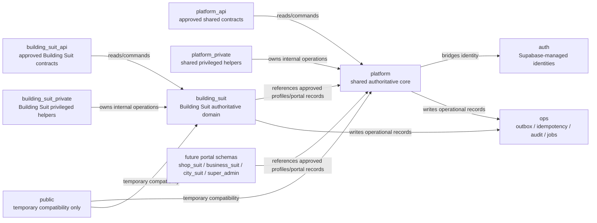

# Building Suit Database Design Document

| Document field | Value |
|---|---|
| Status | Draft for engineering, product, finance, security, and operations approval |
| Database platform | Supabase PostgreSQL 17 |
| Primary active portal | Building Suit |
| Document date | 2026-06-13 |
| Source baseline | PRD, BRD, UX Specification, System Architecture, current migrations, Edge Functions, seed data, and Supabase configuration |

---

## 1. Purpose and Authority

### 1.1 Purpose

This document defines how Building Suit data is stored, related, protected, validated, queried, retained, migrated, backed up, and operated. It converts the approved product and architecture rules into a database design that can be implemented and tested.

The design covers:

- Shared global identity and portal-scoped profiles.
- Building tenancy, units, memberships, occupancy, and history.
- Finance, ledger, subscriptions, withdrawals, and financial read models.
- Governance and voting.
- Issues, announcements, notifications, service providers, files, audit, and operational events.
- Row Level Security (RLS), privileges, privacy, retention, indexing, concurrency, idempotency, migrations, backups, and performance-sensitive queries.

### 1.2 Normative Priority

When sources conflict, the approved product behavior in the PRD and BRD takes priority over the current implementation. The UX Specification defines approved user-visible behavior. The System Architecture defines the approved execution and security direction. Current code and migrations provide implementation evidence but do not override approved requirements.

### 1.3 Source Documents and Repository Evidence

| Source | Role |
|---|---|
| `.docs/01.BUILDING_SUIT_PRD.md` | Product behavior, business rules, non-functional requirements, release gates |
| `.docs/02.BUILDING_SUIT_BRD.md` | Business rules, reporting requirements, lifecycle and approval decisions |
| `.docs/03. BUILDING_SUIT_UX_SPEC.md` | User-visible states, validation, privacy, concurrency, and recovery behavior |
| `.docs/04.BUILDING_SUIT_SYSTEM_ARCHITECTURE.md` | Database boundaries, command/query model, atomicity, RLS, outbox, backup, and performance direction |
| `supabase/migrations/*.sql` | Current physical schema, constraints, indexes, policies, functions, triggers, storage, and realtime configuration |
| `supabase/functions/**/*.ts` | Current authorization, query shapes, commands, balance calculations, and implementation gaps |
| `supabase/config.toml` | PostgreSQL version, exposed schemas, Auth, Storage, Realtime, and local environment configuration |
| `supabase/seed.sql` | Current portal, role, permission, and category reference data |

### 1.4 Scope Boundary

This document designs the Building Suit MVP and the shared platform foundations required to keep future portals isolated. It does not approve:

- Paymob activation without approved merchant onboarding, KYC, contracting, legal/compliance validation, callback verification, reconciliation testing, support procedures, and runbook readiness. Paymob target structures are required before activation.
- Shop Suit, Business Suit, or City Suit entities or workflows. Their bounded-domain schema names are reserved by architecture, but their contents require separate approved designs.
- Any Super-Admin scope beyond the required pre-pilot minimum for privileged portal access, onboarding operations, internal reporting, user management, subscription management, support operations, trial/pricing policy configuration, and audited privileged actions.
- Service Provider Directory as active MVP scope, provider profile creation/editing, provider discovery/contact, provider permissions, provider APIs/tables/security rules as active scope, provider moderation, provider booking, marketplace orders, provider settlement, or reviews.
- A final legal retention schedule or financial accounting policy that has not been approved by its owner.

---

## 2. Executive Design Decisions

| ID | Decision | Status | Reason |
|---|---|---|---|
| DB-ADR-001 | Use one PostgreSQL database per environment for the MVP and pilot. | Source-approved | Matches the modular-monolith architecture, preserves cross-schema transactions, and minimizes operational overhead. |
| DB-ADR-002 | Organize authoritative records by bounded-domain schema: shared records in `platform`, Building Suit records in `building_suit`, and one schema for each future implemented portal. | Source-approved | Makes ownership, grants, migrations, naming, and future extraction boundaries explicit without introducing distributed consistency. |
| DB-ADR-003 | Use bounded-domain API and private schemas such as `platform_api`, `building_suit_api`, `platform_private`, and `building_suit_private`; do not expose authoritative schemas merely for convenience. | Recommended target | Creates controlled query/command contracts and prevents raw physical tables from becoming permanent client APIs. |
| DB-ADR-004 | Every table carries an internal `bigint` `id` and an external UUID `public_id`; `id` is used only for relationships, `public_id` is the only identifier exposed to clients. | Source-approved | Efficient joins internally and stable non-sequential identifiers externally, with one consistent rule for every table. |
| DB-ADR-005 | Treat `building_id` as the mandatory Building Suit tenant partition key on every building-owned record. | Source-approved | Enables isolation, indexing, and operational ownership. |
| DB-ADR-006 | Separate building authorization membership from unit occupancy in the target model. | Recommended target | Current `memberships.unit_id` mixes permissions and occupancy and creates duplicate/ambiguous membership rows. |
| DB-ADR-007 | Represent every physical unit in `units`; occupancy is not the mechanism that creates unit identity. | Recommended target | The unit is the operational anchor for finance, governance, joining, and retained history. |
| DB-ADR-008 | Treat the current ledger as an operational multi-account ledger, not as a formal double-entry accounting system. | Recommended; finance approval required | Current and approved operation templates do not consistently form accounting-balanced journal entries. |
| DB-ADR-009 | Add an immutable financial operation header and post all related ledger lines atomically through database functions. | Recommended target | Provides atomicity, idempotency, correlation, and operation-level auditability. |
| DB-ADR-010 | Use append-only corrections and compensating operations for ledger, required audit, occupancy, and governance history. | Source-approved | Required by product and architecture. |
| DB-ADR-011 | Use transactional outbox records for required post-commit notifications and integrations. | Recommended target | Current non-blocking notification/audit calls can silently fail after the business change commits. |
| DB-ADR-012 | Use purpose-built views or projection tables for dashboards and large read paths; never use materialized views as the live financial source of truth. | Recommended | Improves query performance while preserving authoritative records. |
| DB-ADR-013 | Use cursor/keyset pagination for growing timelines and ledgers. | Recommended | Offset pagination becomes slower and inconsistent at depth. |
| DB-ADR-014 | Do not partition initially; review partitioning/isolation only when operational evidence justifies it. | Recommended | Early partitioning adds complexity without current performance, row-count, query, connection-pool, or incident evidence. |
| DB-ADR-015 | Store sensitive media in private buckets and authorize access through metadata plus signed/authenticated access. | Recommended target | Current public community-media bucket conflicts with the security architecture. |
| DB-ADR-016 | Keep `public` only as a temporary compatibility layer and prohibit new authoritative tables there. | Recommended target | Reduces accidental exposure and ensures every new record has an explicit bounded-domain owner. |
| DB-ADR-017 | Do not split portals into separate databases until documented extraction criteria are met. | Source-approved | Separate databases would add distributed transactions, synchronization, duplicated identity, and additional operational burden without current evidence. |
| DB-ADR-018 | Do not use native PostgreSQL `enum` types for domain values. Store status/type/kind/method/scope values as integer-like coded columns whose names, labels, and allowed transitions are owned by backend code and shared with clients via a typed TypeScript contract. | Source-approved | Native enums require migrations to add/reorder/rename values, cannot carry labels or transition rules, and split the source of truth between database and application. Integer codes keep storage compact and the enum definition single-sourced in code. |
| DB-ADR-019 | Do not store hardcoded human-readable text in the database. Store stable chained i18n keys (plus parameters), and resolve them to a language on the client. Backend success and error responses also carry a chained message key rather than a localized sentence. | Source-approved | Keeps stored data language-neutral, lets new languages ship without data migration, and makes translation a presentation concern owned by the client i18n layer. |

### 2.1 Physical Schema Decision

The target uses **one PostgreSQL database per environment with multiple schemas organized by bounded domain**.

| Schema | Exposure | Ownership and purpose |
|---|---|---|
| `auth` | Supabase-managed | Authentication identities and sessions |
| `storage` | Supabase-managed | Bucket and object metadata |
| `extensions`, `graphql_public`, `realtime`, `vault`, and other provider schemas | Supabase/provider-managed | Platform extensions and managed runtime features; application tables must not be created here |
| `platform` | Not exposed directly | Shared global application Accounts, portal registry, Portal Profiles, and shared authorization reference data |
| `platform_api` | Explicitly exposed after grants/RLS review | Approved shared-platform security-invoker views and RPCs |
| `platform_private` | Not exposed | Shared identity/profile authorization helpers and privileged internal functions |
| `building_suit` | Not exposed directly | All authoritative Building Suit records: buildings, units, finance, governance, community, files, and portal notifications. Provider tables are not active MVP scope. |
| `building_suit_api` | Explicitly exposed after grants/RLS review | Approved Building Suit security-invoker views and RPCs |
| `building_suit_private` | Not exposed | Building Suit authorization helpers, posting functions, triggers, and internal configuration |
| `super_admin` | Not exposed directly | Required pre-pilot Super-Admin portal profile/access isolation, onboarding operations, internal reporting access metadata, user/subscription/support operations, trial/pricing policy configuration, and privileged-action audit references |
| `super_admin_api` | Explicitly exposed only to the Super-Admin application after grants/RLS review | Approved Super-Admin security-invoker views/RPCs; never exposed to regular Building Suit clients |
| `super_admin_private` | Not exposed | Super-Admin privileged helpers, just-in-time access checks, support-operation command functions, policy-management commands, and audited internal workflows |
| `ops` | Not exposed | Cross-platform idempotency, outbox, jobs, delivery attempts, reconciliation, audit, and operational projections |
| `public` | Currently exposed; transitional | Compatibility views/functions/tables required while existing callers migrate; no new authoritative tables |
| `shop_suit`, `business_suit`, `city_suit` | Not created until implementation | Reserved future authoritative portal schema names; contents require separate approved database designs |

Example authoritative references:

```sql
select * from platform.portals;
select * from platform.users;
select * from building_suit.units;
select * from building_suit.ledger_entries;
-- Future, after Shop Suit has an approved design:
select * from shop_suit.invoices;
```

Building Suit's internal modules such as finance, governance, and community remain logically owned modules inside the single `building_suit` schema. Creating one schema per small module would increase migration, grant, search-path, and tooling complexity without creating a meaningful portal boundary.

New privileged `SECURITY DEFINER` functions must be created in the owning unexposed `*_private` schema, use `SET search_path = ''`, and fully qualify every referenced object. Existing privileged functions in `public` must be migrated or hardened.

The current implementation remains largely in `public`. Moving it to `platform`, `building_suit`, and `ops` must use expand-and-contract migrations, compatibility views/functions, caller migration, and explicit grants.

### 2.2 Cross-Schema Dependency Rules

1. `platform` must never reference a portal-owned schema.
2. Portal-owned schemas may reference approved `platform` identities and Portal Profiles through foreign keys.
3. `building_suit` must not directly reference a future portal schema such as `shop_suit`.
4. Cross-portal sharing must use an explicitly approved platform-owned link, API contract, or integration event with consent and audit.
5. `ops` may reference bounded domains using safe public identifiers and scope metadata; avoid hard cross-schema foreign keys where they would prevent retention or future extraction.
6. Clients access approved `*_api` views/RPCs. Direct raw-table access requires a documented exception, least-privilege grants, and RLS.
7. All SQL, policies, functions, migrations, and jobs must use schema-qualified object names.
8. The database connection role's `search_path` must be minimal and must not make `public` an implicit trusted dependency.

### 2.3 Separate-Database Extraction Criteria

A bounded domain may move to a separate database only through a new architecture decision when one or more of these conditions materially outweigh shared-database benefits:

- Legal, regulatory, contractual, or geographic data-residency isolation.
- Independent scaling or workload patterns that cannot be addressed through indexing, read models, connection management, or partitioning.
- Required failure isolation, backup, restore, RPO, or RTO boundaries.
- Independent product ownership, release lifecycle, or divestiture.
- Security requirements that cannot be met with schemas, roles, grants, RLS, and application authorization.

Extraction requires an explicit identity replication/federation model, event contracts, consistency guarantees, reconciliation, independent backup/restore, and an operational ownership plan. Until then, separate databases are prohibited.

---

## 3. Core Data Principles

1. PostgreSQL records are authoritative. Client caches, Realtime payloads, and external gateway states are not authoritative.
2. Every protected record is scoped to a trusted Portal, Building, Profile, Unit, or ownership relation as applicable.
3. `auth.users`, `platform.users`, `platform.profiles`, `building_suit.building_memberships`, and `building_suit.unit_occupancies` are separate concepts.
4. Building-scoped records carry `building_id` directly whenever practical, even if it can be derived through another relationship.
5. Domain integrity is enforced by database constraints and atomic functions, not only by Edge Function checks.
6. Important commands write domain state, required audit, and an outbox event in one transaction.
7. Financial, occupancy, governance-result, and required audit history is append-only or ended, not destructively deleted.
8. Derived statistics and projections must be rebuildable and reconcilable.
9. Public APIs accept and return UUID public identifiers; internal numeric identifiers do not become client contracts.
10. Large or growing lists are bounded, indexed, and cursor-paginated.
11. Sensitive fields are not returned merely because a user can access the containing row.
12. Service-role access is a privileged bypass and requires explicit authorization before every operation.
13. Physical schemas express bounded-domain ownership but never replace RLS, grants, or trusted tenant authorization.
14. Shared-core dependencies point from portal schemas to `platform`, never from `platform` to a portal schema.
15. Every authoritative table carries both an internal `id` used only for relationships and an external `public_id` used for exposure. Relationships and joins use `id`; every client-facing reference uses `public_id`.
16. The database does not use native PostgreSQL `enum` types for domain status, type, kind, method, or scope values. Such values are stored in integer-like coded columns; their names, labels, and allowed transitions are defined once in backend code and shared with clients through a typed contract.
17. The database does not store hardcoded human-readable text. User-facing strings are stored as stable, chained i18n keys (with parameters where needed) and resolved to a language by the client.

---

## 4. Current Implementation Inventory

### 4.1 Current Table Catalog

The current migration chain creates or evolves the following application tables. Unless noted otherwise, these tables currently reside in `public`; the target placement is defined below.

| Module | Current table | Scope | Primary purpose | Current retention direction |
|---|---|---|---|---|
| Platform | `users` | Global account | Application-owned bridge to `auth.users` | Soft delete/open policy |
| Platform | `portals` | Global | Portal registry | Retain |
| Platform | `profiles` | Portal | One profile per user per portal | Soft delete/open policy |
| Authorization | `roles` | Portal | Portal role definitions | Retain reference data |
| Authorization | `permissions` | Portal | Permission definitions | Retain reference data |
| Authorization | `role_permissions` | Portal | Role-to-permission mapping | Retain reference data |
| Platform | `files` | Portal/profile | Storage object metadata | Open decision |
| Platform | `locations` | Global | Building/provider location | Open decision |
| Platform | `categories` | Portal | Issue and service category codes | Retain reference data |
| Building | `buildings` | Portal/building | Building tenant and configuration root | Archive; do not cascade history |
| Building | `units` | Building | Unit identity and current owner/tenant pointers | Retain indefinitely |
| Building | `memberships` | Building/profile/unit | Current authorization and unit participation | Retain ended state |
| Building | `unit_residents_history` | Unit/profile | Occupancy history | Retain indefinitely |
| Building | `invitations` | Building | Admin invitations and join requests | Retain/archive; token expiry |
| Building | `change_requests` | Building | Approval-based changes | Retain/archive |
| Building | `building_billing_configs` | Building | Recurring charge configuration | Retain historical versions |
| Finance | `ledger_entries` | Building/unit/profile | Operational financial source of truth | Immutable/indefinite |
| Finance | `charges` | Building/unit | Unit charges | Retain/compensate |
| Finance | `payments` | Building/unit/profile | Manual payment records | Retain/compensate |
| Finance | `expenses` | Building | Expense records | Retain/compensate |
| Finance | `wallet_transactions` | Building | Wallet movement/request record | Retain/explicit states required |
| Finance | `subscriptions` | Building | Current subscription state and period | Retain/history design required |
| Finance projection | `unit_finance_stats` | Building/unit | Trigger-maintained unit balance projection | Rebuildable |
| Finance projection | `building_finance_stats` | Building | Trigger-maintained building summary | Rebuildable |
| Governance | `votes` | Building | Vote definition, snapshots, and result | Retain indefinitely |
| Governance | `vote_options` | Vote | Normal/money vote options | Retain with vote |
| Governance | `vote_candidates` | Vote/profile | Historical superseded candidate rows only | Retain read-only with historical vote |
| Governance | `vote_results` | Vote or replacement cycle/unit/profile | One final cast result per unit for ordinary votes; for a replacement cycle, at most one **effective** result per unit alongside retained superseded history; resident-facing replacement reads expose aggregates only | Retain indefinitely under restricted integrity/audit access |
| Community | `issues` | Building/profile | Issue workflow | Retain/archive |
| Community | `issue_comments` | Issue/profile | Issue discussion | Retain/soft delete policy required |
| Community | `announcements` | Building/profile | Building announcements | Retain/archive |
| Community | `announcement_reads` | Announcement/profile | Read acknowledgement | Retain according to announcement policy |
| Community | `announcement_rsvps` | Announcement/profile | RSVP acknowledgement | Retain according to announcement policy |
| Future directory | `provider_profiles` | Portal/profile | Existing/future provider directory profile table; not active MVP scope | Future policy if provider scope is reintroduced |
| Future directory | `provider_services` | Provider/category | Existing/future provider service/category table; not active MVP scope | Future policy if provider scope is reintroduced |
| Operations | `notifications` | Portal/profile/building | In-app notifications | Retention decision required |
| Operations | `audit_logs` | Portal/building/profile | Sensitive-action audit trail | Append-only/indefinite minimum |

#### Target Schema Placement

| Target schema | Current tables moving to the schema | Target additions |
|---|---|---|
| `platform` | `users`, `portals`, `profiles`, `roles`, `permissions`, `role_permissions` | Shared identity/portal records approved by later designs |
| `building_suit` | `files`, `locations`, `categories`, `buildings`, `units`, `memberships`, `unit_residents_history`, `invitations`, `change_requests`, `building_billing_configs`, `ledger_entries`, `charges`, `payments`, `expenses`, `wallet_transactions`, `subscriptions`, `unit_finance_stats`, `building_finance_stats`, `votes`, `vote_options`, `vote_candidates`, `vote_results`, `admin_replacement_cycles`, `issues`, `issue_comments`, `announcements`, `announcement_reads`, `announcement_rsvps`, `notifications` | `building_memberships`, `unit_occupancies`, `financial_operations`, `withdrawal_requests`, `withdrawal_state_events`, `withdrawal_risk_config_versions`, `withdrawal_limit_policies`, `withdrawal_daily_reservations`, `trial_policies`, `pricing_policies`, `subscription_events`, `subscription_invoices`, `payment_attempts`, `paymob_callback_events`, approved Building Suit read projections |
| `ops` | `audit_logs` | `idempotency_keys`, `outbox_events`, `job_runs`, `delivery_attempts`, reconciliation and failed-work views |
| `public` | Temporary compatibility objects only | None |

`building_suit.files`, `building_suit.locations`, and `building_suit.categories` are owned by Building Suit because the approved/current behavior is portal-specific. A future portal must create its own domain records or use a separately approved shared-platform abstraction; it must not silently reuse Building Suit tables.

### 4.2 Current Functions, Triggers, and Platform Features

| Area | Current implementation |
|---|---|
| Auth bridge | `public.handle_new_user()` trigger currently creates `public.users` and Building Suit `public.profiles`; target behavior writes `platform.users` and `platform.profiles` through `platform_private`. |
| Nearby duplicate detection | `public.get_buildings_in_radius(...)` uses location coordinates. |
| Join code | `generate_join_code()` produces six-character building codes. |
| Monthly charge job | `public.fn_generate_monthly_charges()` plus scheduled database work. |
| Vote jobs | `fn_process_expired_votes`, scheduling helpers, and vote-related triggers. |
| Finance projections | `fn_sync_finance_stats()` updates projection tables from ledger inserts/deletes. |
| RLS helper | `fn_is_same_building_member_by_building(...)` resolves same-building membership. |
| Realtime | Many raw domain tables are added to `supabase_realtime`. |
| Storage | `community_media` bucket currently configured as public. |
| Edge Functions | Most commands use a service-role Supabase client after application authorization. |

### 4.3 Current Strengths

- The global account → portal profile → building membership direction is already present.
- Most domain tables use internal bigint IDs and UUID public IDs.
- RLS is enabled on the main exposed tables.
- Building-scoped domain tables generally contain `building_id`.
- Financial amounts use exact `numeric`, not floating point.
- The ledger is modeled as append-oriented records with explicit account, entry type, direction, and amount.
- One vote per unit per vote is protected by a unique constraint.
- Portal roles and permissions are data-driven.
- Current list endpoints already use some cursor pagination and batch loading.
- Unit finance and building finance projection tables are explicitly rebuildable.
- Categories use stable codes and client-side i18n labels.

### 4.4 Current Gaps and Production Blockers

| Priority | Gap | Evidence and effect | Required direction |
|---|---|---|---|
| Critical | Financial writes are application-orchestrated multi-step writes. | Payment, charge, expense, withdrawal, resident removal, and building creation perform multiple service-role calls and sometimes delete ledger rows as rollback. | Replace with atomic PostgreSQL command functions/transactions. |
| Critical | No command idempotency store exists. | Duplicate retries can post repeated financial or workflow actions. | Add scoped idempotency keys and request fingerprints. |
| Critical | Audit and notifications are not durable parts of the command transaction. | Helpers log failures and continue; required audit/outbox may be lost. | Insert required audit and outbox rows atomically. |
| Critical | RLS permits overly broad access in several areas. | All authenticated users can read all profiles, files, and locations; some policies permit full building financial/history rows. | Replace with least-privilege policies and approved views. |
| Critical | Current community media bucket is public. | Sensitive issue/comment media can be publicly retrievable. | Make bucket private and authorize objects by Building/Profile/domain reference. |
| Critical | Occupancy-period privacy is not enforced by raw finance table RLS. | A building member can potentially read unit financial history beyond their occupancy period. | Serve resident finance through occupancy-aware views/RPCs. |
| Critical | Wallet balance sign conventions conflict in current code. | Current query code and projection code calculate wallet balance differently. | Apply the approved canonical `debit - credit` convention in one database implementation and remove conflicting calculations. |
| Critical | Withdrawal status/reservation model is missing. | `wallet_transactions` has no explicit `Pending`, `Requires Review`, `Confirmed`, `Failed`, or `Reversed` state, no immutable `withdrawal_limit_day`, and no balance/daily-limit reservation accounting. | Introduce `withdrawal_requests`, withdrawal state timeline, balance reservations, and daily-limit reservations before activation. |
| Critical | Internal confirmation of withdrawals exists. | `confirm-withdrawal` permits an authenticated internal command despite approved callback/reconciliation-evidence behavior. | Remove/disable before release; future state changes must be driven by trusted Paymob callbacks/webhooks or documented reconciliation evidence. |
| High | Membership and occupancy are mixed. | `memberships` may be duplicated per unit; unit owner/tenant pointers and history duplicate occupancy truth. | Separate one building membership from many unit occupancy periods. |
| High | Active-unit calculations are inconsistent in current code. | Some flows count `units.is_active` directly while governance activation also checks active memberships. | Implement and reconcile the approved canonical active-unit projection for billing, governance, and reporting. |
| High | Vote auto-close recomputes current active Units. | Current auto-close result validity can change after vote creation despite the approved snapshot-only rule. | Use creation-time activation, active-unit, and total-unit snapshots for every close mode. |
| High | Units are created opportunistically. | Building creation creates at most one unit; approval may create new units. | Provision and manage every physical unit as the stable anchor. |
| High | Current building creation conflicts with approved behavior. | It writes `status = 'inactive'`, a 120-day trial, and minimum fee `0`, while approved rules require active, a versioned assigned zero-charge trial, and the EGP 200 minimum only after trial. | Correct through an atomic creation function and constraints/defaults. |
| High | Subscription row cardinality is not enforced. | Code uses both `.single()` and “latest row” queries. | Define one current subscription per building plus explicit history/events. |
| High | Recurring charge duplicate prevention is application-only. | Queries check current-month rows but no unique database constraint exists. | Add `charge_period` and a unique key. |
| High | Vote duration constraint permits ten days. | Current table check conflicts with approved maximum of seven days. | Replace constraint with 1–7 days. |
| High | Broad raw-table Realtime publications increase exposure and load. | Finance and other sensitive raw tables are published. | Publish narrow projections/signals after RLS review. |
| High | Cascade deletes can remove required history. | Several historical children use `ON DELETE CASCADE`. | Replace destructive cascades on retained records with restrict/ended state. |
| High | `SECURITY DEFINER` functions are in `public` and some use unsafe search paths. | Exposed privileged functions increase attack surface. | Move each helper to its owning `platform_private` or `building_suit_private` schema, revoke public execute, and use an empty search path. |
| High | Supabase Data API currently exposes `public`/`graphql_public` and adds `public` to request `search_path`. | The current configuration reinforces direct raw-table access and implicit object resolution. | During contract migration, expose approved `platform_api`/`building_suit_api`, remove `public` from exposure/search path when compatibility permits, and keep `extensions` only where required. |
| Medium | Existing provider browse behavior is not active MVP scope. | Provider scope has been removed from MVP. | Do not build active provider browse/read models unless provider scope is reapproved post-MVP; future implementation must use bounded SQL filtering, text search, indexes, and cursor pagination. |
| Medium | Issue location scope is defaulted rather than required. | Current schema/command can silently substitute `unit` when the creator does not choose a scope. | Make `location_scope` required and validate the explicit approved value in the command. |
| Medium | Current ledger query uses offset pagination and computes aggregate totals by loading all matching rows. | Deep pages and exports become expensive. | Use keyset pagination and database aggregate/read-model queries. |
| Medium | Projection triggers support ledger deletes. | Required ledger immutability is weakened and rollback deletion can alter history. | Prohibit deletes; rebuild projections and compensate instead. |
| Medium | `unit_public_id` is duplicated into finance tables by trigger. | Duplicates identifier data and may drift; it is primarily an API-shaping concern. | Prefer joins/views; retain only if measured query needs justify it. |
| Medium | Polymorphic `reference_type/reference_id` pairs have no FK integrity. | References can become invalid or point to unauthorized tables. | Restrict allowed types and use operation/event headers; do not dynamically query arbitrary table names. |

---

## 5. Physical Schema and Conceptual Data Model

### 5.1 Physical Schema Dependencies



The arrows represent allowed dependency or write direction, not automatic authorization. No direct arrow is permitted between portal-owned schemas.

### 5.2 Conceptual Entity Model

```mermaid
erDiagram
    AUTH_USER ||--|| USER : bridges
    USER ||--o{ PROFILE : has
    PORTAL ||--o{ PROFILE : scopes
    PORTAL ||--o{ ROLE : defines
    ROLE ||--o{ ROLE_PERMISSION : grants
    PERMISSION ||--o{ ROLE_PERMISSION : maps

    PROFILE ||--o{ BUILDING_MEMBERSHIP : participates
    BUILDING ||--o{ BUILDING_MEMBERSHIP : contains
    BUILDING ||--o{ UNIT : contains
    UNIT ||--o{ UNIT_OCCUPANCY : has_history
    PROFILE ||--o{ UNIT_OCCUPANCY : occupies

    BUILDING ||--|| BUILDING_SUBSCRIPTION : subscribes
    BUILDING ||--o{ BILLING_CONFIG : configures

    BUILDING ||--o{ FINANCIAL_OPERATION : owns
    FINANCIAL_OPERATION ||--o{ LEDGER_ENTRY : posts
    UNIT ||--o{ LEDGER_ENTRY : affects
    FINANCIAL_OPERATION ||--o| CHARGE : describes
    FINANCIAL_OPERATION ||--o| PAYMENT : describes
    FINANCIAL_OPERATION ||--o| EXPENSE : describes
    FINANCIAL_OPERATION ||--o| SPECIAL_ASSESSMENT : describes
    SPECIAL_ASSESSMENT ||--o{ SPECIAL_ASSESSMENT_OBLIGATION : creates
    SPECIAL_ASSESSMENT ||--o{ EQUALIZATION_CREDIT : redistributes
    UNIT ||--o{ OWNER_OBLIGATION : carries
    FINANCIAL_OPERATION ||--o| WITHDRAWAL_REQUEST : settles

    BUILDING ||--o{ VOTE : governs
    VOTE ||--o{ VOTE_OPTION : offers
    VOTE ||--o{ VOTE_CANDIDATE : nominates
    VOTE ||--o{ VOTE_RESULT : records
    UNIT ||--o{ VOTE_RESULT : casts_once

    BUILDING ||--o{ ISSUE : tracks
    ISSUE ||--o{ ISSUE_COMMENT : discusses
    BUILDING ||--o{ ANNOUNCEMENT : publishes
    ANNOUNCEMENT ||--o{ ANNOUNCEMENT_READ : acknowledges
    ANNOUNCEMENT ||--o{ ANNOUNCEMENT_RSVP : responds

    PROFILE ||--o| PROVIDER_PROFILE : owns
    PROVIDER_PROFILE ||--o{ PROVIDER_SERVICE : offers

    FINANCIAL_OPERATION ||--o{ AUDIT_LOG : audits
    FINANCIAL_OPERATION ||--o{ OUTBOX_EVENT : emits
```



The Mermaid names omit schema prefixes for readability. Physically, `USER`, `PORTAL`, `PROFILE`, `ROLE`, `PERMISSION`, and `ROLE_PERMISSION` belong to `platform`; Building Suit entities belong to `building_suit`; audit/outbox/job entities belong to `ops`.

The target model names `building_suit.building_memberships` and `building_suit.unit_occupancies` conceptually. During migration, the current `public.memberships` and `public.unit_residents_history` tables may remain physical compatibility tables until callers are moved.

---

## 6. Modeling Standards

### 6.1 Naming

- Use lowercase `snake_case`.
- Schema names identify the bounded-domain owner; table names do not repeat the schema name.
- Table names are plural nouns.
- Primary key is `id`.
- External UUID is `public_id`.
- Foreign keys end in `_id`.
- Timestamps end in `_at`.
- Boolean fields start with `is_`, `has_`, or `requires_`.
- Status/type/kind columns store stable integer-like enumeration codes (§6.6); they do not store free text or native enum values.
- Constraint and index names include table and relevant columns.
- Every SQL reference outside the object's own DDL statement is schema-qualified.

### 6.2 Required Common Columns

Every table carries both an internal key and an external identifier:

```text
id bigint generated by default as identity primary key
public_id uuid not null unique default gen_random_uuid()
```

- `id` is the internal relationship key. Foreign keys, joins, and internal functions reference `id`; it never appears in a client contract.
- `public_id` is the only identifier exposed to clients. APIs accept and return `public_id`, never `id`.
- This rule applies to **every** table, including junction/link tables (for example `role_permissions`, `file_links`) and reference/lookup tables. A junction table keeps its natural composite uniqueness constraint, and additionally carries `id` as its primary key and `public_id` for any case where the row must be addressed externally.
- The single deliberate exception is `platform.users`, whose `id` equals `auth.users.id` by design (§7.1); it still carries a `public_id` for external exposure.

Authoritative mutable domain tables additionally include lifecycle timestamps:

```text
created_at timestamptz not null default now()
updated_at timestamptz not null default now()
```

`deleted_at` is added only when approved soft deletion is meaningful. Historical and financial tables use ended/reversed/archived state rather than a generic soft delete.

### 6.3 Data Types

| Concern | Standard |
|---|---|
| Internal identifiers | `bigint` identity |
| External identifiers | `uuid` with unique constraint |
| Date/time | `timestamptz` in UTC |
| Calendar due date/period | `date` |
| Language-neutral text | `text` for identifiers, codes, hashes, paths, and machine values; not for user-facing localized content |
| User-facing text | Stored as a stable chained i18n key (`text`) plus optional `jsonb` parameters; never a hardcoded localized sentence (§6.7) |
| Money | Proposed `numeric(18,2)` plus required `currency_code`; final scale and rounding require finance approval |
| Percent snapshots | `numeric(5,2)` with `0 <= value <= 100` |
| Flexible metadata | `jsonb` only for versioned, non-relational payloads |
| Coordinates | Prefer PostGIS `geography(Point,4326)` when approved; until then constrained latitude/longitude numerics |
| Status/type/kind/method/scope (enumerations) | `smallint` (or `integer`) code plus `CHECK` on the allowed code set; native PostgreSQL `enum` types are prohibited. The code's name, label, and transitions are defined in backend code and shared via a typed contract (§6.6) |

### 6.4 Identifier Rules

- All client-visible resources use UUID `public_id`.
- Numeric IDs remain internal and may appear only in privileged database operations and logs where safe.
- `correlation_id`, `idempotency_key`, `event_id`, `external_reference`, and `public_id` are separate fields with separate meanings.
- Public IDs are globally unique; tenant isolation must not rely on identifier obscurity.
- Dynamic table-name resolution from external inputs is prohibited.

### 6.5 Timestamp and Update Rules

- Database defaults produce creation timestamps.
- A common trigger maintains `updated_at` only for mutable tables.
- Business transition times use explicit columns such as `approved_at`, `left_at`, `ended_at`, `closed_at`, and `cancelled_at`.
- Timestamps used for eligibility, snapshots, and financial periods are written inside the authoritative transaction.

### 6.6 Enumerations and Coded Values

The database must not use native PostgreSQL `enum` types for domain values such as status, type, kind, method, direction, or scope. Native enums require a migration to add, rename, or reorder a value, cannot carry display labels or transition rules, and split the source of truth between the database and the application.

Instead:

- Store the value in an integer-like column (`smallint`, or `integer` when the domain may grow large), constrained by a `CHECK` to the currently allowed code set.
- Treat the integer as an opaque, **stable, never-reused** code. Codes are append-only: a retired value is marked inactive in code, not renumbered.
- Define the enumeration **once in backend code** — the canonical mapping of code → stable name → i18n label key → allowed transitions.
- Share that definition with every client through a **typed TypeScript contract** (a generated or hand-maintained `shared` package of `enum`/`as const` objects and types). Clients reference the typed name, never a magic number.
- Do not store the human-readable label in the database. The label is derived from the i18n key (§6.7) at presentation time.
- Where reference/lookup tables are warranted (for example `categories`), the table stores the stable code and the i18n label **key**, not localized text, and still follows §6.2 (`id` + `public_id`).

```text
-- Example: a coded status column instead of a native enum
status smallint not null default 1
  constraint chk_status check (status in (1, 2, 3, 4))
-- 1=draft, 2=open, 3=closed, 4=cancelled — names/labels/transitions
-- live in the shared backend enum contract, not in the database.
```

At the API boundary the code may be serialized either as the integer or as its stable string name; whichever the API Contract fixes, both sides resolve it through the same shared typed contract rather than duplicating literals.

### 6.7 Localized Text and i18n Keys

The database must not store hardcoded human-readable text intended for users. Any string a user can read is stored as a **stable, chained i18n key** (dot-namespaced, for example `notification.charge.created` or `vote.status.closed`), optionally accompanied by a `jsonb` parameter bag for interpolation (names, amounts, counts). The client i18n layer resolves the key and parameters into the active language.

Rules:

- Stored keys are language-neutral and stable; renaming a key is a coordinated change across backend and client catalogs.
- Parameters carry data (public identifiers, numbers, dates), never pre-rendered localized fragments.
- Reference data (categories, types, roles, permissions) stores a code and a label **key**, not the localized label.
- Free-text authored by users (issue body, comment, announcement content, building name) is genuine user data, not UI copy; it is stored as-is and is out of scope for i18n keys. It is still validated for length and content.
- Missing keys must fall back safely on the client and must never block a record from rendering (UX §5.10).

This applies to backend-originated user-facing messages as well: notifications, success results, and error responses carry a chained message key and parameters rather than a localized sentence (see System Architecture §7.8 and API Contract §1.6).

---

## 7. Target Entity Design

### 7.1 Platform Identity and Portal Entities

#### `platform.users`

Global application-owned account bridge. `id` equals `auth.users.id`.

Required rules:

- One row per Auth identity.
- Domain authorization must not use user-editable Auth `user_metadata`.
- `status` is `active` or `blocked`.
- Email remains Auth-owned. Phone ownership and verification source must be documented; duplicated phone data must have an explicit sync owner.
- Registration requires a canonical unique Egyptian phone; email is optional. Fingerprint/biometric templates, results, and enablement secrets are device-local and must not be stored in PostgreSQL.
- Account deletion must not cascade into retained finance, occupancy, governance, or audit history.

Recommended constraints/indexes:

- PK on `id`.
- Partial index on active non-deleted users only if operational queries require it.
- Egyptian phone normalization and uniqueness must be applied to the approved canonical phone owner.

#### `platform.portals`

Trusted registry of separate portals.

Required rules:

- `code` is unique and immutable after use.
- `is_active` controls portal availability, not building access.
- Portal context comes from trusted server configuration, never arbitrary client input.

#### `platform.profiles`

One user identity inside one portal.

Required rules:

- Unique `(user_id, portal_id)`.
- Status is `active` or `blocked`.
- Profile data is portal-private.
- A global Account session does not grant domain access without the target Portal Profile.
- Optional email state is profile-managed for Building Suit: store or reference `email_address`, `email_verified_at`, `email_verification_requested_at`, and safe verification-attempt metadata as approved by Auth/security design.
- A user may add email when none exists, replace/update an existing email through secure verification, request/resend verification, and see verified/unverified state.
- Missing or unverified email must never block app access, first login, Home access, building access, core usage, phone/password login, or phone-based password recovery.
- Email verification is required only before email-based notifications/messages are sent. Email login/recovery is not part of this checkpoint.

Critical change:

- Remove the policy that permits all authenticated users to read all profiles.
- Same-building profile discovery must use a restricted view that returns approved fields only.

#### `platform.roles`, `platform.permissions`, `platform.role_permissions`

Portal-scoped authorization reference data.

Required rules:

- Unique `(portal_id, code)` for roles and permissions.
- Unique `(role_id, permission_id)`.
- Role and permission references must belong to the same portal.
- Production mutation is privileged and audited.
- Queries must index role/permission foreign keys.
- The approved Building Suit MVP permission catalogue and role mappings are enumerated in PRD Section 3.4.1 and deployed by `supabase/seed.sql`.
- Permission-code changes require coordinated PRD, security-matrix, seed/migration, and authorization-test updates.

### 7.2 Building, Membership, and Occupancy

#### `building_suit.buildings`

Building Suit tenant root.

Required fields/rules:

- `portal_id` must reference the Building Suit portal.
- `name` length is 2–100 after trimming.
- `total_units` is 1–1000.
- `status` is `active`, `inactive`, or `archived`; approved creation status is `active`.
- `join_code` is unique, revocable, case-normalized, and generated with collision retry.
- `created_by_profile_id` belongs to the same portal.

#### Canonical active-unit projection

`building_suit_api.v_active_units` or its reconciled projection is authoritative for active-unit counting:

- Count a non-deleted Unit once when at least one current approved `active` owner or tenant membership is assigned to it.
- Either an active owner or active tenant is sufficient; both still count once.
- Vacant Units and Units with only blocked, pending, rejected, `left`, or otherwise ended memberships do not count.
- An administrator membership without a current owner/tenant Unit assignment does not activate a Unit.
- `units.is_active` is a maintained compatibility/projection field and must reconcile to this rule rather than define it independently.
- Governance activation, reporting, and post-trial subscription billing use this same projection. Each subscription invoice snapshots the canonical active-unit count transactionally; the Building's own resident charge generation continues to use its separately approved eligibility rules (see `building_suit.subscriptions` target).
- Exact location is building-private.
- Deletion is archive/restrict, never cascade into required history.

Recommended additions:

- `version bigint not null default 1` for optimistic concurrency where useful.
- `archived_at`, `archived_by_profile_id`, and `archive_reason`.
- A PostGIS point or geohash strategy for nearby-building lookup.

#### `building_suit.units`

Stable identity for every physical unit.

Required rules:

- Unique `(building_id, normalized_unit_number)`.
- Every physical unit exists independent of current occupancy.
- Unit count must not exceed `buildings.total_units`.
- Unit identity and retained history are never deleted.
- `is_active` must not be overloaded. Use explicit concepts:
  - `is_provisioned`: unit exists in the configured unit list.
  - `is_occupied`: derived from current occupancy.
  - `is_active_unit`: derived from the approved active-unit business definition.

Target change:

- Remove `owner_profile_id` and `tenant_profile_id` as authoritative fields after occupancy migration.
- Current occupancy is derived from `unit_occupancies`.

#### `building_suit.building_memberships` target / current `public.memberships`

Authorization relationship between a Profile and a Building.

Target cardinality:

- One current membership per `(building_id, profile_id)`.
- Membership role represents Building authorization (`admin`, `resident`), not owner/tenant occupancy.
- A membership may be `pending`, `active`, `blocked`, or `left`.
- Blocked members retain only explicitly approved read paths.
- Left members have no active building context.

Required constraints:

- Unique partial current membership on `(building_id, profile_id)` where status is not `left`, or a versioned membership-period design.
- `left_at` required when status is `left`.
- `status_reason` required for block/remove where policy requires.
- Role belongs to the same Portal as the Building and Profile.
- A building must retain at least one active admin; enforce in the transactional command.

#### `building_suit.unit_occupancies` target / current `public.unit_residents_history`

Authoritative owner/tenant relationship and occupancy history.

Required fields:

```text
id, public_id, building_id, unit_id, profile_id
occupancy_role: owner | tenant
started_at, ended_at
created_by_profile_id, ended_by_profile_id
end_reason, created_at
```

Required rules:

- At most one current owner and one current tenant per unit.
- `ended_at` is null for current occupancy and greater than `started_at` when set.
- Occupancy Profile must have an allowed Building membership at creation.
- No overlapping periods for the same unit and occupancy role.
- Historical rows are never deleted.
- Tenant priority for voting derives from current occupancy.
- Past-resident finance access is bounded to that Profile's occupancy periods.
- A newly created occupancy period starts with zero opening balance. It does not inherit old resident Occupancy Credit or debt. Old credit/debt remains historically tied to the ended occupancy period.

Recommended enforcement:

- Partial unique indexes for current owner and current tenant.
- When available, a `btree_gist` exclusion constraint prevents overlapping role periods.

#### `building_suit.invitations`

Admin invitation and resident join-request workflow.

Required rules:

- Invitation/request states: `pending`, `accepted`, `rejected`, `expired`, `cancelled`.
- Role request is `owner` or `tenant`.
- Exactly one of admin-created target identity or resident requester is present.
- Pending duplicate prevention is enforced by database uniqueness, not only application queries.
- Token is hashed if treated as a bearer secret; public join codes and private invitation tokens are separate concepts.
- Rejection requires a reason.
- Acceptance/replace is atomic with occupancy, membership, audit, and outbox.

#### `building_suit.building_onboarding_requests`

Pre-Building request for company-assisted (Platform Operator) onboarding, submitted before any `building_suit.buildings` row exists (PRD §3.2.1; BR-OPS-07).

Required fields/rules:

- `requested_by_profile_id` references the requesting administrator's Profile.
- `location_point` (or geohash) is captured using the same location-first capture as self-service creation; reuses the nearby-building lookup strategy noted under `building_suit.buildings`.
- `proposed_name`, `proposed_total_units`: administrator-supplied basics, validated against the `buildings` bounds only at fulfillment time.
- `roster_payload`: versioned schema, contains no secrets; holds the owner/tenant roster the Platform Operator uses to record first activation.
- `status` is `submitted`, `claimed`, `fulfilled`, `rejected`, or `cancelled`.
- `claimed_by_profile_id`, `claimed_at`: set when a Platform Operator claims the request; null while `submitted`.
- `resulting_building_id` is set only on `fulfilled` and references the created Building.
- Fulfillment is one atomic command: create the Building, provision Units, assign owner/tenant occupancy from `roster_payload`, grant the requesting administrator's Building membership, and write audit/outbox — comparable in atomicity discipline to DB-INV-009.
- Fulfillment records ordinary owner/tenant occupancy and uses the same canonical active-unit model as self-service Buildings. It does not introduce a separate activation or billing mechanism; post-trial subscription invoices use the resulting billing-cycle active-unit snapshot with the EGP 200 minimum.
- During pilot, founder-owned assisted onboarding requires claim and fulfillment timestamps sufficient to measure the published SLA: claimed within 1 business day and fulfilled within 5 business days where requester information is complete.
- Rejection or cancellation requires a reason and creates no Building.

#### `building_suit.change_requests`

Approval-based domain changes that do not have a dedicated workflow table.

Required rules:

- `request_type` is constrained to approved values.
- `payload` has a versioned schema and contains no secrets.
- Accepted requests store the resulting resource reference.
- Generic change requests must not replace explicit finance or governance domain tables.

#### `building_suit.building_billing_configs`

Versioned recurring unit-charge rule.

Required rules:

- `monthly_fee > 0`.
- `due_day between 1 and 28`.
- Cycle is currently `monthly`.
- At least one usable active configuration is required only before configuration-dependent finance writes. It is never required for building activation or join requests.
- Editing a configuration creates a new effective version when historical reproduction matters.
- Deactivation does not alter previously generated charges.
- Automatic monthly generation runs at the beginning of each month and applies only to Units with current active occupancy/eligible active resident profile under the approved occupancy rules.
- Admin manual generation/retry is supported for first operating month, technical failure retry, generation after configuration setup, and operational recovery. Manual runs use the same eligibility, period, and duplicate-prevention rules as the scheduled job.

Recommended additions:

- `effective_from date`, `effective_to date`.
- `created_by_profile_id`, `deactivated_by_profile_id`.
- Unique active config rules only if product decides how multiple active configs are intended to behave.

### 7.3 Finance and Subscription

#### Financial semantic convention

The internal operational ledger uses:

```text
net(account scope) = SUM(debit amount) - SUM(credit amount)
```

For `receivable`, positive net means the unit owes the Building; negative net means the unit has credit. APIs and read models must not expose this ambiguous signed number alone. They return:

```text
amount_due = greatest(receivable_net, 0)
credit_available = greatest(-receivable_net, 0)
```

Unit receivable calculations are scoped by Unit and, where resident identity matters, by `unit_occupancy_id`. Current-resident balance views use only the current occupancy period; past-resident settlement views use the old occupancy period.

Finance balances are also scoped by due bucket/type:

```text
monthly_occupancy_dues
owner_obligations_special_assessments
disputed_under_review
```

Read models must expose bucket-specific amount due, applicable credits, excluded credits, and remaining due. Disputed / Under Review amounts are never included in payable due until resolved into a payable bucket or handled through a separately approved pay-under-dispute flow.

For `manual` and `wallet`, positive net means funds available. `gateway_pending` positive net means Paymob-confirmed resident collections that are counted as collected building money but not yet available for withdrawal/use. Expense debit amounts represent recorded expense value.

Building summary projections return:

```text
total_building_balance = manual_balance + wallet_balance + gateway_pending_balance
collected_not_available_for_withdrawal = gateway_pending_balance
withdrawal_reserved_amount = sum(Pending and Requires Review withdrawal total_reserved_amount)
available_balance = manual_balance + wallet_balance - withdrawal_reserved_amount
```

This convention must be implemented once in database functions/views. Current conflicting application calculations must be removed.

#### `building_suit.financial_operations` target

Immutable header for one business financial command.

Required fields:

```text
id, public_id, building_id, operation_type, status
initiated_by_profile_id, unit_occupancy_id, effective_at, currency_code
due_bucket, ownership_period_id?, owner_profile_id?, responsible_party_profile_id?, actual_payer_profile_id?
idempotency_key, request_fingerprint, correlation_id
reverses_operation_id, metadata, created_at
```

Required rules:

- Unique `(building_id, operation_type, idempotency_key)` where key is present.
- Status is explicit: `posted`, `reversed`, or approved pending states for operations that do not yet post.
- Posted operations are immutable.
- Reversal references the original operation and uses compensating lines.
- One function posts each approved operation template and validates expected lines.
- The same transaction writes domain detail, ledger lines, required audit, and outbox rows.

#### `building_suit.ledger_entries`

Immutable lines belonging to a `financial_operation`.

Target changes:

- Add required `financial_operation_id`.
- Add required `currency_code`.
- Restrict `account_type`, `entry_type`, and `direction`.
- Prohibit client and ordinary service-role direct insert/update/delete.
- Prohibit delete entirely after migration.
- `reference_type/reference_id` becomes optional compatibility metadata, not the integrity boundary.

Required indexes:

- `(building_id, created_at desc, id desc)`.
- `(building_id, unit_id, created_at desc, id desc)` where `unit_id is not null`.
- `(financial_operation_id)`.
- `(building_id, account_type, created_at desc)`.
- Partial indexes for active operational queries only when measured.

#### Operation posting templates

| Operation | Required ledger effect |
|---|---|
| Unit charge | Receivable debit for the Unit |
| Monthly / Occupancy Dues generation | Receivable debit only for current active occupancy/eligible active resident Units; linked to Billing Config and occupancy period; duplicate-safe per Unit/config/month |
| Special Assessment draft creation | No ledger event, receivable, obligation, debt, credit, or money movement; posting is reserved to successful-vote activation |
| Approved Special Assessment activation | Receivable debit for active funding Units / responsible Owners according to the immutable approved original-funder snapshot and initial amount; deferred pending obligations for inactive/no-owner Units are not current resident debt |
| Delayed Special Assessment payment | Receivable credit against the delayed obligation; creates Equalization Credit only for original funders according to the original funder snapshot |
| Manual cash/instapay/other payment | Receivable credit for the Unit; manual debit for the Building |
| Wallet-method payment | Receivable credit for the Unit; wallet credit for the Building, reducing available wallet funds under the canonical `debit - credit` convention; no manual line |
| Monthly / Occupancy Dues overpayment | Receivable credit for the full paid building amount, producing `Occupancy Credit` when credits exceed current due for the same occupancy period; no separate resident wallet |
| Owner Obligations / Special Assessments overpayment | Receivable credit for the full paid building amount, producing `Owner Obligation Credit` for the same Owner/ownership/Unit scope |
| Equalization Credit application | Discount/credit application against eligible future dues according to bucket/scope rules; cannot also be paid out |
| Equalization Payout / Special Assessment Settlement | Building balance reduction linked to person, role, Unit, original Special Assessment, and Equalization Credit; marks the credit settled so it cannot be reused |
| Trusted Paymob resident collection | Receivable credit for the Unit/occupancy period; gateway_pending debit for the building amount excluding resident payment fee |
| Paymob settlement availability | gateway_pending credit and wallet debit, or approved equivalent according to the validated Paymob funds-separation model |
| Resident payment fee | No building ledger line; store fee amount/reference on payment attempt/receipt for transparency and Paymob reconciliation |
| Expense | Expense debit; manual credit |
| Unit Settlement Expense | Expense debit; manual or wallet credit according to the actual outside-app payout source; linked to the old occupancy period; no effect on current occupant opening balance |
| Past Resident Payment / Late Settlement | Receivable credit linked to the old occupancy period; manual/gateway/wallet effect according to actual method; no effect on current occupant opening balance |
| Confirmed withdrawal/disbursement | Wallet credit or approved settlement effect for withdrawal amount plus building-borne fee exactly once according to the validated Paymob funds-separation model; `Pending` and `Requires Review` reservations are not completed outflow lines |
| Correction/refund/reversal/chargeback | New compensating operation; never mutation/deletion of original lines |

This is an operational ledger. It must not be described as formal double-entry accounting until a finance-approved chart of accounts and balancing rules exist.

#### `building_suit.charges`

Required rules:

- Positive amount and required due date.
- Required link to posted financial operation.
- One-off charges may have no billing config.
- Recurring charges have a required normalized `charge_period` equal to the first day of the billing month.
- Unique recurring charge `(building_id, unit_id, billing_config_id, charge_period)`.
- Monthly recurring charges require current active occupancy/eligible active resident profile at generation time and store the generating `unit_occupancy_id`.
- No partial-month proration in the approved MVP.
- Payment is not allocated to a specific charge in the approved MVP; charge status must not be derived by comparing one charge to all Unit payments.
- Cancellation requires a compensating financial operation and audit.

#### `building_suit.special_assessments` target

Separate entity for exceptional shared building improvement costs with deferred equalization.

Required rules:

- Positive `total_cost`.
- Required `total_units_count`, `active_funding_units_count`, `initial_amount_per_active_funding_unit`, and `fair_share_amount_per_total_unit`.
- Required project description/title and created-by Admin.
- Required original funder snapshot. Later payers never join this original-funder redistribution group.
- Required responsibility scope for asset-linked assessments: Owner is primary responsible party.
- Deferred obligations are created for inactive/no-owner Units at fair-share amount and do not become current resident debt.
- When no Owner exists, obligation status is `Owner Responsibility Pending`.
- Every delayed payment creates equalization credits only for original funders and only up to their fair-share overpayment recovery.

#### `building_suit.special_assessment_obligations` target

Per-Unit obligation record for active funding, delayed, owner-responsibility, and dispute states.

Required fields:

```text
id, public_id, building_id, special_assessment_id, unit_id
responsible_party_type, responsible_profile_id?, actual_payer_profile_id?
ownership_period_id?, unit_occupancy_id?, amount_due, amount_paid
obligation_status, created_at, resolved_at?
```

Required statuses include `active_funder_due`, `deferred_pending`, `owner_responsibility_pending`, `acknowledgment_required`, `payable_due`, `disputed_under_review`, `waived`, `settled`.

#### `building_suit.equalization_credits` target

Entitlement created for original funders after delayed Special Assessment payments.

Required rules:

- Links to original Special Assessment, delayed obligation/payment, entitled profile/person, role, Unit, and occupancy/ownership period where applicable.
- Status is `available`, `applied`, `paid_out`, `settled`, or `expired/voided` only if a later approved rule introduces expiration/voiding.
- A credit can be applied as future discount or paid out through Equalization Payout, never both.
- If the entitled person leaves before use, the credit remains tied to that person and old period; it does not automatically transfer to the new resident or Owner.

#### `building_suit.owner_obligations` target

Tracks owner-related old obligations and registration review decisions.

Required rules:

- Classification is `Old Owner Debt`, `Unassigned Owner Responsibility`, or `Pre-First-Owner Unit Obligation`.
- New Owner registration must create or consume a review record before completion when such items exist.
- Old Owner Debt is informational only and cannot be assigned to the new Owner.
- Unassigned Owner Responsibility may be assigned, left unassigned, or waived with reason.
- Pre-First-Owner Unit Obligation defaults to first Owner and may be waived with reason.
- Assigned obligations require owner acknowledgment or documented external acknowledgment before becoming payable due.
- Disputed assigned obligations become `Disputed / Under Review`, remain non-payable, do not block Owner registration, and require documented resolution.

#### `building_suit.payments`

Required rules:

- Positive amount.
- Method is `cash`,`instapay`, `wallet`, or `other`.
- Required Unit and recorder.
- Required `due_bucket` / selected bucket for every payment; generic mixed-bucket payments are not allowed.
- Required `unit_occupancy_id` when the payment affects a resident-scoped balance.
- Required owner/ownership scope when the payment affects Owner Obligations / Special Assessments.
- Required link to one posted financial operation.
- Optional payer Profile only when known and authorized.
- Do not expose another resident's identity or payment detail to ordinary residents.
- Overpayment is allowed only within the selected bucket/scope and produces the correct credit type: `Occupancy Credit`, `Owner Obligation Credit`, or equalization-derived `Equalization Credit`. It is not a separate wallet and not an automatic refund.
- Future gateway payment records require external references, fee amount, total charged, explicit states (`attempted`, `trusted_confirmed`, `collected_not_available`, `available_settled`, `failed`, `reversed`, `refunded`, `chargeback`), verified callback metadata, settlement-availability evidence, and reconciliation.
- Resident Paymob payment fees are stored for receipt/history/reconciliation and excluded from building balance, unit receivable credit, and building expense.
- Refund, reversal, and chargeback outcomes reference the original payment and create compensating operations without deleting or editing the original payment.

#### `building_suit.expenses`

Required rules:

- Positive amount and required non-empty title.
- Required recorder and posted financial operation.
- Expense above manual balance is allowed after confirmation.
- `Unit Settlement Expense` requires an old `unit_occupancy_id` when it settles old resident credit and must not update the current occupant opening balance.
- Correction uses compensation.

#### `building_suit.withdrawal_requests` target

Separate primary request/state table; do not overload `wallet_transactions` and do not create duplicate ledger rows for each state transition.

Required fields/rules:

```text
id, public_id, building_id, requested_by_profile_id
amount, currency_code
fee_amount, total_reserved_amount
status: Pending | Requires Review | Confirmed | Failed | Reversed
reserved_amount, withdrawal_limit_day, destination_type
masked_destination, gateway_reference, requested_at
confirmed_at, failed_at, reversed_at, requires_review_at
idempotency_key, callback_event_id, failure_code, metadata
```

- Request atomically reserves available building balance and daily-limit capacity without posting final outflow ledger lines.
- `total_reserved_amount` equals requested withdrawal amount plus final known building-borne fee. If a final fee cannot be known before creation, the payout method is disabled for MVP.
- Available balance equals posted wallet/manual balance according to the approved model minus active `Pending` and `Requires Review` total reservations; Paymob-confirmed but settlement-pending collections are excluded.
- `withdrawal_limit_day` is persisted immutably at creation using `Africa/Cairo`; callbacks after midnight do not change it.
- Only trusted Paymob callbacks/webhooks or documented reconciliation evidence can change withdrawal state.
- Callback event ID/gateway reference is unique.
- Confirmation consumes the amount-plus-fee reservation and posts the approved settlement effect exactly once.
- Failure/reversal releases both building-balance reservation and daily-limit reservation for the original `withdrawal_limit_day`.
- Building Admin cancellation after submission is prohibited.
- Building Suit stores no full bank-account or e-wallet destination details and no building-owned/Admin-owned beneficiary list. Retained destination evidence is limited to destination type and masked details when available unless a later legal, contractual, or Paymob requirement makes a minimum data element mandatory.

#### `building_suit.withdrawal_state_events` target

Append-only timeline for one withdrawal.

Required fields/rules:

```text
id, withdrawal_request_id, previous_status, new_status
review_outcome: null | Still Pending
event_source: admin_submit | paymob_callback | reconciliation_review | system_timeout
actor_profile_id, event_at, gateway_reference, callback_event_id
evidence_reference, reason_note, metadata
```

- State events power the detail timeline shown to authorized administrators and residents.
- `event_source = reconciliation_review` requires Platform Operator / Super-Admin authority and documented Paymob review or reconciliation evidence.
- `review_outcome = Still Pending` is valid only for an authorized reconciliation review while the primary request status is `Requires Review`.
- A `Still Pending` review event uses `previous_status = Requires Review` and `new_status = Requires Review`, does not change the primary request status, does not release or consume reservations, and does not post a final outflow.
- State events are audit evidence; they do not create additional primary ledger rows.

#### `building_suit.withdrawal_risk_config_versions` target

Versioned Super-Admin operational configuration for withdrawal risk controls.

Required fields/rules:

```text
id, public_id, version_number
global_daily_limit_enabled, global_daily_limit_amount, currency_code
step_up_threshold_amount, pending_to_review_duration_seconds
effective_at, lifecycle_status: draft | active | retired | superseded
created_by_operator_profile_id, audit_log_id, created_at
```

- Restricted Platform Operator / Super-Admin APIs are the only write surface; Building Admins and Residents must not read or mutate this configuration.
- Every mutation records actor, prior value, new value, effective time, scope, and audit linkage.
- Updates are versioned and effective-time based so retries and delayed jobs resolve deterministic configuration.
- Disabling the global daily limit means no general daily limit only when no building-size/category or building-specific policy applies.

#### `building_suit.withdrawal_limit_policies` target

Versioned Super-Admin policy table for daily withdrawal limits.

Required fields/rules:

```text
id, public_id, scope_type: global | building_size | building
building_id, size_category_code, unit_count_min, unit_count_max
limit_amount, currency_code, enabled, global_disabled
version_number, effective_at, lifecycle_status: draft | active | retired | superseded
created_by_operator_profile_id, audit_log_id, previous_policy_public_id, created_at
```

- Policy precedence is building-specific, then size/category-based, then global default, then no daily limit when the global policy is disabled and no more-specific rule applies.
- Every change retains actor, prior value, new value, effective time, and applicable scope through audit or version linkage.
- A building-size policy may use `size_category_code`, `unit_count_min`, `unit_count_max`, or a validated combination of those fields.
- A building policy targets exactly one Building public identifier through `building_id`.
- Retired or superseded policies remain immutable historical evidence and are not deleted.

#### `building_suit.withdrawal_daily_reservations` target

Derived or authoritative reservation support for daily-limit enforcement.

Required fields/rules:

```text
id, withdrawal_request_id, building_id, withdrawal_limit_day
amount, currency_code, status: reserved | consumed | released
created_at, consumed_at, released_at
```

- `Pending` and `Requires Review` withdrawals hold daily-limit capacity.
- `Confirmed` consumes capacity for the original day.
- `Failed` and `Reversed` release capacity for the original day.
- Daily boundaries are `00:00:00` through `23:59:59` in `Africa/Cairo`; rolling 24-hour windows are not used.

#### `building_suit.subscriptions` target

Current Building subscription state.

Required rules:

- Exactly one current subscription per Building.
- Trial is assigned at Building creation from a versioned `trial_policies` row. The default duration is 90 days, and trial subscription charge is zero.
- No subscription charge accrues during trial.
- After trial, price is EGP 20 per canonical active Unit per cycle with EGP 200 minimum. Each invoice stores the active-unit count snapshot and pricing-policy version used so later occupancy changes cannot rewrite issued charges.
- Status is `trial`, `active`, `past_due`, `locked`, or `cancelled`.
- `past_due` allows building writes for 14 days, then transitions to `locked`.
- Locked/cancelled blocks all building writes but not approved sign-in or historical reads.
- Cancellation stores cancellation request, read-only retention start, 3-month retention end, and reactivation state.
- Cancellation is rejected while building wallet balance is positive. Existing negative balance responsibility transfers to a successor administrator; if no successor exists, resolution is handled by a future Platform Operator / Super-Admin process.
- State transitions are atomic, idempotent, audited, and recorded in `subscription_events`.

Recommended related tables:

- `trial_policies`: versioned duration policy with `created_at`, `effective_at`, `duration_days`, and audit actor. Existing Buildings keep the policy assigned at creation.
- `pricing_policies`: versioned post-trial price policy with `created_at`, `effective_at`, `notice_period_days`, `applicability_rule`, unit price, minimum fee, and audit actor.
- `subscription_events`: append-only transition history.
- `subscription_invoices`: realized subscription billing with immutable billing-cycle `active_unit_count_snapshot`, unit price, minimum fee, pricing-policy version, and final amount, separate from planning values.
- `subscription_reminders`: only after support/reminder process approval.
- `subscription_price_notices`: recipient-scoped notice evidence for every affected active Building Suit profile, including in-app notice delivery plus the company-configured external delivery channel(s); may also record Admin dashboard/banner and subscription-page presentation where relevant.
- `subscription_cancellations`: cancellation request, wallet-balance check, read-only retention window, reactivation, and final retention/deletion handoff.

#### Paymob activation target tables

Paymob starts from zero. Before activation, the database design must include:

- `payment_attempts` for resident-to-building collection and Building Suit SaaS subscription billing attempts, including due/payment amount, resident payment fee, total charged, target `unit_occupancy_id` where applicable, and state/timeline fields.
- `payment_settlement_events` or equivalent immutable records for trusted confirmation, collected-but-not-available, settlement availability, refund, reversal, chargeback, and dispute evidence.
- `paymob_callback_events` with verified signature/HMAC status, replay fingerprint, reconciliation result, and immutable raw reference metadata that is safe to retain.
- A documented funds-separation model selected after Paymob onboarding/KYC/contracting/legal/compliance review/technical validation: either per-building Paymob subaccounts/wallets or one platform account/wallet with internal per-building separation.
- A validated payout, wallet, custody, settlement, and licensing model; the database design must not assume that any regulatory, licensing, custody, or payment-service requirement is absent before Paymob, legal/compliance, finance operations, and engineering validation.
- Payout destination evidence limited to destination type and masked details when available; no full payout destination storage and no building-owned/Admin-owned beneficiary table.
- Fee quote/validation records sufficient to prove resident payment fees were shown before payment and withdrawal fees/total reserved amounts were shown before withdrawal request creation.
- Reconciliation views/jobs for unmatched, duplicated, delayed, failed, reversed, refunded, chargeback, disputed, settlement-delayed, and amount-mismatched transactions.
- Linkage from confirmed callbacks to immutable ledger entries or subscription invoice settlement exactly once.
- Audit records for merchant/KYC/contracting readiness, legal/compliance approval, deployment approval, and support-runbook readiness where those approvals are represented in-system.

### 7.4 Governance

#### `building_suit.votes`

Required rules:

- Building-scoped and retained indefinitely.
- Generic type is `normal` or `money`; Admin replacement is owned directly by `admin_replacement_cycles`, not a generic vote type. The former separate `admin_nominations` acceptance model accepts no new writes.
- Duration is 1–7 days.
- Threshold is exactly 50 for Normal and 70 for Money. The dedicated Admin replacement ballot uses normal-governance quorum 50%.
- Governance activation requirement is 60%.
- Store `activation_rate_snapshot`, `active_units_snapshot`, and `total_units_snapshot` explicitly.
- The legacy vote-level `money_amount` is insufficient for Checkpoint 09 and must not be treated as the target model. Every Money Vote stores a server-owned typed `money_vote_topic = spending_authorization|no_vote_limit_change`. Spending authorization stores `financial_mode`, purpose, creator-selected tolerance/validity constraint-policy snapshots, and per-option monetary semantics; the dedicated limit topic stores one proposed limit plus server snapshots and forbids those spending-only fields.
- Resident-created normal/money requests require Admin approval; Admin-created ordinary votes open directly. Replacement requires no Admin approval and cannot enter this request path.
- Approved ordinary votes may be cancelled only by the current Building Admin before the first `vote_results` row exists for that vote and only with a documented cancellation reason. Cancellation preserves the vote and request history and never enables content editing.
- Closure is atomic and idempotent.
- Ordinary manual/expiry/all-units-voted close uses creation-time snapshots. Replacement normal-result calculation/closure is API-100 only, is invoked exclusively by trusted server automation, and commits at the earlier of the scheduled three-day `voting_end_at` or confirmed complete eligible-Unit participation as defined by DB-INV-048. API-101 challenger withdrawal and trusted challenger-ineligibility invalidation are separate race-locked terminal transitions allowed while the cycle is nonterminal; they calculate no winner, perform no Admin transfer, preserve the incumbent and any recorded votes as immutable audit history, write no cooldown, and permit immediate eligible self-nomination after terminal commit.

Recommended additions:

- `parent_vote_id` is legacy ordinary-vote lineage only and is never used for Admin replacement.
- `closed_by_profile_id`, `close_mode` (`manual`, `auto`, `all_units_voted`).
- `result_summary jsonb` as a versioned immutable summary only after authoritative result rows are retained.

#### `building_suit.vote_options` and replacement ballot options

Required rules:

- Ordinary Normal votes have at least two options. `spending_authorization` Money Votes have one or more spend options plus exactly one explicit no-spend option. Spend options store structured positive `amount`; the no-spend row stores `is_no_spend=true` and no positive amount. The winning spend option is the base for authorization; a no-spend winner creates none. `no_vote_limit_change` instead has exactly two server-derived semantic options `approve_proposed_limit|keep_current_limit`, with no client labels, arbitrary option amounts, or no-spend row.
- `vote_candidates` is retained only for historical rows from the superseded model and accepts no new writes.
- Each replacement cycle derives exactly two immutable ballot options from its incumbent snapshot and one eligible self-nominated challenger; no third option or second-round lineage exists.
- Challenger eligibility is rechecked at self-nomination, open, and close; incumbent remains the preserved option even if account access is security-disabled. The trusted event trigger/timing for proactive termination after mid-cycle eligibility loss is a Derived Technical Open Item under ARCH-OPEN-12/DB-OPEN-14/SEC-ADR-08, owned by Engineering and Security; the fixed business outcome is not open.

#### `building_suit.vote_results`

Required rules:

- **Row-kind discriminator.** `vote_results` holds both ordinary and Admin-replacement rows. Checkpoint 08 makes the discriminator explicit: `replacement_cycle_id` is a nullable `bigint` foreign key to `building_suit.admin_replacement_cycles (id)` per DB-ADR-004. `replacement_cycle_id IS NULL` identifies an ordinary Normal/Money result row; `replacement_cycle_id IS NOT NULL` identifies an Admin-replacement result row. Every rule below is stated against that discriminator. **`superseded_at IS NULL` is not a row-kind test** — a currently effective replacement row also has `superseded_at IS NULL`, so it must never be used to mean "ordinary row."
- **Ordinary vote Unit uniqueness (unchanged by Checkpoint 08).** Exactly one result per `(vote_id, unit_id)` for ordinary rows, enforced as a partial unique index predicated on `replacement_cycle_id IS NULL`. The previously unconditional `(vote_id, unit_id)` unique index must be narrowed to this predicate; leaving it unconditional would block retained replacement history and make supersession impossible. Ordinary rows have no supersession: their supersession columns stay null permanently.
- **Admin-replacement effective Unit uniqueness (new in Checkpoint 08).** At most one *effective* result per `(replacement_cycle_id, unit_id)`, enforced as a partial unique index predicated on `replacement_cycle_id IS NOT NULL AND superseded_at IS NULL`. Retained superseded rows for the same cycle and Unit are unconstrained by it, so one Unit may accumulate several historical rows while never having two effective ones. Concurrent casts for one Unit serialize on the effective-row lock inside the cast command.

  The two scopes are distinct and must not be conflated:

```text
Ordinary vote Unit uniqueness:
  replacement_cycle_id IS NULL
  -> unique (vote_id, unit_id)

Admin-replacement effective Unit uniqueness:
  replacement_cycle_id IS NOT NULL AND superseded_at IS NULL
  -> unique (replacement_cycle_id, unit_id)
```
- Selected ordinary option or dedicated replacement option must belong to the same vote/cycle.
- Voter Profile, Unit eligibility, tenant priority, ordinary Admin/author restrictions, and open status are rechecked inside the cast transaction against the **current** valid occupancy assignment. Replacement incumbent/challenger status is not an exclusion; both may vote through Units they validly represent and receive no extra vote.
- A multi-unit eligible voter produces one result per eligible Unit in the same atomic command. Once committed, a choice is final for the voter who cast it: that voter's own second cast, change, or withdrawal attempt conflicts.
- Rows are never updated in substance and never deleted. The single permitted post-cast mutation is supersession: setting `superseded_at`, `superseded_by_result_id`, and `supersession_reason` on the previously effective replacement row inside the same transaction that inserts the new effective row. Supersession is permitted only while the cycle is nonterminal and only when the new caller currently holds voting priority for that Unit.
- Occupancy change alone must never set `superseded_at`. No trigger, job, or occupancy command may supersede or invalidate a vote; only a successfully committed replacement cast may.
- Effective totals, quorum, and participation are computed from rows where `superseded_at IS NULL` only. Superseded rows are retained indefinitely for restricted integrity/audit access and are excluded from every live and final tally and from every resident-facing projection.

Recommended Checkpoint-08 supersession fields (nullable, replacement rows only):

Internal relationships use `bigint` `id` foreign keys per DB-ADR-004. None of these columns crosses the client/API boundary.

```text
replacement_cycle_id bigint          -- NULL for ordinary rows; FK ->
                                     -- admin_replacement_cycles (id)
superseded_at timestamptz            -- NULL means this row is the effective vote
superseded_by_result_id bigint       -- internal id of the superseding
                                     -- vote_results row; FK -> vote_results (id)
supersession_reason text             -- constrained vocabulary, currently
                                     -- 'occupancy_change_replacement_vote'
cast_occupancy_id bigint             -- internal id of the occupancy assignment
                                     -- that authorized this cast;
                                     -- FK -> unit_occupancies (id)
```

Constraints: `superseded_at`, `superseded_by_result_id`, and `supersession_reason` are all-or-nothing; `superseded_by_result_id` must reference a `vote_results` row with the same `replacement_cycle_id` and `unit_id` that is itself effective at supersession time; all three are non-null only when `replacement_cycle_id IS NOT NULL`; and no path may clear them once set. Any tally the system rebuilds from history must be deterministic: replaying the append-only rows in commit order with their supersession links reproduces the recorded result exactly.

**Identifier boundary (DB-ADR-004 / API DL-10).** `superseded_by_result_id` and `cast_occupancy_id` are internal `bigint` relationships and are never serialized to any client, including trusted audit clients. Where a trusted audit projection needs a stable external handle for a superseding result row or an occupancy assignment, it resolves and exposes that related row's UUID `public_id` instead. The physical foreign key stays `bigint`; the projection performs the translation. This preserves both the internal-`bigint`/external-`public_id` split and the approved public-API UUID convention.

#### `building_suit.ordinary_vote_requests`

Required rules:

- Building-scoped with public ID, creator Profile, request kind (`generic|emergency_admin_warning`), current status, current version, assigned review duration, assigned review deadline, and optional opened Vote link. Approval, rejection, withdrawal, resubmission, and linked Vote cancellation never hard-delete the request or its history as part of those lifecycle actions. Long-term retention remains governed by the existing approved platform/audit retention policy and unresolved post-retention decisions, including DB-OPEN-04/05; Checkpoint 6 does not declare indefinite retention.
- Status is `pending_approval|overdue|approved|rejected|withdrawn`.
- `approved` links to exactly one opened ordinary Vote. `rejected` stores current Admin decision actor/time/reason. `withdrawn` stores author actor/time and preserves history.
- Only the creator may edit content before approval. Admins cannot update title, description, type, options, amount, duration, or linked resource.
- `pending_approval`, `overdue`, and `rejected` rows are visible only to the creator and current Building Admin. A `withdrawn` row and its versions are product-readable only by the creator; current-Admin and other-resident RLS/projections deny them. Privileged immutable audit retention is separate and never grants Admin-facing content visibility.
- Rejected and withdrawn requests can be resubmitted as the same request with a new version. Rejected resubmission snapshots a full new review duration and calculates `review_deadline_at` from the resubmission timestamp, retaining prior deadline/history. Checkpoint 13 closes DB-OPEN-12: a withdrawn request has no resubmission deadline while its original membership occurrence remains active and the author is currently eligible, and a successful withdrawn resubmission snapshots the same full new review duration/deadline from the resubmission timestamp (§20A.5C).
- The row links the original membership occurrence under which the request was created (stable internal relationship to the creator's membership row). Permanent end of that membership is an irreversible reuse boundary enforced in the eligibility predicate: the request becomes terminal read-only for its author and can never be adopted by a later membership. The server-authored latest successful submission time drives Admin review-queue ordering and is distinct from the immutable original creation/submission events. The author-only hidden presentation preference and its change time are stored separately from business state, are never used for authorization or lifecycle decisions, are invisible to Admin projections, and are cleared atomically by a successful resubmission. No soft-delete or generic archive field may be reused for the hidden preference or the withdrawn state where doing so would imply business deletion, hide the request from restricted audit, or conflate presentation with lifecycle.
- Admin replacement is excluded from this table; replacement uses `admin_replacement_cycles` directly and has no active nominee-acceptance aggregate.

Recommended fields:

```text
id, public_id, building_id, creator_profile_id
request_kind, status, current_version_number
review_duration_hours_snapshot, review_deadline_at
submitted_at, first_overdue_at, decided_at, decision_admin_profile_id
rejection_reason, withdrawn_at, withdrawn_by_profile_id
opened_vote_id, linked_resource_type, linked_resource_id
creator_membership_id, latest_submission_at
author_hidden_at (nullable; author-only presentation preference, non-null only while canonical state is withdrawn)
version bigint, created_at, updated_at
```

#### `building_suit.ordinary_vote_request_versions`

Required rules:

- Append-only version rows store the resident-submitted proposal for each version of the same request.
- Version payload includes `vote_type`, title, description, duration, typed Money Vote topic, and the topic-conditional payload: structured spending options/no-spend/tolerance/validity/purpose for spending authorization, or one proposed limit for limit change. On approval/opening, server-resolved current-limit/provenance/Building-policy and platform-maximum/version snapshots plus fixed limit options become immutable history.
- Every rejected version remains readable to creator/current Admin through API-108. Every withdrawn version is readable only to its creator through product projections; immutable privileged audit remains restricted and audited.
- Approval freezes the approved version permanently; no later edit by any party is allowed.

Recommended fields:

```text
request_id, version_number, submitted_by_profile_id
proposal_payload jsonb, material_fingerprint
submitted_at, source_status, audit_log_id
```

#### `building_suit.vote_request_review_config_versions`

Required rules:

- One global platform-wide active value controls ordinary vote-request Admin-review duration for all Buildings.
- Default duration is 48 hours.
- Only the company-level Super Admin can create or activate a version. Platform Operators and every Building role are denied configuration mutation.
- Building-specific overrides are forbidden.
- A request snapshots duration/deadline at initial submission. Configuration changes apply only to new requests submitted after the change and never recalculate existing deadlines.

Recommended fields:

```text
id, public_id, version_number, duration_hours
effective_at, lifecycle_status, created_by_super_admin_profile_id
previous_config_public_id, audit_log_id, created_at
```

#### `building_suit.ordinary_vote_request_reminders`

Required rules:

- Records overdue author notification, current-Admin first notification, recurring current-Admin reminders, and stop reason.
- Author receives only one overdue notification per request.
- Current Admin reminders repeat every 24 hours while the request remains `overdue`.
- Reminder dispatch resolves the current Building Admin at each attempt; Admin change does not restart the reminder lifecycle.
- Reminders stop when the Admin approves, the Admin rejects, or the author withdraws.
- No reminder row can approve, reject, or open a Vote.

Recommended fields:

```text
request_id, reminder_type: author_overdue_once | admin_overdue | admin_recurring_24h | new_admin_workload
target_profile_id, scheduled_for, sent_at, stopped_at, stop_reason
notification_public_id, outbox_event_id, job_run_id
```

### 7.5 Community

#### `building_suit.issues`

Required rules:

- Required Building, creator, category, title, and location scope.
- Location scope is `unit`, `building`, or `common_area`.
- `location_scope` is `NOT NULL`; no command may depend on an implicit database default.
- Checkpoint 15 (§20A.5E) extends this aggregate with a required immutable server-validated `content_type` (`discussion|issue`), immutable append-only revisions with per-revision presentation, review decisions, Issue progress events, and the one-per-aggregate reopen request.
- Resident-created content starts pending review; admin-created issue may open directly.
- Workflow states cover pending review, rejected revision, and resubmission/reopen review; published Issue progress states are exactly `open`, `in_progress`, and `resolved` (Q216). The legacy `closed` status is superseded for published Issues by that lifecycle and is not reachable through the Checkpoint-15 workflow; `archived` remains the retained legacy archive value, and Discussion closure remains an explicit open item (DB-OPEN-21).
- Rejection records actor, time, and its mandatory reason; progress transitions record actor, authority context, prior/next state, time, and lifecycle version.
- Anonymous means hidden from ordinary members behind the canonical `Anonymous` / `مجهول` presentation, not anonymous to the current authorized Building Admin or audit; the Admin projection always carries the explicit author-selected-anonymous indicator, and presentation is immutable per revision.
- Retain history; “delete” must archive unless an approved legal deletion policy applies. Revisions, decisions, progress events, reopen requests, and moderation events are append-only.
- Media references use controlled file metadata, not unrestricted public URLs.

#### `building_suit.issue_comments`

Required rules:

- Text and/or media is required.
- The parent Discussion/Issue must be approved/published and the actor must be a currently active authorized unblocked same-Building member; no per-comment preapproval state exists (Q221).
- Comments are immutable after publication and carry their own immutable per-comment presentation mode (`named|anonymous`).
- Comment history is retained; the only Checkpoint-15 moderation is the current-Admin hide with an optional reason, stored as a retained immutable moderation event that never deletes, overwrites, anonymizes, or detaches the original comment (Q222).
- Media is linked through file metadata and Building scope.

#### `building_suit.announcements`, `building_suit.announcement_reads`, `building_suit.announcement_rsvps`

Required rules:

- Announcement requires title, message, type, positive duration/end time, Building, and creator.
- Type is `normal` or `urgent`; urgent ordering is a query concern.
- Status is `active`, `closed`, or `archived`; generic destructive deletion is not approved.
- Unique `(announcement_id, profile_id)` for reads and RSVPs.
- RSVP insert is allowed only when announcement requires RSVP and actor belongs to the Building.
- Engagement metrics use aggregate views, not unrestricted read/RSVP rows.

### 7.6 Future/Post-MVP Provider Directory

Provider functionality is removed from MVP. Existing provider tables, if present in the current database, are treated as inactive/future structures and must not be exposed through MVP APIs, permissions, RLS policies, or read models.

#### `building_suit.provider_profiles`

Future rules if provider scope is reapproved:

- One Provider Profile per authenticated Building Suit Profile.
- Required title, valid phone, city/location, and status.
- No automatic activation is approved for MVP because the feature is out of scope.
- Exact address and coordinates are returned only when `share_location = true`.
- Consent change immediately removes exact location from approved directory views.
- Provider moderation, suspension, removal, and retention require an approved policy before scale.

#### `building_suit.provider_services`

Future rule, if reapproved, is one active category/service per Provider Profile unless the future provider PRD changes it.

Required rules:

- Unique active Provider service/category relationship.
- Category must be an active `service.*` category in the same Portal.
- Deactivate rather than delete when history matters.

Performance direction:

- Directory search runs in SQL with bounded results.
- Use normalized city/area fields or referenced location dimensions.
- Use trigram or full-text search for title/description only after enabling and testing the relevant extension.
- Use PostGIS/geospatial indexes if radius search becomes a primary path.

### 7.7 Files and Storage

Replace the current broad `files`/public-URL model with controlled metadata.

Recommended entities:

| Entity | Purpose |
|---|---|
| `building_suit.file_objects` | Storage bucket/path, owner, MIME type, byte size, hash, lifecycle, scan/moderation state |
| `building_suit.file_links` | Portal/Building/domain resource relationship and usage type |
| `building_suit.consent_events` | Optional future evidence for provider location/media consent changes |

Required rules:

- Buckets containing community media or private files are private.
- Object path includes non-authoritative random identifiers, not sensitive readable paths.
- Upload authorization validates Portal, Building, Profile, feature, file type, and size.
- Download authorization validates current access every time or issues short-lived signed URLs.
- `mime_type`, extension, and actual content type are validated.
- Storage object deletion follows retention and legal-hold rules.
- Orphan cleanup is a retryable job with a grace period.

### 7.8 Notifications, Audit, Outbox, and Jobs

#### `building_suit.notifications`

Required rules:

- Scoped to Portal and receiver Profile; Building is optional context.
- Store i18n keys and parameters, not hardcoded localized content.
- Read state is receiver-owned.
- References use safe public identifiers in API output.
- Retention period is an open decision; deletion must not remove required audit/domain history.

Recommended indexes:

- `(profile_id, created_at desc, id desc)`.
- Partial `(profile_id, created_at desc, id desc) where is_read = false`.
- Optional `(profile_id, type, created_at desc)` when measured.

#### `ops.audit_logs`

Append-only evidence of sensitive actions.

Required fields/additions:

- Portal, optional Building, actor Profile nullable for system jobs, action, entity type/reference.
- `correlation_id`, `request_id`, `source`, and safe before/after or payload metadata.
- No passwords, tokens, OTPs, secrets, unrestricted bodies, or unnecessary PII.
- Ordinary users do not read global audit rows.
- Building admin audit visibility is explicitly defined and field-limited.
- Insert occurs in the required command transaction.
- Update/delete is revoked from application roles.

#### `ops.idempotency_keys`

Required fields/rules:

```text
scope_type, scope_id, command_name, idempotency_key
request_fingerprint, status, response_code, response_body
resource_public_id, created_at, completed_at, expires_at
```

- Unique `(scope_type, scope_id, command_name, idempotency_key)`.
- Same key plus different fingerprint is a conflict.
- In-progress duplicates do not execute concurrently.
- Completed duplicates return the stored authoritative result.
- Financial/webhook key retention must cover the approved replay window; do not expire too early.

#### `ops.outbox_events`

Required fields/rules:

```text
event_id uuid, event_type, event_version
portal_id, building_id, aggregate_type, aggregate_public_id
payload jsonb, correlation_id
occurred_at, available_at, claimed_at, processed_at
attempt_count, last_error, failed_at
```

- Inserted in the same transaction as authoritative state.
- Event payload contains public references and safe metadata only.
- Dispatcher claims rows with `FOR UPDATE SKIP LOCKED`.
- Delivery is idempotent.
- Permanent failures remain visible in an operations failed-work view.

#### `ops.job_runs` and `ops.delivery_attempts`

Record schedule, claim, attempts, result, next retry, final failure, and correlation. Jobs include monthly charge generation, vote closure, ordinary vote-request overdue/reminders, subscription transitions, outbox delivery, future reconciliation, and file cleanup.

---

## 8. Relationships and Tenant Integrity

### 8.1 Mandatory Tenant Rules

- A Building belongs to one Portal.
- Every Building Suit Building-owned table carries `building_id`.
- A Unit belongs to the same Building referenced by related Membership, Occupancy, Finance, Vote, Issue, or Announcement records.
- A Profile used in a Building command belongs to the Building Suit Portal and has the required Building relationship.
- `platform` records never depend on `building_suit` records.
- Every `building_suit` foreign key to an Account, Portal, or Portal Profile references the approved `platform` owner.
- Cross-portal relationships are prohibited unless represented by an approved platform-owned link or integration contract.
- Schema placement never substitutes for Portal, Building, Profile, Unit, or ownership validation.
- A role/permission/category used by a Building belongs to the same Portal.
- Cross-Building foreign-key combinations must be prevented by composite foreign keys or transactional checks where ordinary foreign keys cannot express the rule.

### 8.2 Recommended Composite Integrity Pattern

For high-risk relationships, add unique parent keys and composite foreign keys:

```sql
unique (id, building_id)
foreign key (unit_id, building_id) references units (id, building_id)
foreign key (vote_id, building_id) references votes (id, building_id)
```

This prevents a valid Unit ID from another Building being attached accidentally or maliciously.

### 8.3 Ownership Rules

| Resource | Authoritative owner/scope |
|---|---|
| Account | Auth user/global `users` row |
| Portal Profile | User + Portal |
| Building | Portal; operated by authorized Building memberships |
| Unit | Building |
| Membership | Building + Profile |
| Occupancy | Building + Unit + Profile |
| Finance records | Building; optional Unit/Profile sensitivity |
| Withdrawal records | Building; requesting Admin and masked destination metadata only |
| Vote and result | Building; result additionally anchored to Unit |
| Issue/announcement | Building |
| Future Provider Profile | Portal Profile; future directory-visible fields only if provider scope is approved post-MVP |
| Notification | Receiver Profile |
| Audit/outbox/job | Platform/operations with Portal/Building correlation |

---

## 9. Constraint and Invariant Catalog

The following invariants must be enforced in PostgreSQL or in a PostgreSQL transactional command function.

| ID | Invariant | Enforcement |
|---|---|---|
| DB-INV-001 | One Profile per User per Portal | Unique constraint |
| DB-INV-002 | Building name 2–100; total units 1–1000 | Check constraints |
| DB-INV-003 | Building active from creation | Creation function/default plus tests |
| DB-INV-004 | Every physical Unit has stable identity | Provisioning workflow and count checks |
| DB-INV-005 | One current Building membership per Profile/Building | Partial unique constraint |
| DB-INV-006 | At most one current owner and tenant per Unit | Partial unique constraints/exclusion |
| DB-INV-007 | No overlapping occupancy periods per Unit/role | Exclusion constraint or transaction lock/check |
| DB-INV-008 | Final active admin cannot be removed | Transaction lock/check |
| DB-INV-009 | Join approval/replacement is atomic | Command function |
| DB-INV-010 | Building writes require allowed subscription state; configuration-dependent finance writes also require billing readiness | Posting and domain command functions |
| DB-INV-011 | Financial operation posts all required lines or none | Command function |
| DB-INV-012 | Ledger lines cannot be updated or deleted | Privileges and trigger guard |
| DB-INV-013 | Recurring charge unique per Building/Unit/config/period | Unique constraint |
| DB-INV-014 | Resident removal/replace ends occupancy without transferring old credit/debt; new occupancy opens at zero, and old occupancy balances remain historical | Command function with Unit and occupancy lock |
| DB-INV-015 | One current subscription per Building | Unique constraint |
| DB-INV-016 | Trial duration is assigned from the effective versioned trial policy at creation; grace is 14 days; post-trial minimum is EGP 200 | Transition/creation function and checks |
| DB-INV-017 | Vote duration is 1–7 days | Check constraint |
| DB-INV-018 | One vote per Unit per Vote | Unique constraint |
| DB-INV-019 | Vote option/candidate belongs to the Vote | Composite FK/check in cast function |
| DB-INV-020 | Ordinary vote close is atomic/idempotent; Admin replacement uses DB-INV-038..040 | Command functions and row locks |
| DB-INV-021 | Issue comment contains text and/or at least one authorized media item; text-only, media-only, and text-plus-media are valid. Comment-file links are immutable, each supplied file is same-Building, uploader/attachment-authorized, complete, safe, and privately accessible; anonymous or hidden comment media cannot leak identity or remain ordinarily resident-accessible | Check + immutable link rows; transaction-time file authorization; private reauthorized access/projection denial |
| DB-INV-022 | One read and RSVP per Profile/Announcement | Unique constraints |
| DB-INV-023 | Future Provider Profile uniqueness is reserved but inactive in MVP | Future/Post-MVP constraints only |
| DB-INV-024 | Future provider exact-location consent is reserved but inactive in MVP | Future/Post-MVP view/RPC only |
| DB-INV-025 | Required audit/outbox written with important command | Command function |
| DB-INV-026 | Same idempotency key cannot execute command twice | Unique constraint and command protocol |
| DB-INV-027 | Onboarding-request fulfillment creates exactly one Building with Units and occupancy matching the roster, or none | Command function |
| DB-INV-028 | Withdrawal reservation and state timeline use one primary withdrawal record; state changes do not create duplicate ledger rows | Withdrawal command/function plus append-only state events |
| DB-INV-029 | Withdrawal daily-limit day is immutable, uses `Africa/Cairo`, and reservation capacity is held while `Pending` or `Requires Review` | Command function, generated/persisted day, and reservation constraints |
| DB-INV-030 | `Still Pending` is a review outcome event only; the primary withdrawal status remains `Requires Review`, reservations remain held, and no final outflow is posted | Check/trigger/command-function guard on `withdrawal_state_events` and `withdrawal_requests` |
| DB-INV-031 | Withdrawal-risk configuration and limit-policy mutations are restricted to Platform Operator / Super-Admin paths and retain actor/prior/new/effective/audit linkage | Privileged schema/RLS plus append-only audit records |

---

## 10. Row Level Security and Privileges

### 10.1 General Policy

- Enable RLS on every tenant-sensitive authoritative table and every exposed table where applicable.
- Keep authoritative `platform`, `building_suit`, and `ops` schemas unexposed by default; expose only approved `platform_api` and `building_suit_api` contracts.
- Use non-login owner roles for each bounded-domain schema; ordinary application roles must not own schemas or authoritative tables.
- Revoke `CREATE` on `public` from general roles and revoke broad default schema/table/function privileges.
- Grant schema `USAGE`, relation access, and function `EXECUTE` explicitly through migrations and reviewed default privileges.
- Migration/owner roles perform DDL; application, worker, and service-command roles receive only the privileges required by their contracts.
- RLS is defense in depth; service-role code must still authorize explicitly because service role bypasses RLS.
- Policies must use indexed columns and stable helper functions.
- Wrap stable auth calls as `(select auth.uid())` where appropriate for policy performance.
- UPDATE policies require both readable rows and appropriate `WITH CHECK`.
- Exposed views use `WITH (security_invoker = true)`.
- Revoke broad default privileges and grant only required table/view/function access.
- Direct writes to critical tables are denied to `anon` and `authenticated`; approved commands use RPC/Edge Functions.

### 10.2 Access Matrix

| Data group | Anonymous | Authenticated own Profile | Active member | Blocked member | Building admin | Service command |
|---|---|---|---|---|---|---|
| Portal registry/reference codes | Approved read only | Read | Read | Read | Read | Read/write privileged |
| Account/Profile private fields | None | Own | Approved directory fields only | Approved fields only | Approved member fields only | Explicit need only |
| Building/Units | None except approved join lookup | Accessible contexts | Building read | Approved read-only | Full approved Building read | Explicit need only |
| Memberships | None | Own contexts | Approved member directory view | Approved restricted view | Full approved Building membership view | Explicit need only |
| Occupancy history | None | Own history | Current approved summary | Own approved history | Full Building history | Explicit need only |
| Ledger/charges/payments | None | None globally | Own Unit/occupancy-period views only | Approved own read-only | Full Building finance view | Posting/query command |
| Subscription | None | None globally | Status summary | Status summary | Full Building subscription | Transition command |
| Votes | None | None globally | Approved Building votes/results | Approved read-only | Full approved view/actions | Command |
| Issues/announcements | None | None globally | Approved Building content | Approved read-only | Full approved view/actions | Command |
| Future provider directory | None | None in MVP | None in MVP | None in MVP | None in MVP | Future/Post-MVP only |
| Notifications | None | Own only | Own only | Own only | Own only | Delivery command |
| Audit | None | None | None | None | Approved Building audit view only | Append/query privileged |
| Outbox/jobs/idempotency | None | None | None | None | None | Operations only |

### 10.3 Required Current RLS Remediation

1. Remove authenticated-all-profile read access.
2. Remove authenticated-all-file and location read access.
3. Ensure all Building policies check allowed membership status, not membership existence alone.
4. Do not allow global audit rows to all authenticated users.
5. Replace broad finance reads with admin and occupancy-aware resident views.
6. Restrict pending issues to creator/admin as approved.
7. Validate RSVP/read insert belongs to an Announcement in an accessible Building.
8. Move privileged helper functions out of `public` into the owning `platform_private` or `building_suit_private` schema; revoke public execute.
9. Audit Realtime publications against the final policies and column sensitivity.
10. Test cross-Portal, cross-Building, blocked, left, and past-resident negative cases; provider-consent tests apply only if future provider scope is reintroduced.

---

## 11. Views, Read Models, and Reporting

### 11.1 View Rules

- Exposed views must use `security_invoker = true`.
- Views return public identifiers and approved fields only.
- Views do not become an alternative source of truth.
- Live financial balances come from authoritative ledger aggregation or a reconciled projection table.
- Materialized views are reserved for internal analytics/reporting where staleness is acceptable.

### 11.2 Recommended API Views

| View/read model | Purpose | Implementation |
|---|---|---|
| `platform_api.v_my_portal_profiles` | Current Account's portal Profiles | Security-invoker view |
| `building_suit_api.v_my_building_contexts` | Accessible active/blocked Building contexts, roles, restrictions | Security-invoker view |
| `building_suit_api.v_building_member_directory` | Approved member fields with role/Unit summary | Security-invoker view; admin/ordinary field separation |
| `building_suit_api.v_current_unit_occupancy` | Current owner/tenant by Unit | Security-invoker view |
| `building_suit_api.v_my_occupancy_history` | Current Profile's retained residential history | Security-invoker view |
| `building_suit_api.v_active_units` | Canonical approved active-unit calculation | Reconciled view or projection using the binding owner/tenant membership rule |
| `building_suit_api.v_unit_finance_balance` | Bucket-separated `amount_due`, applicable/excluded credits, remaining due, current `unit_occupancy_id`, owner/ownership scope where applicable, and update time by Unit/occupancy/ownership period | Reconciled projection/view |
| `building_suit_api.v_building_finance_summary` | Wallet/manual totals, total building balance, collected but not yet available for withdrawal, withdrawal reserved amount, available balance, outstanding/collected/expenses, active/late units, bucket totals, Special Assessment deferred obligations, and equalization credits/payables | Reconciled projection |
| `building_suit_api.v_payment_preview` | Selected due bucket, current due, applicable credits/discounts, excluded credits, amount being paid, excess/new credit, remaining due, and preview version | RPC/query requiring finance authorization |
| `building_suit_api.v_special_assessment_detail` | Assessment cost, total Units, active funding Units, original funders, fair share, obligations, delayed collections, equalization credits/payouts | View/RPC requiring `finance.view` |
| `building_suit_api.v_special_assessment_draft_history` | API-106 draft state, API-046-owned Vote-close transition, material fingerprint, distribution versions, approval invalidation, and activation link | Security-invoker view/RPC with Admin/resident-safe field shaping |
| `building_suit_api.v_emergency_expense_timeline` | API-107 permanent expense, report revisions with evidence-or-reason, independent report/review statuses, warning-request decision, Vote/result, and optional warning | Building-scoped security-invoker RPC with redaction and cursor |
| `building_suit_api.v_ordinary_vote_request_history` | API-108 creator history across all states; current-Admin history across `pending_approval|overdue|approved|rejected` only; withdrawn content/history is author-only in product reads; linked review/reasons/versions/reminders/opened vote retained | Security-invoker view/RPC; lifecycle retains rows; RLS excludes withdrawn rows from current-Admin and other-resident projections while privileged immutable audit remains separate |
| `building_suit_api.v_owner_obligation_review` | Old Owner Debt, Unassigned Owner Responsibility, Pre-First-Owner Unit Obligation classifications and allowed actions for new Owner registration | Admin-scoped view/RPC requiring membership management and finance visibility |
| `building_suit_api.v_admin_ledger_feed` | Full approved Building ledger feed | View/RPC with keyset pagination |
| `building_suit_api.v_my_unit_ledger_feed` | Occupancy-period-limited resident ledger feed | RPC/view requiring current Profile |
| `building_suit_api.v_building_withdrawals` | One resident-safe primary withdrawal record per authorized Building withdrawal, cursor-paginated | View/RPC requiring `finance.view`; excludes full destination data, raw gateway/callback references, reconciliation evidence, private notes, and hidden audit metadata |
| `building_suit_api.v_building_withdrawal_detail` | Resident-safe withdrawal primary record plus chronological safe timeline | View/RPC requiring `finance.view`; exposes display status/event type/message parameters only |
| `building_suit_api.v_vote_summary` | Counts, participation, result, and eligibility summary | View/projection |
| `building_suit_api.v_announcement_engagement` | Read/RSVP counts for authorized admin | Aggregate view |
| `building_suit_api.v_provider_directory` | Future/Post-MVP provider discovery only; not active in MVP | Do not expose until provider scope is reapproved |
| `ops.v_failed_outbox_events` | Permanent/retryable delivery failures | Unexposed operations view |
| `ops.v_ledger_reconciliation` | Projection-vs-ledger mismatches | Unexposed operations view |
| `ops.v_job_health` | Job lag/failure visibility | Unexposed operations view |

### 11.3 Projection Tables

Projection tables are appropriate for:

- Unit finance balance.
- Building finance summary.
- Active-unit counts.
- Unread notification count.
- Dashboard activity summary.

Projection requirements:

- Primary key includes the complete scope.
- `updated_at` and optionally `source_high_watermark` record freshness.
- A deterministic rebuild function exists.
- Reconciliation compares projection to source.
- Projection writes occur from authoritative transactions or durable outbox consumers.
- Clients may subscribe to projections for Realtime updates.

### 11.4 Business Reporting

Internal business analytics should use a separate reporting path or materialized views for:

- Registered/configured/active/paid Building funnel.
- Active-unit and subscription revenue basis.
- Feature usage by Building and period.
- Neighborhood density and referrals after event taxonomy approval.
- Realized subscription revenue versus forecasts.

Analytics events must avoid unnecessary identity and financial detail. Reporting data is not used to authorize domain operations.

Finance / Revenue Operations owns subscription and revenue reporting; Product Leadership owns adoption, retention, activation, and feature-usage reporting. During development, a restricted internal reporting path may be used temporarily. During pilot, approved Platform Operators must use the full Super-Admin Portal. Reporting reads are least-privilege and audited and cannot mutate Building Suit domain records.

### 11.5 Required Super-Admin Pre-Pilot Data Scope

The full Super-Admin Portal must be completed after Building Suit MVP implementation and before pilot launch. Temporary mini queue/reporting tooling may exist only during development; during pilot, Platform Operators must use the full Super-Admin Portal.

Minimum required database scope:

- `super_admin.operator_profiles`: privileged operator identity linked to `platform.profiles`, separate from regular Building Suit membership roles.
- `super_admin.operator_access_grants`: just-in-time or scoped privileged access records with grant reason, approver/source, scope, expiry, and revocation state.
- `super_admin.onboarding_queue_views` / RPCs over `building_suit.building_onboarding_requests`: claim, fulfill, reject/cancel, and SLA timestamps without exposing the queue to regular Building Suit routes.
- `super_admin.reporting_access`: least-privilege reporting views/projections for onboarding, activation, revenue, support, and product usage; no mutation through reporting views.
- `super_admin.user_management_actions`: audited user/profile support actions, status changes, and support notes with PII minimization.
- `super_admin.subscription_management_actions`: audited subscription status/support operations, cancellation/reactivation support, and Paymob readiness/support references.
- `super_admin.withdrawal_risk_config_actions`: audited global daily-limit enabled/disabled state, global limit amount, step-up threshold, and pending-to-review duration changes, including actor, prior/new values, effective dates, idempotency reference, and audit linkage.
- `super_admin.withdrawal_limit_policy_actions`: audited global, size/category, and building-specific daily-limit policy changes, including disabled-global state, lifecycle status, prior/new values, and effective dates.
- `super_admin.vote_request_review_config_actions`: audited global ordinary vote-request review-duration changes by a company-level Super Admin, including Super Admin actor, prior/new duration, effective date, idempotency reference, and audit linkage; Platform Operators and Building roles have no mutation grant, and no Building-specific override view or command exists.
- `super_admin.withdrawal_review_actions`: operational review actions for `Requires Review` withdrawals, storing Paymob reference or reconciliation evidence, reviewer, timestamp, previous/new state, `review_outcome` when applicable, and reason/note.
- `super_admin.support_cases`: support operations queue linked by public identifiers to building/user/subscription context where needed.
- `super_admin.trial_policies` and `super_admin.pricing_policies`: authoritative policy-management commands or approved views over the versioned policy tables; changes carry creation date, effective date, notice period, applicability rule, actor, and audit reference.
- `super_admin.privileged_audit_log`: append-only privileged action log, or a strongly scoped view over the global audit table, covering every Super-Admin read/write and support action.

Regular Building Suit users must not receive grants on `super_admin`, `super_admin_api`, or `super_admin_private`; client routes and API carriers must remain isolated from the Building Suit portal.

---

## 12. Index Strategy

### 12.1 Principles

- Index every foreign key used for joins/deletes.
- Lead composite indexes with equality columns, then range/sort columns.
- Match common Building-scoped filters with `building_id` first.
- Use partial indexes for stable subsets such as pending, unread, current, or active rows.
- Use covering `INCLUDE` columns only for measured high-frequency queries.
- Avoid duplicate/redundant indexes.
- Review plans with `EXPLAIN (ANALYZE, BUFFERS)` against representative data.

### 12.2 Required/Recommended Indexes

The following list is the initial design baseline; final creation must check existing indexes and measured plans.

```sql
-- Membership and occupancy
create unique index uq_membership_current_profile_building
  on building_suit.building_memberships (building_id, profile_id)
  where status in ('pending', 'active', 'blocked') and deleted_at is null;

create index idx_memberships_profile_status_building
  on building_suit.building_memberships (profile_id, status, building_id)
  where deleted_at is null;

create index idx_memberships_building_status_joined
  on building_suit.building_memberships (building_id, status, joined_at, id)
  where deleted_at is null;

create unique index uq_current_unit_owner
  on building_suit.unit_occupancies (unit_id)
  where occupancy_role = 'owner' and ended_at is null;

create unique index uq_current_unit_tenant
  on building_suit.unit_occupancies (unit_id)
  where occupancy_role = 'tenant' and ended_at is null;

create index idx_occupancies_profile_history
  on building_suit.unit_occupancies (profile_id, started_at desc, id desc);

create index idx_occupancies_unit_history
  on building_suit.unit_occupancies (unit_id, started_at desc, id desc);

-- Invitations
create index idx_invitations_building_pending_created
  on building_suit.invitations (building_id, created_at, id)
  where status = 'pending';

create unique index uq_pending_join_request
  on building_suit.invitations (building_id, requested_by_profile_id, unit_number, role)
  where status = 'pending' and requested_by_profile_id is not null;

-- Finance
create index idx_ledger_building_feed
  on building_suit.ledger_entries (building_id, created_at desc, id desc);

create index idx_ledger_unit_feed
  on building_suit.ledger_entries (building_id, unit_id, created_at desc, id desc)
  where unit_id is not null;

create index idx_ledger_operation
  on building_suit.ledger_entries (financial_operation_id);

create index idx_ledger_building_account_time
  on building_suit.ledger_entries (building_id, account_type, created_at desc, id desc);

create unique index uq_recurring_charge_period
  on building_suit.charges (building_id, unit_id, billing_config_id, charge_period)
  where billing_config_id is not null;

create index idx_charges_building_due_status
  on building_suit.charges (building_id, status, due_date, id);

create index idx_payments_building_created
  on building_suit.payments (building_id, created_at desc, id desc);

create index idx_withdrawals_building_status_created
  on building_suit.withdrawal_requests (building_id, status, created_at desc, id desc);

-- Governance
create index idx_votes_building_status_created
  on building_suit.votes (building_id, status, created_at desc, id desc);

-- Admin replacement uniqueness belongs to admin_replacement_cycles; generic votes
-- cannot represent Admin replacement cycles.

create index idx_vote_results_vote_created
  on building_suit.vote_results (vote_id, created_at, id);

-- Community
create index idx_issues_building_status_created
  on building_suit.issues (building_id, status, created_at desc, id desc);

create index idx_issue_comments_issue_created
  on building_suit.issue_comments (issue_id, created_at desc, id desc)
  where deleted_at is null;

create index idx_announcements_building_status_created
  on building_suit.announcements (building_id, status, created_at desc, id desc)
  where deleted_at is null;

-- Notifications, audit, outbox
create index idx_notifications_profile_created
  on building_suit.notifications (profile_id, created_at desc, id desc);

create index idx_notifications_profile_unread
  on building_suit.notifications (profile_id, created_at desc, id desc)
  where is_read = false;

create index idx_audit_building_created
  on ops.audit_logs (building_id, created_at desc, id desc)
  where building_id is not null;

create index idx_outbox_claim
  on ops.outbox_events (available_at, occurred_at, event_id)
  where processed_at is null and failed_at is null;
```

### 12.3 Current Query Improvements

| Query path | Current behavior | Target |
|---|---|---|
| Building ledger | Offset pagination; application aggregates all matching rows | Keyset `(created_at,id)` cursor; SQL aggregates/projection |
| Finance overview | Loads all Building ledger entries and recalculates in Edge Function | Reconciled `building_finance_summary` projection |
| Unit balance/history | Repeated ledger scans | Indexed occupancy-aware view/projection |
| Future provider directory | Out of MVP scope | If reapproved post-MVP, use SQL filters, search indexes, and cursor limits |
| Notifications | Offset pagination plus separate unread count | Keyset pagination; optional unread-count projection |
| Members | Unbounded list ordered by join time | Bounded search/pagination with composite index |
| Monthly charges | Per-Unit loops and duplicate checks | Atomic set-based insert with unique constraint and batch result |
| Vote close | Multiple reads/writes and role swaps | Single locked transaction/function |

### 12.4 Partitioning Threshold

Do not partition initially. Revisit range partitioning, tenant isolation, quotas, and noisy-neighbor playbooks only when actual indicators justify it, such as performance issues, heavy queries, row-count pressure, connection-pool pressure, incidents, materially slow maintenance, or retention operations that require efficient partition dropping. Likely future candidates are `ledger_entries`, `audit_logs`, `notifications`, and `ops.outbox_events`.

### 12.5 Bounded-Schema Performance Characteristics

- PostgreSQL schemas are namespaces and privilege/ownership boundaries; they do not provide compute, memory, connection-pool, WAL, vacuum, or failure isolation.
- Cross-schema joins inside this database have the same planner and transaction capabilities as same-schema joins. Performance still depends on query shape, statistics, indexes, cardinality, and data volume.
- A noisy portal can still affect the shared database. Monitor workload by application name, role, query fingerprint, and schema-owned relations.
- Avoid using schemas as a substitute for partitioning or tenant filters. Building Suit queries still require `building_id` scoping and appropriate indexes.
- Schema-qualified SQL reduces ambiguity and prevents unsafe `search_path` resolution; it does not itself make a query faster.
- Extraction to a separate database is a scale/operations decision only after shared-database tuning and the criteria in Section 2.3 are satisfied.

---

## 13. Transaction, Locking, and Idempotency Design

### 13.1 Mandatory Atomic Commands

The following operations execute in one PostgreSQL transaction:

- Building creation with location, units, admin membership, optional occupancy, subscription, audit, and outbox.
- Join approval and explicit occupant replacement.
- Member removal with final-admin protection, occupancy ending, old credit/debt warning/audit, zero opening balance for the next occupancy, and outbox.
- Charge, directed payment, wallet-method payment, bucket-scoped credit creation, Unit Settlement Expense, Past Resident Payment / Late Settlement, expense, correction, refund, reversal, and chargeback posting.
- Monthly recurring charge batch, including scheduled generation and Admin manual generation/retry.
- Special Assessment non-posting draft/vote linkage and approved activation, original-funder snapshot, deferred owner-responsibility obligations, delayed payment equalization, Equalization Credit application/payout, old owner obligation review, Owner acknowledgment, and dispute resolution.
- Withdrawal creation/reservation, callback confirmation/failure/reversal, and reconciliation-evidence review.
- Vote cast across all eligible Units.
- Ordinary vote close/result and dedicated Admin-replacement close/transfer.
- Subscription transition affecting finance eligibility.

### 13.2 Locking

- Lock rows in a consistent order to reduce deadlocks.
- Financial Unit commands lock the Building subscription row, then Unit/projection row, then operation rows as required.
- Directed payment commands lock the selected bucket projection and applicable credit rows before posting.
- Special Assessment delayed-payment commands lock the assessment, delayed obligation, original funder snapshot, and equalization-credit rows before distribution.
- New Owner registration locks owner-obligation review rows before completing the owner assignment.
- Occupancy replacement locks the Unit and current occupancy rows.
- Final-admin change locks active admin membership rows.
- Vote cast locks the Vote and relies on unique `(vote_id, unit_id)` protection.
- Vote close locks the Vote using `FOR UPDATE`; a non-open Vote is idempotently rejected/returned.
- Jobs use transaction-level advisory locks or claim rows with `FOR UPDATE SKIP LOCKED`.
- External network calls never occur while database locks are held.

### 13.3 Idempotency Protocol

1. Caller sends an idempotency key for retry-sensitive commands.
2. Command computes a canonical request fingerprint.
3. Transaction inserts/claims the scoped idempotency row.
4. Existing same-key/same-fingerprint completed request returns stored result.
5. Existing same-key/different-fingerprint request returns conflict.
6. Command writes authoritative state, audit, outbox, and stored result.
7. Unknown client outcomes are reconciled by key before retry.

Mandatory for finance commands, monthly charge generation, resident-removal adjustment, ordinary vote close, Admin-replacement transitions, subscription transitions, callbacks, outbox delivery, and reconciliation jobs.

---

## 14. Data Lifecycle and Retention

### 14.1 Lifecycle Matrix

| Data | Creation | Mutation | End/delete behavior | Retention direction |
|---|---|---|---|---|
| Account/Profile | Auth/portal onboarding | User/admin-approved fields | Deactivate/anonymize subject to legal policy | Open decision |
| Building | Atomic creation | Controlled settings | Archive; no cascade into history | Indefinite operational history |
| Unit | Building unit setup | Label/config corrections | Never delete after referenced | Indefinite |
| Membership | Join/creation | Status/role transition | End with `left_at`; no destructive history loss | Indefinite |
| Occupancy | Approved assignment | End/replace only | End period; never delete | Indefinite |
| Ledger/financial operation | Posting function | None; compensation only | No update/delete | Indefinite |
| Charge/payment/expense | Posting function | Status only where approved | Compensation/archive, not delete | Indefinite |
| Subscription current state | Building creation | State transitions | Preserve event history | Indefinite event history |
| Vote/results | Vote commands | Controlled pre-open/close transitions | Never delete result/history | Indefinite |
| Issues/announcements | Authorized commands | Workflow transitions | Archive; legal deletion policy open | Long-term operational history |
| Notifications | Outbox/delivery | Read state | Retention period open | Product/legal decision |
| Audit | Sensitive command | None | No update/delete | Indefinite minimum |
| Idempotency | Command claim | Completion metadata | Expire by approved replay policy | Policy by command risk |
| Outbox/jobs | Domain command/worker | Attempt metadata | Archive/purge after operational window | Operations policy |
| Files | Authorized upload | Lifecycle/moderation | Delete only under retention/legal rules | Open decision |

### 14.2 Account Deletion

Account deletion must not cascade-delete retained Building records. The target process:

1. Revoke sessions and disable access.
2. Validate final-admin and active-occupancy consequences.
3. End/remove active memberships and occupancies through approved commands.
4. Preserve required financial, governance, occupancy, and audit references.
5. Anonymize or pseudonymize personal fields only where legally permitted and operationally safe.
6. Apply file and notification retention policy.
7. Record the deletion/anonymization audit event.

### 14.3 Cascades

`ON DELETE CASCADE` is allowed only for truly dependent, non-retained records. It must not remove required ledger, occupancy, governance, audit, issue, or announcement history. Before pilot production data, review every current cascade and replace unsafe cases with `RESTRICT`, nullable retained references, or explicit archival.

---

## 15. Realtime Design

- Realtime is a delivery signal, not authoritative state.
- Subscribe only to the active Portal/Building/Profile and required features.
- Prefer notifications and narrow projection tables over raw financial/domain tables.
- Remove subscriptions immediately on Building switch or access loss.
- RLS applies to Realtime reads, but publication membership and payload fields still require review.
- Realtime payloads must not expose internal IDs, sensitive addresses, unrestricted financial details, or other Profiles' private data.
- Domain transactions publish outbox events; a dispatcher may emit scoped Broadcast events where Postgres Changes is too broad.
- Duplicate and out-of-order signals are expected; clients refresh authoritative state.

---

## 16. Migration Strategy

### 16.1 Rules

- Migrations are forward-applied, version-controlled, reviewed, and tested.
- Use Supabase CLI-generated migration files.
- Use expand-and-contract changes for active clients.
- Add nullable columns or compatible structures first, backfill in bounded batches, validate, then enforce constraints.
- Avoid long blocking table rewrites.
- Create large indexes concurrently in production-compatible operational procedures where supported.
- Use `NOT VALID` foreign/check constraints followed by `VALIDATE CONSTRAINT` for large existing datasets where appropriate.
- Backfills are restartable, observable, and idempotent.
- Application rollback is paired with a compatible forward database fix; irreversible migrations require approval.
- New authoritative tables must be created in their owning bounded-domain schema, never `public`.
- Schema creation, ownership, default privileges, grants, exposed-schema configuration, and function execute privileges are migration-controlled.
- `public` compatibility objects require explicit expiry/removal milestones.

### 16.2 Bounded-Domain Schema Migration Procedure

Every move from `public` to a target schema follows an expand-and-contract migration:

1. Create `platform`, `platform_api`, `platform_private`, `building_suit`, `building_suit_api`, `building_suit_private`, and `ops` with explicit owners and no broad default grants.
2. Configure Supabase/PostgREST to expose only approved API schemas; do not expose authoritative or private schemas by default.
3. Inventory every table caller, function, trigger, policy, publication, foreign key, job, Edge Function, and generated type that references the object.
4. Create or update the target API view/RPC and migrate callers away from raw `public` tables.
5. Move the authoritative table with `ALTER TABLE ... SET SCHEMA` during a reviewed lock window, or create/backfill/swap when the move requires structural redesign.
6. Recreate schema-qualified policies, functions, grants, publications, and jobs. Validate cross-schema foreign keys and ownership.
7. Provide a temporary `public` compatibility view/function only for supported old callers. Compatibility views must preserve approved RLS/security-invoker behavior; writable views require explicitly reviewed `INSTEAD OF` triggers and a removal date.
8. Compare counts, checksums/aggregates, authorization results, and critical query plans before and after cutover.
9. Remove compatibility objects after all supported callers migrate; revoke stale grants and fail CI if new code references them.

`ALTER TABLE ... SET SCHEMA` preserves a table's identity and dependent foreign keys but requires an appropriate lock. Production moves must be measured against representative table sizes and scheduled to avoid unacceptable blocking.

### 16.3 Recommended Implementation Phases

#### Phase 0: Baseline and Safety

- Produce a clean current schema dump from a successful local migration reset.
- Run security and performance advisors.
- Inventory all foreign keys, missing indexes, grants, policies, privileged functions, publications, and cascades.
- Inventory every `public` object and assign its target bounded-domain owner.
- Add automated schema/RLS tests before structural migration.

#### Phase 1: Schema Foundation and Critical Hardening

- Create the target bounded-domain/API/private/operations schemas with explicit owners and default privileges.
- Prohibit new authoritative `public` objects in migration review and CI.
- Begin migrating callers to `platform_api` and `building_suit_api` contracts.
- Fix approved Building creation status, trial, minimum fee, and Vote duration constraints.
- Make community media private.
- Remove broad Profile/File/Location/Audit access.
- Establish canonical financial sign functions and reconciliation queries.
- Block ledger update/delete and remove rollback deletion behavior.
- Disable internal withdrawal confirmation and Admin cancellation after withdrawal submission.

#### Phase 2: Atomic Command Foundation

- Add `ops.idempotency_keys`, `ops.outbox_events`, job/delivery records.
- Add `building_suit.financial_operations`.
- Move critical finance/building/membership/governance writes into atomic functions in `building_suit_private`.
- Write required audit/outbox in the same transaction.

#### Phase 3: Occupancy Normalization

- Create `building_suit.unit_occupancies`.
- Backfill from current Unit owner/tenant pointers and `unit_residents_history`.
- Reconcile duplicates/overlaps.
- Move reads and commands to occupancy model.
- Enforce current-owner/current-tenant constraints.
- Stop writing duplicated occupancy fields; remove them only after compatibility period.

#### Phase 4: Read Models and Query Boundary

- Add `platform_api` and `building_suit_api` security-invoker views/RPCs.
- Replace raw table reads for finance, membership directory, occupancy history, and engagement metrics.
- Add keyset pagination and approved composite indexes.
- Narrow Realtime publications to approved projections/signals.
- Move remaining authoritative `public` tables to `platform`, `building_suit`, or `ops`; retain only time-bounded compatibility objects.

#### Phase 5: Lifecycle and Operations

- Implement retention/anonymization policy after approval.
- Add reconciliation, failed-work, backup/restore, and job-health operational procedures.
- Add Paymob activation structures for resident-to-building collection and Building Suit SaaS subscription billing after merchant onboarding, KYC, contracting, legal/compliance validation, callback verification, reconciliation testing, support procedures, and runbook readiness are approved.

### 16.4 Data Reconciliation Gates

Every migration phase must verify:

- Record counts before/after.
- No orphaned foreign keys.
- No duplicate current memberships/occupancies.
- Unit counts do not exceed Building configured totals.
- Ledger-derived balances equal projections.
- Subscription states/formulas match approved rules.
- Every authoritative object exists in its approved owner schema.
- No active supported caller depends on an expired `public` compatibility object.
- No prohibited cross-portal dependency or `platform`-to-portal foreign key exists.
- RLS negative-isolation tests pass.
- Realtime does not deliver unauthorized records.

---

## 17. Backup, Recovery, and Continuity

### 17.1 Required Production Direction

- Enable automated PostgreSQL backups and point-in-time recovery.
- Treat backup and point-in-time recovery as database-wide: one backup contains `platform`, every portal schema, `ops`, and compatibility objects.
- A schema is not an independent disaster-recovery boundary. Portal-only restore requires a separately designed logical export/import and reconciliation procedure.
- Use separate development, staging, and production projects.
- Document Storage object backup/lifecycle separately from database backup.
- Protect backup access using least privilege and environment separation.
- Restore into an isolated environment and validate application/RLS behavior.
- Retain migration history and the application version compatible with each restore point.

### 17.2 Required Restore Validation

Restore testing must verify:

- Auth bridge and Portal/Profile resolution.
- Building memberships and occupancy history.
- Ledger totals and projection reconciliation.
- Vote history and results.
- Audit/outbox/job integrity.
- Bounded-domain schema ownership, grants, cross-schema dependencies, and API/private exposure.
- Storage metadata/object accessibility.
- RLS and privilege behavior.

### 17.3 Open Operational Decisions

RPO, RTO, backup retention, restore-test frequency, Storage backup strategy, regional recovery, and disaster-recovery ownership remain Operations Runbook decisions and must be approved before pilot production data.

---

## 18. Monitoring and Database Operations

### 18.1 Required Monitoring

- Database availability, connections, pool saturation, storage, WAL, and replication health.
- Slow and high-total-time queries through `pg_stat_statements`.
- Lock waits, deadlocks, long-running transactions, and failed statements.
- Autovacuum/analyze health and table/index bloat.
- RLS authorization denials and suspicious tenant-boundary attempts.
- Ledger reconciliation and projection mismatch.
- Idempotency conflicts and duplicate callbacks.
- Outbox backlog, retry age, and permanent failures.
- Job lag/failures for monthly charges, votes, subscriptions, and cleanup.
- Realtime publication/load and connection health.
- Backup and restore-test failures.

### 18.2 Maintenance

- Run `ANALYZE` after large backfills.
- Tune autovacuum only from measured table churn.
- Review unused and duplicate indexes periodically.
- Review query plans for critical paths before public launch.
- Set appropriate statement and lock timeouts for application/worker roles.
- Keep transactions short.
- Do not use production superuser/application-owner credentials for ordinary workloads.

---

## 19. Performance-Sensitive Query Contracts

| Query | Required scope/filter | Pagination | Target support |
|---|---|---|---|
| Accessible Buildings | Current Profile; active/blocked membership | Bounded; usually small | `building_suit_api.v_my_building_contexts`, membership composite index |
| Members/Units | Building, status/search | Cursor | Building/status indexes, restricted directory view |
| Unit occupancy history | Unit or current Profile; time | Cursor | Occupancy history indexes |
| Building finance overview | Building | Single projection row plus bounded recent feed | Reconciled projection |
| Unit financial history | Unit + authorized occupancy periods | Cursor `(created_at,id)` | Unit ledger index and occupancy-aware RPC |
| Building ledger | Building + type/date/Unit | Cursor `(created_at,id)` | Building ledger composite indexes |
| Monthly generation | Building + config + period + active Units | Set based | Unique period constraint and batch posting function |
| Votes list/detail | Building + status/time | Cursor | Building/status/time index and aggregate view |
| Vote cast | Vote + eligible Units | Atomic command | Unique vote/unit constraint |
| Assessment draft history | Building + draft + version | Cursor for versions | Draft/version unique index and API-106 safe projection |
| Emergency timeline | Building + expense + event time | Cursor `(occurred_at,id)` | Composite Building/expense/time index and API-107 projection |
| Ordinary vote-request history | Building + creator/status/time | Cursor | Building/status/creator index and API-108 projection |
| Issues/announcements | Building + status/time | Cursor | Building/status/time indexes |
| Notifications | Receiver + unread/type/time | Cursor | Receiver/time and unread partial index |
| Future provider directory | Out of MVP scope | Cursor if reapproved | SQL filters, category/location/search indexes |
| Admin audit | Building + action/entity/time | Cursor | Building/time and entity indexes |

Exports must use an asynchronous job or bounded streaming strategy when result size can exceed normal API limits.

---

## 20. Database Testing Strategy

### 20.1 Schema Tests

- Every required table/column/constraint/index/policy exists.
- Every authoritative object exists in its approved bounded-domain schema.
- No new authoritative table exists in `public`.
- `platform` has no foreign key, view, function, or trigger dependency on a portal-owned schema.
- No portal-owned schema directly depends on another portal-owned schema.
- Authoritative and `*_private` schemas are not exposed through the Data API.
- Approved `*_api` schemas contain only reviewed views/RPCs with least-privilege grants.
- SQL functions use schema-qualified references and approved `search_path` settings.
- Every foreign key has an appropriate supporting index.
- Critical tables deny unauthorized direct writes.
- Ledger/audit/occupancy/governance-result mutation guards work.
- Required functions have correct owner, grants, volatility, and search path.

### 20.2 Isolation Tests

Test users across:

- Different Portals.
- Different Buildings.
- Active, blocked, left, and pending memberships.
- Admin and resident roles.
- Current and past occupancies.
- Owner and tenant priority.
- Future provider location consent on/off, only if provider scope is reintroduced after MVP.

Each test attempts authorized and unauthorized SELECT/INSERT/UPDATE/DELETE/RPC/Realtime/Storage access.

### 20.3 Integrity and Concurrency Tests

- Concurrent join approval and occupant replacement.
- Concurrent final-admin removal.
- Duplicate recurring charge generation.
- Duplicate payment/idempotency key.
- Duplicate monthly generation through scheduled and manual paths.
- Concurrent directed payment against the same bucket and credit preview.
- Concurrent delayed Special Assessment payment and equalization distribution.
- Concurrent new Owner registration and old owner-obligation review.
- Resident-removal balance changes during confirmation.
- Two casts for the same Unit.
- Concurrent vote close.
- Duplicate webhook callbacks.
- Outbox worker duplicate claims.

### 20.4 Financial Tests

- Every operation template produces expected lines.
- Canonical bucket-separated `amount_due`, applicable/excluded credits, Occupancy Credit, Owner Obligation Credit, Equalization Credit, manual balance, wallet balance, gateway-pending balance, and available balance.
- Wallet-method payment behavior.
- Resident Paymob payment fee is receipt/reconciliation data only and is excluded from building balance and unit credit.
- Paymob confirmed-but-not-settled payment remains collected but not available for withdrawal until settlement availability.
- Monthly charge generation runs automatically and manual Admin generation/retry uses the same active-occupancy eligibility and duplicate prevention.
- Monthly dues apply only to current active occupancy/eligible active resident Units and old monthly debt never transfers to a new resident.
- Special Assessment draft zero-effect boundary, unchanged successful Money Vote, exactly-once activation funding/fair-share/deferred obligations/immutable funder snapshot, delayed equalization, and original-funder-only credit distribution.
- Equalization Credit can be applied as future discount or physically paid out once; no double use.
- Owner Responsibility Pending, old owner obligation classifications, mandatory new-owner review, allowed actions, acknowledgment/external acknowledgment, and Disputed / Under Review behavior.
- Overpayment creates the correct bucket-scoped credit type for the selected bucket.
- Expense above manual balance.
- Resident removal/replacement preserves old credit/debt historically and opens the next occupancy at zero.
- Unit Settlement Expense and Past Resident Payment / Late Settlement affect only the old occupancy period.
- Withdrawal fee is included in total reserved amount; unknown final fee blocks payout method activation.
- Projection rebuild and reconciliation.
- No partial state under injected failures.
- Corrections, refunds, reversals, and chargebacks use compensation and preserve originals.

### 20.5 Migration and Recovery Tests

- Empty database migration reset succeeds.
- Representative production-like upgrade succeeds.
- Backfills can resume after interruption.
- Old supported clients remain compatible during expand/contract.
- Backup restore succeeds and passes reconciliation/RLS checks.

---

## 20A. Checkpoint-05 concrete storage and invariants

### 20A.1 Special Assessment draft

`special_assessment_drafts` stores `building_id`, public ID, title/description/type/purpose, total cost, responsibility scope, status (`draft|pending_vote|vote_failed|vote_expired|approved|posted|cancelled`), current distribution version, linked Money Vote, due-date/document metadata, version, and timestamps. `special_assessment_distribution_versions` stores immutable per-version participating/deferred Units, proposed original funder/ownership snapshot, fair share, Owner responsibility, Deferred Equalization, rounding, and material-input fingerprint. The locked API-046 Money Vote close transaction owns `pending_vote -> approved|vote_failed|vote_expired|cancelled` and writes the immutable state-history event with zero financial effect. API-087 material revision consumes a fresh preview, invalidates approval, and returns an approved but unposted draft to `draft`; cancellation remains non-postable. Only API-088 accepts unchanged `approved` and copies that version into immutable `special_assessments`, `special_assessment_original_funders`, obligations, and ledger effects as `approved -> posted`.

### 20A.2 Emergency governance

`emergency_expenses` stores category enum, explanation, amount, paid party, method/date, evidence-or-unavailable reason, spendable-balance snapshot, permanent ledger link, and `report_due_at`. Report and review lifecycles are independent columns/aggregates: `report_status = report_due|report_overdue|reported`; `review_status = not_flagged|awaiting_admin_response|response_submitted|warning_vote_pending|review_closed`. Therefore `report_overdue` and an active review can coexist. `emergency_expense_reports` has one logical current record per expense; every immutable `emergency_expense_report_revision` stores at least one authorized same-Building evidence-document link or a nonblank evidence-unavailable reason and preserves that revision's choice. `emergency_review_flags` is immutable except append-only evidence; a flag may precede the report and never blocks report submission. `admin_emergency_responses` preserves explanation plus one-or-more supporting documents per completed revision. An Admin-created warning Vote uniquely links directly to the review and changes it to `warning_vote_pending`; a resident-created warning action first creates an `ordinary_vote_request` linked to the review and leaves it `response_submitted`. Only API-105 approval may create/link the fixed-option Vote and transition the review; rejection preserves request/reason and creates no Vote or Warning. `admin_warnings` uniquely links the complete chain and only a valid fixed-option vote where `misuse_proven` won; it has no permission/account/ledger side effects.

### 20A.3 Admin replacement and ordinary vote requests

`admin_replacement_cycles` retains the Checkpoint-08 state, locking, no-cooldown, titleless/retry, eligibility, and supersession model. Replacement `vote_results` keep exact effective rows for authoritative internal tally and restricted integrity/audit. While a cycle is open, the resident/member projection exposes Unit-based participation/progress only and never candidate totals, superseded rows, events, or Unit/person choices. Finalized candidate totals may be projected under existing final-result rules. This closes DEC-16/ARCH-OPEN-13/SEC-ADR-09 without changing internal tally correctness or terminal behavior.

`ordinary_vote_requests` keeps append-only versions and existing states. After pre-decision withdrawal, product RLS/projections are creator-only and revoke current-Admin access; audit retention remains immutable/restricted. Rejected resubmission assigns a full new review snapshot/deadline from resubmission and preserves prior values in history. Checkpoint 13 closes DB-OPEN-12: withdrawn resubmission has no deadline while the original membership remains active and eligible, and a successful withdrawn resubmission assigns the same full new review snapshot/deadline from resubmission (§20A.5C).

### 20A.4 Checkpoint-09 financial authorization, purpose, and policy storage

- `votes` adds a non-null typed Money topic for Money rows. Spending authorization adds `financial_mode`, `tolerance_percent`, one `money_vote_constraint_policy_version_id`, snapshotted maxima, `execution_validity_duration`, and `spending_purpose_id`; limit change instead adds `proposed_no_vote_limit`, current-limit/provenance/Building-policy snapshots, and applicable no-vote maximum/policy-version snapshot. Conditional checks make the two shapes mutually exclusive and immutable after opening. Legacy `money_amount` is compatibility evidence only.
- `vote_options` adds structured `amount`, `is_no_spend`, and a server-owned semantic code. Spending authorization requires positive amount exactly for spend rows and no positive amount for its single no-spend row. Limit change permits exactly the server-derived semantic rows `approve_proposed_limit|keep_current_limit`, with no amount or client-authored label.
- A financial authorization aggregate (separate table or clean constrained extension) stores only a successful `spending_authorization` Vote with a spend winner, winning option, base, tolerance, maximum, validity deadline, commitment state/evidence/timestamp, authorization state, cumulative effective consumed amount or an authoritative derived projection, and remaining amount. It never accepts the limit-change topic or substitutes a client-maintained counter for ledger-derived truth.
- `expenses`/`financial_operations` link to a stable `spending_purpose_id` and optionally the authorizing Money Vote/authorization. One-to-many Vote-to-operation linkage is permitted only for the same Building and authorized purpose.
- `spending_purposes` (or equivalent) is first-class and Building-scoped. Grouping decision/basis and normalized risk signals are auditable; explicit same-purpose linkage is deterministic even while fuzzy thresholds remain open.
- `no_vote_limit_policy_versions` owns only default initial limit, maximum/boundary, effective time, normal new-Building applicability, and exceptional propagation metadata. `building_financial_governance_policies` stores the effective value, creation/propagation/local source, local protection, source Vote, and no-vote policy versions. A partial unique index allows at most one open `no_vote_limit_change` Vote per Building; composite Building FKs bind Vote, policy row, snapshots, and application history.
- `money_vote_constraint_policy_versions` separately owns only maximum tolerance, maximum execution-validity duration, effective time, and version. A new Vote in any existing/new Building snapshots the effective constraint row; no Building applicability/propagation columns exist in this aggregate, and a single nullable catch-all policy row is forbidden.
- `local_no_vote_limit_change_history` (or equivalent append-only application event) records source Vote, old/new values and provenance, policy versions, actor/system transition, timestamps, eligibility basis, applied/not-applied terminal outcome, audit, and outbox linkage. Only API-046 writes an applied row and only for a valid approve winner.
- Exceptional propagation uses the Checkpoint-10 per-Building scheduled-application aggregate below. Eligibility excludes a Building with a prior applied local `approve_proposed_limit` result; keep-current and every other non-approval terminal outcome do not create protection.

### 20A.5 Checkpoint-10 scheduled exceptional-propagation storage

- `scheduled_no_vote_limit_changes` (or equivalent within the no-vote policy domain) stores one public/internal identity, `building_id`, immutable old/current-limit and provenance/Building-policy-version snapshots, immutable proposed EGP amount, source `no_vote_limit_policy_version_id` and maximum snapshot, Super-Admin actor/audit context, canonical server `created_at`, `announced_at`, future `effective_at`, lifecycle version/state, and established idempotency/audit/outbox correlation. It coordinates future application; `building_financial_governance_policies` remains the only effective-value source of truth.
- State is constrained to active `scheduled|suspended_open_vote` and terminal `applied|superseded_by_local_vote|cancelled_by_super_admin|ineligible_noop`. Terminal reason codes are limited to the decided transition semantics. Checkpoint 11 makes cancelled rows and their complete event/correction/access evidence permanent and immutable in product workflows as specified below.
- Proposed amount uses the canonical EGP string-decimal/storage scale contract, differs from the snapshotted current amount, and cannot exceed the snapshotted policy maximum. Proposed amount, source policy/version, old-value snapshots, and `effective_at` are immutable after insert/initial notice. Building Admin and resident grants cannot insert, update, cancel, apply, or rewrite these rows.
- A partial unique constraint on `building_id` for `state in ('scheduled','suspended_open_vote')` permits at most one active schedule per Building. Creation locks the Building policy/active-key and revalidates eligibility/protection/current value/version so concurrent creates or stale previews cannot auto-cancel or bypass the rule. Terminal rows do not block a new independent schedule and never return to an active state.
- Same-Building composite foreign keys bind schedule, Building policy, source policy, any `suspending_vote_id`/`superseding_vote_id`, transition history, recipient notifications, audit, and outbox. Only a relevant `no_vote_limit_change` Vote may be linked; unrelated/cross-Building Votes cannot suspend or supersede.
- API-J09/trusted application locks Building policy, active schedule, relevant Vote/topic uniqueness, and source snapshots. It alone may commit `scheduled -> applied`, `scheduled -> suspended_open_vote`, or `suspended_open_vote -> applied/ineligible_noop` as applicable. API-046 may atomically commit active schedule -> `superseded_by_local_vote` only while applying a valid local approve result. API-118 may commit active schedule -> `cancelled_by_super_admin` only before application.
- Initial, cancellation, local-success, and platform-application transitions write recipient-scoped notification outbox events for the server-resolved current Building Admin plus all active owners/residents. Recipient IDs are derived from existing membership/occupancy rows, deduplicated, and never accepted from clients. Event payloads use localized keys/parameters and contain only the approved old/new/source/planned/actual time and independent-Vote-continuation content.
- Exactly-once policy update, provenance `platform_propagated_policy`, actual application time, schedule transition, audit, and outbox commit together. No schedule transition can reference or create a financial authorization, Expense, payable, reservation, Special Assessment, balance mutation, or ledger row.

### 20A.5A Checkpoint-11 cancellation/correction/access storage

- `scheduled_change_cancellations` is a one-to-one immutable event for a `cancelled_by_super_admin` schedule. It stores stable public/internal identity, same-Building composite link, old/current and proposed limits, planned effective/created/announced/cancelled times, source-policy and schedule versions, nonblank `internal_cancellation_reason`, separate nonblank `resident_safe_cancellation_explanation`, authenticated Super-Admin actor/service and permission context, relevant Vote link/independent-continuation marker, and audit/outbox/audience correlations. No raw internal field is copied to resident payload storage.
- `scheduled_change_safe_corrections` stores one immutable event per safe correction: original cancellation, same Building, prior safe-correction nullable link, strictly increasing `chain_version`, nonblank internal `correction_reason`, nonblank `resident_safe_cancellation_explanation`, server-owned actor/context/time, idempotency fingerprint, audit event and current-audience/outbox batch references. Unique `(cancellation_id, chain_version)`, unique prior-successor linkage and idempotency uniqueness prevent forks/duplicates while allowing unlimited appended versions.
- `scheduled_change_internal_reason_corrections` separately stores original cancellation, prior internal-correction link, increasing `chain_version`, nonblank corrected internal reason and nonblank correction rationale, actor/context/time, idempotency and audit linkage. It has no notification/outbox relationship and cannot update the safe chain.
- `scheduled_cancellation_audit_access_events` append immutable evidence for every successful protected `view|search|export`: reader identity, permission/role context, server timestamp, target cancellation or normalized query/export scope, operation and request/correlation identifiers. The protected query boundary durably appends this event before returning success; product grants expose no update/delete operation.
- Cancelled schedule, original cancellation, both correction chains, access events, linked audit/outbox/audience evidence and Vote relationship are not hard-deleted by product workflows. Account/privacy processes must preserve integrity using separately approved lawful handling without fabricating unknown historical actor/reason data.
- RLS/grants separate resident-safe views, cancellation/correction command functions, ordinary operational schedule reads, and protected audit functions requiring `cancellation_audit.view`. The resident view derives the deterministic latest safe explanation and full ordered safe chain, while never selecting internal texts, actor identities, access events, recipient rows or internal keys.

### 20A.5B Checkpoint-12 employee-permission lifecycle and protected artifact storage

- Extend the canonical employee permission model with `employee_permission_grants` (or its existing equivalent), not a cancellation-only duplicate. One stable public/internal identity links the target employee/profile and permission catalogue code fixed to `cancellation_audit.view`, grant type `temporary|permanent`, effective/expiry shape, current `active|expired|revoked` projection, monotonic lifecycle version, creating manager/context, current emergency-boundary version and established idempotency/audit correlation. A partial unique constraint prevents overlapping active grants for the employee/permission.
- Check constraints require a server-normalized future `expires_at` for temporary grants and prohibit expiry for explicit permanent grants. Missing expiry cannot select permanent. Centrally versioned configuration references provide the temporary-default duration, pre-expiry notice lead and export-artifact retention duration; this checkpoint stores no numeric values and rejects missing/invalid configuration fail-closed.
- `employee_permission_grant_events` is append-only and ordered by `(grant_id, lifecycle_version)`. It records grant, extension, temporary-to-permanent, permanent-to-temporary, exact expiry, manual revoke, account/employment revoke and emergency bulk revoke with actor/system cause, prior/new type/status/expiry/version, required protected internal reason where applicable, server time, correlation, idempotency, audit and nullable notification/outbox references only where that operation has an approved notice. Originals and prior events cannot be updated/deleted; reactivation is a new grant, never reversal.
- `employee_permission_emergency_revocations` stores one public operation ID, prior/new global denial version, authenticated manager, mandatory incident reason, confirmation, server time, idempotency/correlation and result. The global version and correlated per-active-grant events commit in one transaction before success. No per-grant partial-success state is valid; retry reads the committed operation or safely reruns an uncommitted request.
- `employee_permission_notice_schedules` and recipient/outbox evidence use unique grant/event/config-window/recipient keys. Pre-expiry resolution includes the affected employee plus current active `employee_permissions.manage` holders and excludes Building profiles. Conversion, manual-revocation and emergency-revocation events notify only the affected employee. Account/employment revoke events create no employee notification/outbox row in this checkpoint. Payload storage contains no cancellation content, protected reason, incident detail or employment data.
- Account/employment active state is joined by the canonical authorization predicate and trusted lifecycle command. Disable/termination blocks reads immediately and appends cause-correlated revoke events; asynchronous cleanup cannot define access. Reactivation has no FK/cascade or command that restores a revoked grant.
- Extend protected export jobs with requesting employee, grant public/internal link, accepted lifecycle/emergency versions, allowlisted filter fingerprint, and safe cancellation reason code. `protected_export_artifacts` stores stable public ID, job/employee/grant, private storage reference, created/retention-expiry/deleted times, configuration version and state. `protected_export_delivery_attempts` immutably records issue/download success or denial, current grant/emergency versions, safe reason, time and correlation without content, raw secret or signed URL.
- Export acceptance/worker/poll/link/byte-delivery functions recheck active employee, grant status/type/expiry/version and global denial version plus Q165 evidence. Access loss cancels queued/running work and forbids artifact commit/delivery; retention expiry or early revocation cleanup deletes storage idempotently. Artifact deletion never cascades to grant events, API-121 access evidence, delivery attempts, audit or job history.
- Index current-grant lookup by employee/permission/active state and expiry; expiry/notice workers by exact time and lease state; manager listing by status/type/expiry/public cursor; event/audit lookup by grant/version/time; emergency reconciliation by operation/global version; artifact cleanup by state/retention expiry; outbox leasing and delivery attempts by correlation. Public API IDs remain separate from internal keys.
- Only protected command functions may insert lifecycle/emergency events or change the current projection. RLS/default grants deny direct client/manual writes. `employee_permissions.manage` management reads exclude cancellation content; `cancellation_audit.view` reads remain separately coupled to immutable access evidence. Employee-safe and Building projections cannot select internal reasons, employment/incident/security fields, recipients or storage keys.

### 20A.5C Checkpoint-13 withdrawn-request resubmission storage

- The same `ordinary_vote_requests` row and public ID survive initial submission, withdrawal, eligible editing while withdrawn, permitted later resubmissions/withdrawals, terminal approval/rejection, temporary eligibility loss/recovery, permanent end of the original membership, and author hide/restore. Resubmission is never implemented by copying the row or issuing a new public request ID; it appends a new `ordinary_vote_request_versions` row and lifecycle event on the same aggregate.
- The row's minimum Checkpoint-13 semantics: stable request public ID; Building/tenant scope; creator profile under existing privacy conventions; `creator_membership_id` as the immutable stable relationship to the original membership occurrence; canonical current state; monotonic `version` for state/lifecycle CAS; immutable original `created_at` and original submission event/time; server-authored `latest_submission_at` for review-queue ordering; withdrawal and resubmission lifecycle events with actor and server time; the current editable draft/content projection while withdrawn; immutable submitted content versions as restricted audit evidence; the nullable author-only `author_hidden_at` presentation preference; idempotency/correlation metadata; outbox linkage for the resubmission notification; and no hard delete or history rewrite. Internal bigint keys never cross the API boundary (DL-10).
- Current edit/resubmit eligibility is a server-derived predicate over the live membership/eligibility rows plus the request state/version — never a destructive mutation of `withdrawn`. Temporary ineligibility denies edit/resubmit while leaving recovery possible; a permanently ended `creator_membership_id` membership is an irreversible reuse boundary, and a later membership row for the same person/Building never satisfies the predicate for the old request.
- The withdraw, approve, reject, and resubmit command functions serialize on the locked request row with expected-version compare-and-swap: withdrawal only from a withdrawable pre-decision state, decision only from reviewable states, resubmission only from reusable `withdrawn` after full current-rule revalidation. Exactly one competing transition commits; losers receive the canonical safe conflict with no partial version/event/outbox rows. The successful resubmission transaction atomically appends the content version and lifecycle event, sets `status = pending_approval`, snapshots the current global review duration and computes `review_deadline_at` and `latest_submission_at` from server time, clears `author_hidden_at`, and inserts the deduplicated Admin notification outbox event. Idempotent retries replay the stored outcome without duplicate versions/events/notifications; a reused key with a changed payload fails per §13.3.
- Hide/restore is a dedicated account-owned presentation command touching only `author_hidden_at`. Under the same request-row lock/transaction that changes the preference, it requires an active authenticated profile equal to the immutable creator, tenant/path Building match, author-history visibility, and canonical current state exactly `withdrawn`; it does not require an active current membership. It is idempotent in both directions while withdrawn, creates no state/content/membership/audit/notification mutation, and derives no RLS/domain authorization from the preference. An author-visible non-withdrawn target conflicts safely; invisible/non-author/cross-scope targets stay concealed. Resubmission-first prevents stale Hide, while Hide-first is cleared by the later successful resubmission. Hidden rows remain author-only and unchanged for restricted audit.
- RLS/projections: the creator projection includes withdrawn/hidden rows with server-computed allowed actions and stable read-only reasons; the current-Admin projection excludes withdrawn rows entirely and, for a resubmitted request, selects only the current content version plus neutral lifecycle events — never pre-withdrawal `proposal_payload` bodies, diffs, or `author_hidden_at`; ordinary Building history/search/export surfaces never include an author-only withdrawn record after membership termination; restricted audit access continues under existing protected rules only.
- Conceptual constraints/indexes (no migration in this checkpoint): uniqueness of the request public ID and per-request `(request_id, version_number)`; idempotency uniqueness per §13.3; a validity constraint tying `creator_membership_id` to the creator and Building; state/version transition safety in the command functions; a review-queue index on `(building_id, status, latest_submission_at, id)` for deterministic cursor ordering; a creator personal-history/hidden-lookup index on `(creator_profile_id, building_id, author_hidden_at, status)`; chronological lifecycle-event retrieval per request; and content-version retrieval by `(request_id, version_number)`.

### 20A.5D Checkpoint-14 financial-record dispute storage

- Conceptual `financial_record_disputes` current projection: stable public/internal identity; immutable `building_id` and canonical `source_payment_id`; author profile/account, original membership occurrence, Unit/member/debt scope; state; monotonic lifecycle version; reconsideration-used/version; created/updated server times; accepted decision and optional required correction-operation linkage. A receipt entry resolves to its backing `payments` row/read projection and creates no receipt table or parallel identity. Source scope uses composite same-Building FKs and never copies or mutates finance truth.
- Append-only `financial_record_dispute_events` uniquely orders `(dispute_id, lifecycle_version)` and records safe transition type, actor/authority context, server time, expected/prior/result version, correlation/idempotency fingerprint, and linked submission/question/decision/correction/outbox public IDs. Historical rows reject update/delete and relationship deletes use restrict/no-action rather than cascade.
- `financial_record_dispute_resident_entries` appends the original structured reason/explanation, information replies, and one reconsideration append; `financial_record_dispute_admin_entries` appends request-information questions and accept/reject reasons. Content is nonblank under canonical normalization where required, immutable, ordered, actor-attributed, and absent from operational logs/metrics.
- `financial_record_dispute_evidence_links` appends evidence public ID, uploader, Building/tenant, linked resident-entry/event version, attachment time, completed/private-storage authorization metadata, safe media classification, and scan/control result. Composite keys prevent wrong-Building linkage; raw paths, signed URLs, and bytes are not stored in read projections.
- A partial unique index on canonical `(building_id, source_payment_id)` for active states enforces one active dispute whether entry came from payment or receipt presentation. Terminal rows never delete or block history. One reconsideration maximum uses a unique conditional row/constraint; one acceptance and, when required, exactly one linked compensating operation use unique conditional relationships.
- Command idempotency is unique by actor/operation/key scope and stores canonical request fingerprint/result/status/version. Lifecycle CAS and deterministic lock order cover source uniqueness, dispute, current Admin authority, original membership continuation, evidence, and finance correction. Same-key/same-fingerprint replays; changed fingerprint conflicts.
- Admin review queue indexes `(building_id, active_state, review_activity_at, public_id)`; author history indexes immutable author plus deterministic time/public-ID; event timelines index dispute/version/public ID. Every list uses signed keyset pagination and bounded canonical limits. Current Admin is derived at read/command time, never persisted as permanent assignee.
- Financial acceptance remains activation-gated by `DB-OPEN-20`. No active correction-input storage contract exists until a later approved canonical `FinancialDisputeCorrectionInput` publishes closed fields/conditions, and no column/blob/map/JSON passthrough may stand in for it. A separately approved deterministic server policy must classify the exact case; missing/unavailable/indeterminate classification or unavailable correction schema produces the safe policy-unavailable failure before any domain/finance write. When eventually enabled, correction-required success links to the existing immutable compensating ledger-operation model: decision, correction, ledger posting, non-null correction link, event, audit, projection invalidation, and accepted-correction author outbox commit all-or-nothing. A policy-classified correction-free acceptance has no Checkpoint-14 accepted-correction outbox. The original payment/receipt/ledger rows prohibit update/delete through either path.
- Active-author membership end never deletes/cascades the aggregate and enables only the immutable-account own-open read/reply predicate; final decision ends that narrow continuation. Admin role replacement neither changes the aggregate nor reassigns rows; live authority predicates transfer queue visibility and revoke the former Admin.
- Accepted-correction outbox insertion has a conditional referential invariant equivalent to `correction_operation_public_id IS NOT NULL`; it deduplicates by dispute/decision/correction operation/lifecycle version/recipient/event type and links to the committed accepted-correction domain event. Policy/schema/classification rejection, validation/posting failure, rollback, competing-transition loss, correction-free acceptance, and non-accept paths cannot create that row. Safe audit/security evidence retains public IDs, versions, state/correlation and evidence metadata without content. No company reader, support queue, or new protected permission is represented.

### 20A.5E Checkpoint-15 moderated community content storage

- The canonical `building_suit.issues` aggregate is extended, not duplicated: one stable public/internal identity per Building content aggregate with immutable `building_id`, immutable author account/profile, immutable server-validated `content_type` (`discussion|issue`), monotonic lifecycle version, workflow state, current published Issue progress state where applicable, reopen-request usage, and created/updated server times. No competing Topic table exists.
- Conceptual append-only `issue_revisions` stores every submitted/publication revision: `(issue_id, revision_number)` unique, immutable content payload, immutable per-revision presentation mode (`named|anonymous`), submitting-author attribution, submission server time, normalized content fingerprint for genuine-change/idempotency detection, and correlation. Current-review and current-published pointers reference revisions without deleting history; historical rows reject update/delete.
- Conceptual append-only `issue_review_decisions` stores approve/reject decisions per revision with acting Admin, live authority context, server time, lifecycle version, correlation, and — for reject — the mandatory normalized nonblank non-placeholder reason; approve stores no required reason. Conceptual append-only `issue_progress_events` uniquely orders `(issue_id, lifecycle_version)` progress transitions restricted to `open -> in_progress -> resolved`, each with acting Admin, authority context, prior/next state, server time, and — for `resolved` — the optional normalized/bounded/sanitized resolution summary.
- Conceptual `issue_reopen_requests` enforces at most one row per Issue aggregate (unique `issue_id`), stores the mandatory author reason, request server time, linked new revision, and the Admin decision (`accepted|rejected`) with its mandatory Admin reason, actor, authority context, time, and version; idempotent replay cannot create a second row or consume a second attempt.
- `building_suit.issue_comments` is extended with the immutable per-comment presentation mode and hidden state; conceptual append-only `issue_comment_moderation_events` retains each hide with acting Admin, authority context, server time, optional normalized/bounded/sanitized reason, and correlation. Hide never deletes/updates the comment row's content, attribution, or presentation; concurrent hide/retry converges idempotently.
- Ordinary resident RLS/projections select only approved current revisions of same-Building content for currently active authorized members; pending/rejected revisions are restricted to the immutable author and the live current Building Admin. Anonymous revisions/comments project only the canonical `Anonymous` / `مجهول` presentation to ordinary members — no name, avatar, Unit, profile public ID, contact, or correlatable metadata in any row, cursor, count, or placeholder — while the current-Admin projection joins real identity plus the explicit `author_selected_anonymous` indicator. Hidden comments project the neutral placeholder without the optional reason. Former-Admin and former-member predicates fail immediately; authority is derived live, never stored assignment.
- Command idempotency is unique by actor/operation/key scope with canonical request fingerprint/result; lifecycle CAS on expected version, deterministic lock order (idempotency scope → aggregate → revision/decision rows → membership/authority rows → comment row), and one transaction per command give first-valid-atomic-commit-wins for approve/reject/resubmit/progress/reopen/comment/hide/Admin-replacement races with zero losing partial rows.
- Indexes: Admin review queue `(building_id, workflow_state, latest_submission_at, public_id)`; published feed `(building_id, published_state, published_at, public_id)` filtered to approved current revisions; author history by immutable author with deterministic time/public-ID tie-break; revision retrieval by `(issue_id, revision_number)`; comment retrieval by `(issue_id, created_at, id)` (existing index preserved). All lists use bounded signed keyset pagination; no numeric limit, retention duration, or rate threshold is selected here.
- No production migration, Supabase change, or prototype work is performed by this documentation checkpoint.

### 20A.6 Added invariants

| ID | Invariant | Enforcement |
|---|---|---|
| DB-INV-032 | Draft/preview and API-046 close transitions have zero financial posting; close maps successful valid 70% Money Vote to `approved`, failed/no-quorum to `vote_failed`, expired to `vote_expired`, and cancelled to non-postable `cancelled` | Separate tables; locked close state transition; activation-only financial grants |
| DB-INV-033 | API-088 accepts only unchanged `approved` and performs `approved -> posted`; material revision of approved/unposted consumes a fresh preview, invalidates approval, and returns to `draft` | Deferred constraints + locked close/revision/activation functions |
| DB-INV-034 | Emergency amount cannot exceed locked currently spendable balance and creates no receivable/Unit/Owner debt | Balance lock/check and restricted ledger event type |
| DB-INV-035 | One logical report with revisions and 24-hour deadline; each revision requires/preserves authorized same-Building evidence or a nonblank unavailable reason; deadline worker changes only `report_status`, while flag/review never blocks API-090 and overdue never reverses expense | Unique FK, revision/evidence tables, conditional and independent status checks |
| DB-INV-036 | `review_status` is independent of `report_status`; completed Admin response requires explanation and at least one document; resident warning request creates no Vote and leaves `response_submitted` until API-105 approval; only direct Admin creation/approved request links the fixed-option Vote and sets `warning_vote_pending`; warning requires `misuse_proven` winner and never mutates permissions/account/ledger | Separate aggregate, request/review/vote composite FKs, conditional uniqueness/result checks |
| DB-INV-037 | Review flag/response/warning are same-Building and resident-safe; no cross-Building warning profile exists; report-overdue and active review may coexist | Composite FKs/RLS; orthogonal statuses; no reputation view |
| DB-INV-038 | One active replacement cycle and one self-nominated challenger per Building; incumbent equals current Admin snapshot at start; no third-party nominator or acceptance state exists | Partial unique index and self-membership command validation |
| DB-INV-039 | Building has exactly one Admin; successful challenger-majority transfer swaps roles in one transaction; incumbent majority/tie/no quorum/withdrawal/ineligibility preserves incumbent; withdrawal during announcement or voting commits `cancelled_challenger_withdrawn`, retains recorded votes only as immutable audit history, and creates no winner/transfer | Deferred role constraint + locked close/cancel functions |
| DB-INV-040 | Announcement is exactly 24 hours and a non-withdrawn, still-eligible voting cycle remains open until the earlier of the scheduled 3-day `voting_end_at` or confirmed complete eligible-Unit participation per DB-INV-048; no terminal outcome writes or enforces a cooldown, and a new cycle is allowed immediately after the previous cycle is terminal | Timestamp/phase checks; automation-only finalization grant; absence of cooldown relation/columns; active-cycle partial unique index |
| DB-INV-041 | Ordinary resident vote—including emergency Admin-warning kind—cannot have a Vote/open link without Admin approval; warning request options are immutable server semantics; rejection requires retained reason/history, no Vote/Warning, and linked review remains `response_submitted`; replacement cannot enter approval path | State checks, non-null conditional constraints, request-kind/type exclusion, composite links |
| DB-INV-042 | Ordinary vote-request content is author-editable only before approval; Admin cannot edit resident content; approved content is permanently immutable; rejected versions/reasons and withdrawn versions/state/actor/time are retained, and same-request resubmission is versioned | Version table append-only checks, approval freeze, author-only update function, Admin decision function excludes content fields; withdrawal stores no reason column |
| DB-INV-043 | Ordinary vote-request review duration is a global Super-Admin-controlled 48-hour default; request deadlines are snapshotted and non-retroactive; deadline worker changes only `pending_approval -> overdue` and never creates a decision | Config-version table, request deadline snapshot, restricted grants, idempotent overdue job |
| DB-INV-044 | Overdue reminders notify author once and current Admin every 24 hours until approval/rejection/withdrawal; Admin handover preserves reminder history and resolves the current Admin per attempt without restart | Reminder uniqueness, target-resolution function, stop-condition checks, notification/outbox links |
| DB-INV-045 | Approved ordinary Vote cancellation is allowed only by current Admin before first `vote_results` row and with a reason; after the first result it is forbidden; cancellation never deletes audit/request/history or edits approved content | Locked vote/result count check, cancellation reason constraint, retained state event |
| DB-INV-046 | Replacement incumbent/challenger may cast only through Units they validly represent; tenant priority applies and at most one effective vote exists per Unit; a voter can never change or withdraw their own recorded choice; withdrawal/open/API-100-finalize/supersession races commit exactly one terminal cycle result | Locked eligibility function, partial unique effective-result index, append-only result permissions, shared terminal-transition lock |
| DB-INV-047 | Open replacement member reads expose Unit-based participation/progress only and no candidate totals; internal exact tallies and individual/superseded Unit/Profile rows remain restricted, while finalized totals follow existing result rules | Security-invoker participation projection, direct-row/tally RLS denial, audited privileged access |
| DB-INV-048 | Normal-result completion is evaluated by trusted server code only, at the earlier of `voting_end_at` or confirmed complete eligible-Unit participation, where completion means every Unit currently holding an eligible voter already has an effective (`superseded_at IS NULL`) row and no eligible Unit can still cast a first effective vote; it is never a raw count of result rows and never resident-, membership-, or user-count-based | Completion evaluator invoked under cycle row lock after every vote-affecting commit and at deadline processing; grants exclude all human roles; evaluation inputs and reason persisted |
| DB-INV-049 | Every terminal replacement transition is exactly once and idempotent: re-evaluating a terminal cycle is a no-op that writes no second result, role transfer, audit row, or outbox event | Cycle row lock, terminal-state guard, unique terminal-result and idempotency keys |
| DB-INV-050 | The Building's physical Unit set is fixed at Building creation; no voting, casting, occupancy, or completion path inserts, admits, or expands a `units` row, and the participation denominator is the fixed Unit count rather than any resident, membership, occupied-Unit, or user count | Voting/occupancy commands hold no insert grant on `units`; denominator derived from the fixed Unit set; snapshot checks |
| DB-INV-051 | At most one effective vote exists per Unit per replacement cycle; historical superseded rows are retained, never deleted, and never counted; occupancy change alone never sets `superseded_at`; ordinary-row uniqueness and replacement effective-row uniqueness are separate scopes and `superseded_at IS NULL` is never used as a row-kind test | Partial unique index on `(vote_id, unit_id) WHERE replacement_cycle_id IS NULL` for ordinary rows and on `(replacement_cycle_id, unit_id) WHERE replacement_cycle_id IS NOT NULL AND superseded_at IS NULL` for replacement rows; `bigint` internal FKs per DB-ADR-004; no delete grant on results; supersession permitted only inside the cast command |
| DB-INV-052 | A valid replacement cast by the Unit's currently eligible resident atomically supersedes the previous effective row and inserts the new one; any failure rolls back entirely and leaves the previous row effective with totals unchanged | Single transaction with Unit-vote and cycle locks, deferred constraints, all-or-nothing supersession column check |
| DB-INV-053 | A replacement cycle stores no user-supplied title, and retry status is server-derived at creation from Building, still-serving incumbent, same self-nominating challenger, and prior terminal-cycle history; any persisted retry indicator or sequence is server-computed and client-immutable, and the previous terminal cycle is never modified or reopened | Absence of a title column, server-side derivation in the create command, no client write grant on retry columns, immutability guard on terminal cycles |
| DB-INV-054 | Withdrawn ordinary request content/history is product-readable only by creator; current Admin and other residents are denied, while immutable privileged audit remains retained and separate | State-aware RLS/security-invoker projections; no delete grant; audited privileged access |
| DB-INV-055 | Rejected resubmission creates a new immutable version and full new review snapshot/deadline from resubmission; prior deadline, rejection, reason, timestamps, and audit remain immutable. Withdrawn resubmission has no resubmission deadline and, on success, assigns the same full new review snapshot/deadline from resubmission (Checkpoint 13, DB-INV-099..106) | Locked resubmit function; history table; conditional deadline assignment |
| DB-INV-056 | `spending_authorization` option structure has one-or-more positive-amount spend options and exactly one no-spend option with no positive amount; its financial/tolerance/validity fields cannot mutate after voting begins | Conditional checks, unique no-spend index, locked open transition, immutable versions |
| DB-INV-057 | Successful `spending_authorization` with a spend winner creates authorization only and no Expense, payable, reservation, or ledger row; no-spend and limit-change results create none; Special Assessment financial effects remain API-088-only | Topic/result conditional grants and separate Finance command/assessment activation |
| DB-INV-058 | A linked financial operation must match Building, successful `spending_authorization`, winning spend option, purpose, timing/commitment, and authorization; cumulative effective linked spend cannot exceed maximum authorized amount, including under concurrency | Composite FKs, authorization/purpose/ledger locks, serializable check, idempotency key |
| DB-INV-059 | `Started` alone never records qualifying execution start; only documented commitment before expiry permits later completion after expiry under the same ceiling | Evidence FK/type/timestamp constraints and server command validation |
| DB-INV-060 | Ordinary no-vote threshold applies to cumulative effective same-purpose operations; concurrent/split rows cannot independently pass. Emergency Expense remains outside this invariant | Purpose row/advisory lock, transactional aggregation, separate emergency command |
| DB-INV-061 | New Building snapshots applicable platform default/version; direct Admin mutation is absent; local effective-limit changes require an applied same-Building `approve_proposed_limit` result and cannot exceed applicable policy | Creation command snapshot, restricted grants, topic/result/boundary checks |
| DB-INV-062 | Normal no-vote policy versions do not mutate existing Buildings. Exceptional propagation may schedule/apply only for eligible Buildings with no applied local approve-proposed result and never overwrites protected values; every result records policy/version/provenance/audit | Eligibility predicate under policy/Building locks; immutable scheduled propagation/application events |
| DB-INV-063 | Every Money Vote has exactly one typed server-owned topic. Spending authorization requires its structured spend/no-spend shape; limit change requires one proposed value and prohibits `financial_mode`, tolerance, validity, purpose, exposure, and authorization fields. Topic is never derived from text | Integer-backed topic code; conditional table checks; command allowlist; immutable opened Vote |
| DB-INV-064 | A limit-change Vote snapshots server-resolved current value/provenance/Building policy and applicable maximum/version and has exactly the server-derived `approve_proposed_limit|keep_current_limit` options. Proposed value satisfies the approved EGP string-decimal/financial-value contract, differs from current, and does not exceed the snapshot maximum | Money scale/currency/value checks; server-only snapshot columns; semantic-option uniqueness/count constraints; deferred validation on open |
| DB-INV-065 | At most one open limit-change Vote exists per Building, while unrelated Money Votes remain allowed; every Vote/policy/snapshot/application relationship is same-Building | Partial unique index by Building/topic/nonterminal state; composite FKs including `building_id` |
| DB-INV-066 | API-046 is the only application boundary. A valid approve winner closes and changes effective limit/provenance/protection exactly once; keep-current, tie, no quorum, expiry, cancellation, and failure close without changing value/provenance/protection. Retry/concurrent close cannot apply twice | Vote/Building-policy/snapshot row locks; terminal guard; unique source-Vote application; idempotency key; conditional update |
| DB-INV-067 | A limit-change Vote never creates a financial authorization, Expense, payable, reservation, Special Assessment, balance mutation, or ledger row. Applied and non-applied outcomes preserve append-only proposal/snapshot/result/history/audit/outbox evidence | Topic-excluding authorization FK/check; restricted grants; append-only application events; ledger absence assertions |
| DB-INV-068 | No-vote-limit policy versions and Money Vote-constraint policy versions are separate strict aggregates. Building creation/propagation consumes only the former; newly created/opened Votes snapshot the latter across existing/new Buildings; neither lifecycle mutates the other's state or past snapshots | Separate tables/commands/routes and FKs; no shared applicability column; immutable snapshot references; field-level checks |
| DB-INV-069 | A scheduled change is same-Building and snapshots immutable old amount/provenance/Building-policy version, proposed EGP amount, source no-vote policy/version/maximum, Super-Admin context, announced/future effective time, and correlation; it is never a second effective-limit source | Composite FKs; canonical money/time checks; immutable columns; effective value retained only in Building policy |
| DB-INV-070 | At most one `scheduled|suspended_open_vote` change exists per Building under concurrency; terminal rows do not block a fresh ordinary schedule and never reactivate | Partial unique index on Building/active states; Building-policy lock; terminal transition check |
| DB-INV-071 | Only company Super Admin may schedule/read privileged detail and cancel before application; Building roles cannot mutate value/time/state/recipients, and only trusted API-J09/API-046 transitions may apply/suspend/supersede | Restricted schema grants/RLS plus command allowlists and state/version guards |
| DB-INV-072 | At due time, the worker applies exactly once only when still eligible and no relevant open same-Building limit Vote exists; otherwise that Vote alone causes `suspended_open_vote`. Unrelated Votes cannot block and a Vote opened after `applied` cannot roll back | Shared Building-policy/schedule/Vote locks; topic/scope predicate; terminal guard |
| DB-INV-073 | API-046 application of a valid approve-proposed result atomically updates the Building value/protection and moves any active schedule to `superseded_by_local_vote`; platform application can never overwrite the result | Shared lock order, deferred terminal constraints, unique schedule/local-application links |
| DB-INV-074 | Relevant non-success before due preserves `scheduled` and original time; after due while suspended it applies platform value immediately. Super-Admin cancellation preserves current value and any open Vote, whose later success/non-success remains independent | Trusted close/cancel transition checks using server time and stored effective time; no Vote cancellation FK cascade |
| DB-INV-075 | Required notices resolve current Building Admin plus all active owners/residents server-side, deduplicate recipients, and atomically write localized recipient notification/outbox events for schedule, cancellation, local success, and application | Membership/occupancy query under Building scope; recipient uniqueness; transition/outbox FK and idempotency key |
| DB-INV-076 | Platform application updates Building policy/provenance, actual time, terminal schedule, audit, and outbox exactly once and creates no financial authorization, Expense, payable, reservation, Special Assessment, balance, or ledger effect | Single locked function; unique application event; topic-excluding FKs/grants; ledger absence assertions |
| DB-INV-077 | A cancelled schedule and its original cancellation/correction/access evidence are terminal, permanently retained in product workflows, and cannot be updated, deleted, rewritten or reactivated | Append-only tables; terminal guards; revoke update/delete; no cascading product delete |
| DB-INV-078 | Original internal reason and resident-safe explanation are independently nonblank, immutable, and written atomically with cancellation audit/outbox | Separate check constraints; one-to-one cancellation event; restricted command |
| DB-INV-079 | Safe and internal corrections append to separate chains; originals/prior corrections cannot be replaced, hidden or deleted and no fixed correction cap exists | Insert-only grants/triggers; separate relations; prior links |
| DB-INV-080 | Each correction type has one deterministic ordered chain per cancellation; concurrent commands cannot both claim the same next version | Unique `(cancellation_id, chain_version)` and prior-successor constraints under chain lock |
| DB-INV-081 | Resident-safe reads/outbox can never expose internal reasons/rationales, staff identity, access evidence or recipient internals | Allowlisted views/payload builders; deny direct table grants; RLS |
| DB-INV-082 | Safe corrections cannot mutate schedule/value/time/current limit/provenance/protection/financial/Vote state; internal corrections additionally cannot create a resident notification | Separate insert-only functions; excluded columns/FKs; outbox absence constraint for internal chain |
| DB-INV-083 | Every successful protected full-audit view/search/export creates immutable access evidence before result delivery | Security-definer read wrapper and access-event transaction/durable coupling |
| DB-INV-084 | Idempotent cancellation/correction retries cannot duplicate cancellation, correction, audit, audience or outbox rows | Command-scoped idempotency fingerprint uniqueness and stored-result replay |
| DB-INV-085 | Safe correction audience is the server-resolved, deduplicated current Admin plus current active Owners/residents; original/former/inactive recipients confer no eligibility | Membership/occupancy snapshot query under lock; recipient uniqueness; no client recipient fields |
| DB-INV-086 | Protected audit read permission is distinct from cancellation/correction write and ordinary schedule read; actor status grants no implicit access | Dedicated `cancellation_audit.view` grant; default-deny RLS/function authorization |
| DB-INV-087 | `cancellation_audit.view` grants are managed only by an active Super Admin with separate `employee_permissions.manage`; management capability, general role, actor status and direct DB/client writes grant no protected read | Permission catalogue checks; restricted functions/grants; RLS; server reauthorization |
| DB-INV-088 | One nonoverlapping active grant exists per employee/permission. Temporary is default but requires future expiry/config mode; permanent requires explicit type, mandatory reason and ordinary command submission with no additional confirmation, and prohibits expiry | Partial unique index; type/expiry checks; command validation |
| DB-INV-089 | Temporary authorization is valid only while server `now < expires_at`; delayed expiry worker/cache cannot extend access and the exact expiry event materializes once | Predicate constraint/function; expiry index; idempotent unique event; versioned cache invalidation |
| DB-INV-090 | Extension appends with its required confirmation/reason/expiry; each dedicated conversion appends with required reason and expiry/type semantics but no additional confirmation; no renewal, revoke-and-recreate conversion or history rewrite occurs | Grant row lock; unique lifecycle version; insert-only events; command allowlists |
| DB-INV-091 | Manual revoke, account/employment revoke and emergency revoke deny immediately and append immutable cause/version evidence; reactivation cannot restore and no second approval is required | Shared predicate/locks; terminal event checks; no restore transition/FK cascade |
| DB-INV-092 | Emergency revoke-all commits the incremented global denial boundary and one correlated event for every active grant atomically; no successful partial result can leave a targeted grant active | Global-version lock; deferred completeness assertion; operation/per-grant uniqueness; stored-result replay |
| DB-INV-093 | Grant/extend/convert/revoke/expiry/account/emergency races serialize with optimistic lifecycle versions; same idempotency key/body replays and changed body conflicts without duplicate audit/outbox | Deterministic lock order; fingerprint uniqueness; terminal/version guards |
| DB-INV-094 | Pre-expiry, conversion, manual-revoke and emergency-revoke notices use their approved server-resolved deduplicated recipients, exclude Building members/internal content, and never define or extend access; account/employment revoke creates no notice | Recipient query constraints; payload allowlist; outbox uniqueness; authorization independent of delivery |
| DB-INV-095 | API-121 view/search/export/job/poll/link/download uses the same current employee/grant/expiry/lifecycle/emergency predicate and durable access/delivery evidence; failure yields no protected result, handle, authorization or bytes | Restricted wrappers; grant/version FKs; evidence-before-delivery transaction; deny-by-default |
| DB-INV-096 | Access loss cancels queued/running export work before usable artifact commit/delivery; a signed link is employee/grant/version-bound and cannot outlive current authority | Worker conditional updates; private storage proxy; delivery-time predicate; stale-version denial |
| DB-INV-097 | Protected artifacts expire/delete under centrally configured retention or earlier access loss, while grant lifecycle, access/download-attempt, job and audit evidence never cascade-delete | Retention/cleanup index; idempotent object deletion; restricted FK delete actions |
| DB-INV-098 | Internal reasons, employment/incident/security state, raw recipients, storage keys and protected content are absent from employee-safe, Building, analytics, support and unprotected export projections | Separate allowlisted views/payloads; column grants; negative projection tests |
| DB-INV-099 | The ordinary vote-request aggregate keeps one stable row/public ID across withdrawal, eligible editing, resubmission, decision, eligibility loss/recovery, membership end, and hide/restore; resubmission appends a version and lifecycle event and never copies the row or issues a new public ID | Immutable identity columns; append-only version/event tables; command allowlists |
| DB-INV-100 | `latest_submission_at` is server-authored only by a successful submission/resubmission transaction and drives deterministic review-queue ordering; the original `created_at`, original submission event, and prior version history are never rewritten | Command-function-only writes; append-only history; queue index on latest submission time |
| DB-INV-101 | `creator_membership_id` immutably links the original membership occurrence; a permanently ended original membership denies edit/resubmit forever, and no later membership row for the same person/Building can satisfy the reuse predicate for the old request | Immutable FK; eligibility predicate join; no transfer/adopt transition exists |
| DB-INV-102 | Current edit/resubmit eligibility is a server-derived predicate; temporary ineligibility never mutates `withdrawn`, never requires record recreation, and recovery is automatic when the predicate passes again for the same active membership | Predicate evaluated in reads and revalidated in command transactions; no state mutation on denial |
| DB-INV-103 | `author_hidden_at` is author-only presentation state, never authorization/lifecycle input and never visible to Admin/other-resident projections. It may be set/cleared only while the locked request's canonical state is exactly `withdrawn`, by the active authenticated immutable creator with tenant/path match regardless of current membership, or cleared atomically by successful resubmission. Thus non-withdrawn rows cannot acquire or retain hidden state; ended membership still denies domain edit/resubmit but not this preference command, and no FK/cascade/rejoin transfers ownership or reuse authority. | Dedicated locked presentation command with state/creator/scope guard; conceptual non-withdrawn-null constraint; projection exclusion; atomic clear in resubmit transaction |
| DB-INV-104 | Withdraw, approve, reject, and resubmit serialize on the locked request row with expected-version CAS; exactly one competing transition commits, a committed withdrawal permanently invalidates decision commands for that version and a committed decision permanently invalidates withdrawal, and losing commands create no partial version/event/notification/outbox row | Row lock + monotonic version guard; transition state checks; single-transaction event/outbox commit |
| DB-INV-105 | Resubmission retries with the same idempotency key/payload replay one stored outcome — one state change, one content version, one lifecycle event, one outbox notification; a changed payload conflicts, and two concurrent resubmissions cannot create duplicate review entries or versions | Idempotency fingerprint uniqueness; per-request version uniqueness; locked transition |
| DB-INV-106 | Withdrawn rows never enter ordinary current-Admin review projections; a resubmitted request's Admin projection selects only the current content version plus neutral lifecycle events, pre-withdrawal content bodies remain creator/restricted-audit evidence, and an author-only record after membership termination never appears in Building history/search/export projections | State-aware RLS/projections; column/row allowlists; negative projection tests |
| DB-INV-107 | One stable dispute/public ID and immutable source/Building/Unit/member/debt/author/original-membership link survives every question, reply, decision, reconsideration, correction, withdrawal, membership end, and Admin replacement; no relationship cascade removes history | Immutable columns/composite FKs; append-only events; `ON DELETE RESTRICT`/tombstone policy |
| DB-INV-108 | At most one active dispute exists for an exact canonical source; authorized duplicates converge safely while terminal rows remain retained | Partial unique active-state index plus source-key lock and concealed duplicate projection |
| DB-INV-109 | Opening/pendency has zero finance effect and `under_dispute` derives only from an authorized active dispute; source payment/receipt and posted ledger identity/content never change | Separate read-model join; no finance write grants; immutable ledger/source triggers |
| DB-INV-110 | Required structured reason/explanation, resident replies/evidence, Admin questions/reasons, and chronology append immutably; prior content cannot be edited, replaced, or deleted | Insert-only content/event tables; nonblank checks; update/delete revoked |
| DB-INV-111 | Withdrawal is allowed only before decision, clears active projection without deletion, and cannot coexist with a committed accept/reject for the same lifecycle version | State/version transition checks; row lock; terminal conditional constraints |
| DB-INV-112 | Reconsideration count never exceeds one, remains in the same aggregate, and requires a new immutable text and/or evidence append distinguishable from prior material | Unique conditional reconsideration row; normalized new-material fingerprint/link checks |
| DB-INV-113 | API-136 first requires an approved available deterministic server classification; missing/unavailable/indeterminate classification fails before acceptance. While `DB-OPEN-20` has no closed `FinancialDisputeCorrectionInput`, supplied correction fails closed and financially effective acceptance cannot commit. Once explicitly enabled, financially effective acceptance and exactly one separate same-scope compensating ledger operation/link commit together; correction-free acceptance is legal only from the approved classifier, never client input | Closed-schema activation predicate; no arbitrary JSON storage; deferred conditional FKs/uniqueness; single locked finance function/transaction |
| DB-INV-114 | Current Admin authority is evaluated live for every read/command and role replacement changes access without row reassignment; former Admin caches/sessions cannot satisfy the predicate | RLS/security-definer predicate over current authority/version; invalidation event |
| DB-INV-115 | Membership end preserves only the immutable active author account's own already-open read/reply until final decision; it neither authorizes create nor other Building access and cannot transfer to later occupancy/account/membership | Immutable account/membership links; narrow operation/state predicate; negative RLS policies |
| DB-INV-116 | Every state command increments one monotonic version and uses expected-version, scoped idempotency fingerprint, deterministic locks, and one transaction; first valid atomic commit wins and losers create no partial domain/finance/outbox rows | Unique `(dispute_id,lifecycle_version)`; CAS; idempotency store; transaction/lock contract |
| DB-INV-117 | Resident/Admin ordinary projections, lists, counters, search/export/realtime/cache and evidence access are author-or-current-authorized-Admin only; cross-tenant and unauthorized public IDs are concealed | Allowlisted RLS views/functions; composite tenant FKs; private storage proxy |
| DB-INV-118 | The newly mandatory accepted-correction notification exists iff the committed acceptance has a non-null correction-operation link; one deduplicated in-app author outbox row links to that decision/correction/event. Correction-free acceptance and every rejected/failed/rolled-back/losing/non-accept path have none; delivery state never defines, rolls back, or duplicates finance truth | Conditional outbox FK/check on non-null correction; unique dispute/decision/correction/version/recipient/type key; transactional enqueue; asynchronous delivery |
| DB-INV-119 | Admin queue, resident history, and timeline use bounded signed keyset pagination with deterministic server ordering/tie-break; cursor content cannot broaden authorization | Purpose/actor/tenant-bound signed cursors; queue/history/event indexes |
| DB-INV-120 | Dispute observability/audit excludes explanation, reason/question, evidence bytes/names/paths/URLs, phone, secrets, internal IDs, and full finance payload while preserving safe transition/correlation evidence | Structured allowlist schemas; logging redaction; negative telemetry tests |
| DB-INV-121 | No unapproved Discussion/Issue revision is discoverable to ordinary residents through any feed, counter, search, realtime, notification, export, analytics, preview, cache, or deep-link projection; only the immutable author and live current Building Admin read pending/rejected revisions | State-aware RLS/projections; author/current-Admin predicates; negative projection tests |
| DB-INV-122 | No rejection decision commits without its normalized nonblank non-placeholder reason, and no reopen-request decision commits without its mandatory Admin reason for acceptance and rejection alike | Nonblank normalized check constraints on decision rows; command validation |
| DB-INV-123 | Resubmission never overwrites or deletes an earlier revision, rejection decision, or reason. It materializes one complete normalized immutable snapshot from the latest eligible revision plus the closed deterministic patch: omissions inherit, explicit nullable/attachment/presentation values follow API-140, and required fields remain valid. Only the immutable author with current active eligible same-Building membership can resubmit; an identical fully materialized snapshot appends nothing | Append-only revision rows with unique `(issue_id, revision_number)`; complete-snapshot validation and normalized content/attachment-set/presentation fingerprint comparison; author/membership predicate |
| DB-INV-124 | Every content aggregate carries exactly one immutable server-validated `content_type` (`discussion|issue`) that no review or moderation command can change | Immutable typed column; command allowlists exclude type mutation |
| DB-INV-125 | Published Issue progress follows only `open -> in_progress -> resolved`; only the live current Building Admin, reauthorized inside the transaction, commits a transition, and each transition is uniquely versioned with immutable actor/authority/prior/next/time evidence | Transition state checks; live-authority predicate; unique `(issue_id, lifecycle_version)` events |
| DB-INV-126 | `resolved` commits with or without a resolution summary; an omitted summary blocks nothing and a supplied summary is stored immutably with the transition | Nullable summary column with sanitization/bounds; no NOT NULL/required check |
| DB-INV-127 | At most one reopening/relisting request exists per resolved Issue aggregate; its mandatory reason is separately immutable, and it stores a complete immutable candidate revision using API-142 carry-forward semantics. A reason-only request is valid; idempotent replay consumes no additional attempt and a second request fails as exhausted | Unique `issue_id` on reopen requests; separate immutable reason; complete candidate snapshot; idempotency fingerprint replay |
| DB-INV-128 | Only currently active authorized same-Building members create comments, only on approved/published content, and only with the caller-authorized current version checked inside the transaction; former members, pending applicants, cross-Building, company, and unauthorized accounts fail concealed | Live membership/content-visibility/version predicate inside transaction; composite tenant FKs |
| DB-INV-129 | Comments cannot be edited or hard-deleted through this workflow; hiding retains the original comment, attribution, presentation, immutable media links, and history as an immutable moderation event whose reason is genuinely optional. Hidden media is concealed from ordinary residents while retained private links remain available only to the existing authorized Admin/audit boundary | Insert-only comment/moderation/link rows; update/delete revoked; nullable reason; resident media projection/access denial |
| DB-INV-130 | Ordinary resident projections cannot resolve or correlate an anonymous author through any column, join, cursor, count, placeholder, filename, URL, or stable pseudonym | Allowlisted anonymous projections; no per-author anonymous alias key; negative leak tests |
| DB-INV-131 | Current-Admin projections expose both the immutable real author identity and the explicit author-selected-anonymous indicator; no other actor's projection carries either | Admin-only identity join gated by live authority predicate; indicator column in Admin views |
| DB-INV-132 | A revision's or comment's presentation mode cannot be changed in place after submission/creation; a fresh choice exists only on a permitted new resubmission/relisting revision | Immutable per-revision/per-comment presentation columns; append-only revision chain |
| DB-INV-133 | Every revision is a complete immutable snapshot. An approved new revision never rewrites the content, attachment set, presentation, decisions, comments, timelines, or audit history of an older revision; API-143 publishes exactly its stored reopening candidate without reconstruction | Append-only complete-snapshot tables; current-revision pointers only; historical update/delete rejected |
| DB-INV-134 | Every approve/reject/resubmit/progress/reopen/comment/hide command uses expected version, scoped idempotency fingerprint, deterministic locks, and one atomic transaction; the first valid commit wins and losers create no partial state, revision, comment/file link, event, notification, realtime, search, cache, or audit-success artifact | CAS + unique version rows; idempotency store; transaction/lock contract |
| DB-INV-135 | All Checkpoint-15 rows are tenant-isolated to one Building through composite FKs, and no company/Super Admin/employee reader, cross-Building feed, or public projection exists | Composite `building_id` FKs; RLS denial; absent grants |
| DB-INV-136 | Checkpoint-15 observability/audit excludes resident text, hidden comment bodies, real anonymous-author identity, contact data, raw attachment data, internal IDs, and secrets while preserving safe transition/correlation evidence | Structured allowlist schemas; logging redaction; negative telemetry tests |

Concurrency locks draft/vote/distribution on activation, balance/expense on emergency posting, flag/vote/warning on warning issuance, and Building/cycle/memberships/vote on every replacement open/withdraw/invalidate/finalize terminal transition. A replacement cast additionally takes the `(replacement_cycle_id, unit_id)` effective-row lock before reading or superseding, so concurrent casts for one Unit serialize and a cast racing finalization is rejected as already-finalized rather than committing after the result. The completion evaluator takes the cycle lock before reading effective votes or writing a terminal state, so the last required vote, a superseding vote, an occupancy change, and scheduled deadline processing all converge on a single terminal commit. Unique idempotency and terminal-result keys make every posting/transfer/warning/replacement termination exactly once. RLS derives `building_id` through composite foreign keys and denies cross-Building reads, including warnings, candidates, reports, evidence, and rejected vote requests.

## 21. Open Decisions


| ID | Decision | Owner | Required by |
|---|---|---|---|
| DB-OPEN-01 | Resolved: count each non-deleted Unit once when it has at least one current approved active owner or tenant membership; blocked, pending, ended, and vacant Units do not count; partial occupancy counts. | Product, Finance, Engineering | Closed |
| DB-OPEN-02 | Partially resolved: fee ownership/display, no-estimated-withdrawal-fee gating, support-only MVP refunds, occupancy-period Occupancy Credit, owner/special-assessment credit scoping, and compensating reversal behavior are approved. Remaining decisions cover currency code support, decimal precision/scale, rounding, tax, exact Paymob fee schedules/amount validation, and detailed support/legal procedures. | Finance, Product, Engineering | Before public launch |
| DB-OPEN-03 | Final Paymob funds-separation model, payout rails, destination-saving capability, payout/wallet/custody/settlement/licensing model, exact fee quote mechanism, settlement-availability events, and settlement reconciliation remain open; wallet-method payment direction is resolved as receivable credit plus wallet credit with no manual line. | Finance, Product, Engineering, Legal | Before gateway activation |
| DB-OPEN-04 | Approve account deletion, anonymization, legal hold, and subject-access behavior. | Legal, Product, Engineering | Before public launch |
| DB-OPEN-05 | Approve notification, audit, idempotency, outbox, and job-record retention periods. | Legal, Operations, Engineering | Before public launch |
| DB-OPEN-06 | Removed/not applicable for MVP because Service Provider functionality is out of active scope; re-open only if provider scope is reintroduced post-MVP. | Product, Operations, Legal | Future/Post-MVP |
| DB-OPEN-07 | Approve RPO, RTO, backup retention, restore-test frequency, and DR ownership. | Founder/CTO, Operations | Before pilot production data |
| DB-OPEN-08 | Approve whether all physical Units are generated with default labels or configured by the administrator during onboarding. | Product, Engineering | Before occupancy normalization |
| DB-OPEN-09 | Resolved: a Building always has exactly one Admin; replacement is one atomic old-to-new role transition with no intermediate zero/multiple-Admin state. | Product, Engineering | Closed |
| DB-OPEN-10 | Approve business analytics event taxonomy and privacy rules. | Product, Growth, Engineering | Before pilot measurement |
| DB-OPEN-11 | Approve Paymob resident collection and SaaS billing data contracts, including callback, hold, settlement availability, fee, reconciliation, refund, chargeback, and dispute records. | Finance, Product, Engineering, Legal | Before Paymob activation |
| DB-OPEN-12 | Resolved by Q122 and Checkpoint 13 (Q181): rejected resubmission gets a full new review window from resubmission; withdrawn resubmission has no deadline while the original membership remains active and eligible, and a successful withdrawn resubmission snapshots the same full new review window from the resubmission timestamp (§20A.5C, DB-INV-099..106). | Product, Engineering | Closed |
| DB-OPEN-13 | Resolved: withdrawn ordinary request content/history is product-readable only by creator; current Admin and other residents are denied; immutable privileged audit remains separate. | Product, Security, Engineering | Closed |
| DB-OPEN-14 | **Derived Technical Open Item:** design the trusted eligibility event source, detection timing, idempotent execution, and locked race handling that terminates an active replacement cycle after challenger eligibility loss. Open/close already recheck eligibility; the approved outcome is fixed: an ineligible challenger cannot win, the incumbent remains, no cooldown is written, immediate eligible self-nomination follows termination, and incumbent-controlled confirmation is forbidden. | Engineering and Security | Before implementing proactive mid-cycle eligibility-loss termination |
| DB-OPEN-15 | Select the numeric platform default/maximum no-vote limits, maximum tolerance, and maximum execution-validity duration after Product/Finance approval; schema supports versioned values without inventing them. | Product, Finance, Engineering | Before enabling financial authorization/policy creation |
| DB-OPEN-16 | Define exact fuzzy anti-splitting thresholds/tuning and safe risk-review operation. Deterministic explicit same-purpose grouping and transactional aggregation are already required. | Engineering and Security | Before enabling fuzzy fragmentation signals |
| DB-OPEN-17 | Resolved by Checkpoint 10: recipient resolution, future schedule, Vote suspension/outcomes, cancellation, immutable terms, and active uniqueness are defined in §20A.5/DB-INV-069..076. | Product, Security, Engineering | Closed |
| DB-OPEN-18 | Resolved by Checkpoint 11: cancelled schedule, original dual texts, append-only safe/internal corrections, current-audience evidence, and protected-read access events are permanently retained and immutable in product workflows. | Product, Legal, Security, Engineering | Closed |
| DB-OPEN-19 | Select centrally configured numeric values for the temporary-grant default duration, pre-expiry notice lead time, and protected export-artifact retention duration. Checkpoint 12 defines validation and behavior but no numbers. | Product, Security, Legal, Operations, Engineering | Before enabling Checkpoint-12 grant management/export delivery |
| DB-OPEN-20 | **Open and activation-blocking:** Checkpoint 14 fixes immutable dispute/source/correction invariants but does not select the structured-reason catalogue; server classification of correction-required versus correction-free acceptance; a closed `FinancialDisputeCorrectionInput`; correction categories, amount/partial limits, tax/currency/rounding; review/reply/reconsideration deadlines or SLAs; general new-case eligibility after terminal history; former-member post-final visibility/retention; extra notification channels; or numeric attachment/pagination/rate thresholds. Until Product/Finance approves and the canonical API publishes an `additionalProperties:false` correction schema plus deterministic classification policy, the financial branch is not production-ready, supplied correction and indeterminate classification fail closed, and no financially effective acceptance commits. Paymob/provider dispute/refund/chargeback contracts remain separately open in DB-OPEN-11. | Product, Finance, Legal, Security, Engineering | Before production financial-dispute activation |
| DB-OPEN-21 | **Open:** Checkpoint 15 fixes moderated community-content invariants but does not decide who ends/closes an approved Discussion or its exact terminal lifecycle; ended-Discussion reopening beyond the approved fresh-review principle; Discussion closure reasons/limits; categories beyond the canonical existing category/reference-data contract; Issue priority/assignment/scheduling/deadlines/reminders/escalation/SLA; reactions, threaded replies, mentions, comment editing, self-deletion, restore, or moderation appeal; report-abuse workflow beyond the Admin hide; notification recipients/channels/timing; post-membership historical visibility/retention; numeric content/attachment/pagination/rate/retention thresholds or future media-policy extensions; or creation/relisting after terminal history beyond the one approved reopening request. Optional comment media itself is already supported by API-051/DB-INV-021 and is not open. These fail closed and are not defaulted; Q226+ is not inferred. | Product, Security, Legal, Engineering | Before extending community-content scope |

---

## 22. Implementation Priority and Release Gates

### 22.1 Before Pilot Production Data

- Local migration reset and schema validation pass.
- New authoritative objects are created only in their approved owner schemas.
- Critical broad RLS policies are removed.
- Community media is private.
- Building creation, finance posting, membership/occupancy transitions, and vote close are atomic.
- Ledger/audit/required history cannot be destructively deleted.
- Canonical finance sign convention and reconciliation pass.
- Approved Building creation/trial/minimum-fee/Vote-duration rules are enforced.
- RLS and Realtime negative-isolation tests pass.
- Backups and a tested restore procedure exist.

### 22.2 Before Public Launch

- Supported callers use `platform_api`/`building_suit_api` contracts or documented raw-table exceptions; expired `public` compatibility objects are removed.
- Authoritative records reside in `platform`, `building_suit`, or `ops` according to the approved placement map.
- Occupancy-period finance privacy is enforced.
- Idempotency and transactional outbox are active.
- Keyset pagination and required read models support growing lists.
- Lifecycle/retention and account-deletion behavior are approved.
- Monitoring covers slow queries, locks, ledger reconciliation, jobs, outbox, and backups.
- Production SLO/capacity thresholds are approved.

### 22.3 Before Paymob Activation

- Paymob merchant onboarding, KYC, contracting, and legal/compliance validation are complete.
- The first Paymob release covers both resident-to-building payment collection and Building Suit SaaS subscription billing.
- Final Paymob funds-separation model, payout/wallet/custody/settlement/licensing model, payout rails, exact fee quote mechanism, settlement-availability events, and any destination-saving capability are validated; Building Suit does not assume any regulatory, licensing, custody, or payment-service requirement is absent and does not store full payout destination details or beneficiary lists.
- No internal actor can confirm withdrawals or gateway payments without trusted callback/webhook data or documented reconciliation evidence, and no Building Admin can cancel a withdrawal after submission.
- Balance reservations, amount-plus-fee reservations, daily-limit reservations, explicit withdrawal states, immutable `withdrawal_limit_day`, callback event uniqueness, HMAC/signature verification, replay protection, settlement-availability handling, and reconciliation are implemented.
- Exactly-once ledger posting, SaaS invoice settlement, refund/reversal/chargeback behavior, fee handling, and reconciliation tests pass.
- Operational support procedures and deployment/runbook readiness are approved.
- Finance/legal approval is recorded.

---

## 23. Traceability

| Database design area | Primary requirement sources |
|---|---|
| One database and bounded-domain schemas | PRD 2.1–2.7; Architecture 3.1–3.2, 6, 9.1 |
| Portal identity and isolation | PRD 2.1–2.7, 3.1; Architecture 9–10 |
| Building, Unit, membership, occupancy | PRD 3.2–3.4, 3.2.1; BRD 6.3, 7, BR-OPS-07; UX 1.4, 1.4A, 1.5–1.9, 5.6–5.7 |
| Finance and ledger | PRD 3.5–3.6, 6.4; BRD 6.4, 7.4; UX 1.10–1.16; Architecture 8, 11.1, 13 |
| Checkpoint-14 resident financial-record disputes | PRD §6.8J; BRD BUS-RULE-142..156/DEC-23; UX §8.10; Architecture §31; API-130..138; SEC-076..085; TS-417..456 |
| Checkpoint-15 moderated Building discussions/issues | PRD §6.8K; BRD BUS-RULE-157..171/DEC-24; UX §8.11; Architecture §32; API-048/050/051 amended + API-139..144; SEC-086..095; TS-457..492 |
| Governance | PRD 3.7; BRD 6.5, 7.5; UX 1.19–1.20, 5.9 |
| Community and notifications | PRD 3.8; BRD 6.6; UX 1.17–1.18, 1.24 |
| Provider directory/privacy | PRD 3.9; BRD 6.7; UX 1.21–1.22, 5.11 |
| RLS, privacy, storage | PRD 6.2, 6.6; Architecture 9–10, 16 |
| Atomicity, idempotency, outbox | Architecture 8.6–8.8, 13 |
| Performance/read models | PRD 6.1; Architecture 9.7, 14 |
| Migration, backup, recovery | PRD 6.5; Architecture 13.5, 17.4 |

---

## 24. Approval Criteria

This document is ready for approval when:

- Product confirms the Unit, active-unit, occupancy, subscription, governance, and removal rules.
- Engineering confirms the one-database bounded-domain schema model, ownership/dependency rules, target entities, constraints, RLS, transaction boundaries, indexes, views, and migration phases.
- Finance confirms the operational ledger convention, wallet behavior, currency rules, and reconciliation direction.
- Security confirms tenant isolation, least privilege, private media, service-role controls, and audit behavior.
- Operations confirms backup, restore, monitoring, jobs, outbox, and retention direction.
- Legal confirms or owns the unresolved privacy, deletion, consent, and retention decisions.

Approval of this document authorizes the database design direction. It does not itself authorize Paymob activation, destructive production migration, or unresolved financial/legal behavior.

---

## 25. Approval Record

| Role | Name | Decision | Date |
|---|---|---|---|
| Founder / CTO |  | Pending |  |
| Product Lead |  | Pending |  |
| Engineering Lead |  | Pending |  |
| Finance / Revenue Operations |  | Pending |  |
| Security / Privacy |  | Pending |  |
| Operations |  | Pending |  |
| Legal / Compliance |  | Pending |  |
