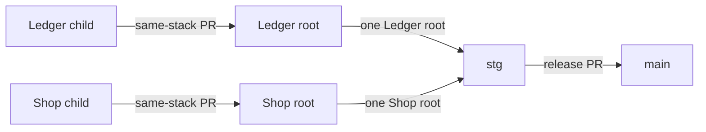

# App-specific feature stacks and staging roots

This is the ongoing workflow for every app, shared package and AI agent. Use short-lived `codex/<stack>/<feature>` branches. The segment immediately after `codex/` is the stack key, such as `ledger-suit`, `shop-suit`, `building-suit-docs` or `shared`.

Each stack may have one open root PR into `stg`, including drafts. Different stack keys may have independent roots into `stg` at the same time. Additional work in an active stack starts from that stack's newest committed leaf and targets the open same-stack parent branch. Cross-stack parent links and multiple roots for the same stack are invalid. `main` receives release PRs only from `stg`.

## Before starting or resuming any work

Run `pnpm agent:preflight` from the chosen worktree (or `node tooling/git/preflight.mjs` before dependencies are installed). Re-run immediately before pushing, creating/retargeting a PR, integrating a stack or merging. If the command is absent in an older checkout, use the commands below and read the current rules from `origin/stg` before editing.

The command fetches/prunes `origin`, checks every local worktree, its dirty files, recent commits and upstream divergence, queries live open/closed/merged PR state, reports recent staging merges and staging commit checks, and validates active staging roots. It does not pull, switch branches, stash, reset, delete worktrees or modify working files. Fetch/prune removes obsolete remote-tracking refs, not local branches.

```sh
git status --short
git worktree list --porcelain
git fetch origin --prune
git log -5 --oneline origin/stg
gh pr list --repo Building-Suit/building-suit-monorepo --state open --json number,headRefName,baseRefName,url
gh pr list --repo Building-Suit/building-suit-monorepo --state merged --base stg --limit 10 --json number,headRefName,mergedAt,mergeCommit
# For the actual current/parent branch, also inspect its closed or merged PR:
gh pr list --repo Building-Suit/building-suit-monorepo --state all --head '<branch>' --json number,state,mergedAt,headRefOid,baseRefName
```

Read the results, not just the exit code. Dirty files belong to their existing task; work in a separate worktree if necessary. A merged/closed PR retires its branch even when squash/rebase merging means commit ancestry differs. Never push it again just because its local commits appear absent from `stg`. Check a missing upstream branch against GitHub before recreating anything. If GitHub/fetch is unavailable, local investigation can continue, but publication/base decisions must wait for verified state.

Use `git pull --ff-only` only in a clean, appropriate feature worktree after inspecting its upstream. A diverged branch needs deliberate reconciliation. Never auto-reset, discard, force-push or delete someone else's work. Worktrees may be active in another task even when clean.

## Choose the branch and PR

| Situation | Branch and review target |
|---|---|
| First feature for a stack; no active same-stack parent | Create `codex/<stack>/<feature>` from fresh `origin/stg`; push it and open that stack's root PR into `stg`. A root in another stack does not block this one. |
| Adjustment to an open feature | Reuse its worktree/branch and PR. Add commits there; update the description and validation. |
| New feature while the same stack is active | Create a separate branch from that stack's newest verified committed leaf and open its PR into that same-stack parent branch. Do not target another stack even if its worktree is newer. |
| Two features in one stack | Checkpoint the first feature, then create the second worktree from that committed tip and target its PR at the first branch. Bring later parent commits into the child explicitly; filesystem edits are not shared. |
| Features in different stacks | Use independent `codex/ledger-suit/*`, `codex/shop-suit/*`, `codex/building-suit-docs/*` or `codex/shared/*` roots. Each stack may have one root into `stg`; do not chain them together. |
| Several features form one app-specific batch | The stack root may become the batch, with its PR title/body updated to cover included same-stack work. Do not move unrelated app work into that chain. |
| Feature’s PR already merged/closed | Retire it, refresh GitHub and choose the newest remaining active parent in the same stack. Use updated `origin/stg` only when that stack is empty; transfer only genuinely unmerged work. |



Before creating a worktree, inspect the relevant stack's newest leaf, not simply the most recently created directory. Exclude retired PR branches, detached snapshots, prunable worktrees and every other stack. Verify the parent’s local HEAD against its upstream and PR, then record the exact parent SHA. Existing divergent worktrees need an explicit parent choice or reconciliation; do not silently merge them.

A new worktree inherits committed files only. If the child needs dirty parent changes, coordinate a reviewed checkpoint with the parent’s owner before branching. For independent work that can start at the existing committed tip, record excluded pending edits and incorporate the parent’s later commit deliberately. Never copy, stash or commit another task’s dirty files automatically. If the same-stack parent has no PR yet, publish its reviewed committed checkpoint and open its PR before opening the child PR.

Example after discovering the actual same-stack parent and verified SHA:

```sh
git worktree add .local/worktrees/shop-catalog -b codex/shop-suit/catalog '<verified-shop-parent-commit-sha>'
# Implement and verify in that worktree, then commit only the intended files.
git push -u origin HEAD
gh pr create --base '<open-shop-parent-branch>' --head codex/shop-suit/catalog --body-file '<prepared-description.md>'
pnpm agent:pr-check '<new-PR-number>'
```

Keep feature PRs small and short lived. Push coherent, locally checked checkpoints rather than each edit; keep fixing the same feature on its branch. An open draft PR is still a PR and can trigger provider integrations. Never assume draft status prevents builds. Include the stack key, parent/root link, affected apps, tests and intended merge order in each PR description.

CI revalidates PR description/base edits, so a child retargeted to `stg` cannot keep only its earlier lightweight result. Staging-root metadata edits can therefore restart validation; they do not change `stg` or trigger a branch-filtered Vercel deployment.

## Integrate and release app stacks

1. Refresh GitHub/worktree state and confirm the stack has at most one root PR into `stg`. Other stack roots may coexist. Run `pnpm agent:pr-check <number>` for the PR being published or reviewed. This is an observation, not an atomic reservation; concurrent agents must recheck after creation. Repair duplicate same-stack roots or cross-stack parents promptly without deleting their commits.
2. Incorporate reviewed child PRs into their same-stack root locally or through GitHub within the user's merge authorization. Prefer **merge commits** while branches depend on that ancestry. Squash only when no dependent work will be stranded, or repair children using the recovery procedure below.
3. Group ready same-stack changes into one root update/push. If a dependent child contains unfinished work, do not merge it just to empty the queue. Test the combined result and update the root PR's scope and evidence.
4. Immediately before an authorized staging merge, fetch again, verify base/head SHAs and required checks, and inspect linked Vercel/Supabase deployment state. Merge only one root at a time. Never push directly to `stg` or merge another root while the previous staging deployment is queued, running or failed. After success, use a **five-minute minimum between staging merges** and combine ready work within a stack where practical. This is an agent/release rule, not a provider-enforced timer; manual GitHub merges must follow it too.
5. Verify the resulting `stg` SHA and actual provider outcomes before the next stack root is merged. CI success does not authorize production deployment.
6. Fetch after the merge, reconcile that stack's remaining children, and create its next short-lived root only when useful. Other stacks remain independent. Remove branches/worktrees only after confirming their work is merged, clean and unused, within the user's authorization.

## When the user merges manually on GitHub

Check live PR state before every task, including tasks resumed after a break. Do not rely on a remembered branch name, old `origin/stg`, a previous preflight snapshot or `git branch --merged` alone.

- **Merge commit:** fetch, confirm the parent's commit is contained in its new base, merge that base into an open same-stack child as appropriate, then retarget the child to the current same-stack parent or `stg` when that stack has no root.
- **Squash/rebase merge:** record the exact former parent tip from the PR before changing history. Determine which child commits are actually unique; do not cherry-pick the parent's already integrated changes. A clean, solely owned child may use `git rebase --onto <new-base> <old-parent-tip> <child>`, followed by verification and an explicit-SHA `--force-with-lease` only when rewriting that branch is authorized. Otherwise create a fresh same-stack branch, transfer the reviewed unique commits and supersede the old PR without altering others' work.
- **Parent closed without merging:** preserve the child, inspect the intended dependency, then retarget or rebuild from an appropriate same-stack base. Do not silently discard the dependency or merge abandoned work.
- **GitHub automatically retargeted children:** recheck the per-stack root limit. Keep at most one root into `stg` for that stack and point its remaining children at an open same-stack parent. Do not alter roots from other stacks.

## What controls builds

| Control | What it does | What it does not do |
|---|---|---|
| `agent:preflight` and `agent:pr-check` | Detect stale worktrees/PRs, duplicate same-stack roots and invalid parent chains before publication. | They do not lock GitHub or merge changes. |
| `branch-policy` CI job | Fails when the current PR has an invalid branch/parent chain, a cross-stack parent, or a duplicate root for its stack. | It cannot prevent a provider receiving the original PR event. Enforce the check through branch protection for merges. |
| `review` CI job | Runs workspace boundaries and unit tests on feature/stack PRs. | It is not a replacement for relevant local feature/browser/DB tests. |
| `verify` CI job | Runs full lint/type/build/browser validation for each staging-root PR and `main` promotion/push. Newer runs on the same PR cancel obsolete validation. | GitHub Actions concurrency does not serialize external Vercel/Supabase jobs. This workflow never deploys databases. |
| App/root `vercel.json` | Allows automatic Git deployments from `stg` and `main` only, suppressing feature/root pushes when the connected project reads this configuration. | It does not change a project's production-branch or domain mapping, prevent deploy hooks/manual deployments, or serialize separate Vercel projects. |
| Supabase integration settings | Disable Automatic branching to avoid feature/stack preview databases; keep the intended staging deployment branch and app working directory. | Merely targeting PRs at another branch does not disable Supabase previews. |

Configure each linked Vercel project's Root Directory to its app and ensure its environment tracks the intended branch: staging projects use `stg`, production uses `main`. The root configuration is a fallback for projects configured at repository root. Preserve existing domains and keys. Every future generated app includes the same deployment filter. A stack root can still legitimately build multiple affected apps.

For each Supabase project, inspect **Settings → Integrations → GitHub**: repository, deployment branch (`stg` for the staging project, `main` for production), working directory (`apps/ledger-suit` or `apps/shop-suit`) and Automatic branching. Keep Automatic branching off for this workflow. “Supabase changes only” narrows preview creation but does not prevent multiple previews for parallel database features. Do not enable an additional migration deployer alongside an existing one. SQL migrations stay versioned and environment-bound.

In GitHub, protect `stg` with required `branch-policy`, `review` and `verify` checks, up-to-date PRs, and no direct/force pushes or branch deletion. Preserve existing protections and collaborator access when applying settings. Protection enforces merge checks, not the number or topology of PRs that can be opened. Keep this limitation explicit; repository files alone cannot install provider/dashboard settings.

Provider configuration must be verified separately before claiming deployment suppression is fully active. Sources: [Vercel Git deployment filters](https://vercel.com/docs/project-configuration/git-configuration), [Supabase GitHub integration and working directories](https://supabase.com/docs/guides/deployment/branching/github-integration), [GitHub Actions concurrency](https://docs.github.com/en/actions/how-tos/write-workflows/choose-when-workflows-run/control-workflow-concurrency).
