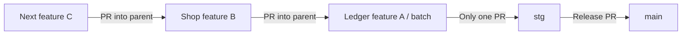

# Feature branches, stacked work and staging batches

This is the ongoing workflow for every app, shared package and AI agent. Use short-lived feature branches and one open PR into `stg` for the **entire monorepo**, including draft PRs. Each feature has a pushed branch and an open review PR; only the active feature/batch PR targets `stg`. Each subsequent feature starts from the latest active worktree’s committed tip and targets that parent branch, so the stack accumulates completed checkpoints across apps. `main` receives release PRs from `stg`.

## Before starting or resuming any work

Run `pnpm agent:preflight` from the chosen worktree (or `node tooling/git/preflight.mjs` before dependencies are installed). Re-run immediately before pushing, creating/retargeting a PR, integrating a batch or merging. If the command is absent in an older checkout, use the commands below and read the current rules from `origin/stg` before editing.

The command fetches/prunes `origin`, checks every local worktree, its dirty files, recent commits and upstream divergence, queries live open/closed/merged PR state, reports recent staging merges and staging commit checks, and validates the PR parent chain. It does not pull, switch branches, stash, reset, delete worktrees or modify working files. Fetch/prune removes obsolete remote-tracking refs, not local branches.

```sh
git status --short
git worktree list --porcelain
git fetch origin --prune
git log -5 --oneline origin/stg
gh pr list --repo Building-Suit/building-suit-monorepo --state open --json number,headRefName,baseRefName,url
gh pr list --repo Building-Suit/building-suit-monorepo --state merged --base stg --limit 10 --json number,headRefName,mergedAt,mergeCommit
# For the actual current/parent branch, also inspect its closed or merged PR:
gh pr list --repo Building-Suit/building-suit-monorepo --state all --head '<branch>' --json number,state,mergedAt,headRefOid,baseRefName
```

Read the results, not just the exit code. Dirty files belong to their existing task; work in a separate worktree if necessary. A merged/closed PR retires its branch even when squash/rebase merging means commit ancestry differs. Never push it again just because its local commits appear absent from `stg`. Check a missing upstream branch against GitHub before recreating anything. If GitHub/fetch is unavailable, local investigation can continue, but publication/base decisions must wait for verified state.

Use `git pull --ff-only` only in a clean, appropriate feature worktree after inspecting its upstream. A diverged branch needs deliberate reconciliation. Never auto-reset, discard, force-push or delete someone else's work. Worktrees may be active in another task even when clean.

## Choose the branch and PR

| Situation | Branch and review target |
|---|---|
| First feature; no active feature worktree/parent | Create `codex/<app>/<feature>` from fresh `origin/stg`; push it and open the sole PR into `stg`. An unpublished active worktree is still a parent; absence of a PR alone does not make the stack empty. |
| Adjustment to an open feature | Reuse its worktree/branch and PR. Add commits there; update the description and validation. |
| Any new feature while an active worktree exists | Create a separate branch from the newest active stack leaf’s verified committed HEAD; open its PR **into that parent branch**. This is the default even across different apps. |
| Two features at once | Checkpoint the first feature, then create the second worktree from that committed tip and target its PR at the first branch. Continue each feature in its own worktree. Bring later parent commits into the child explicitly; filesystem edits are not shared. |
| Feature belongs to another app | Use `codex/ledger-suit/*`, `codex/shop-suit/*`, `codex/building-suit-docs/*` or `codex/shared/*`, but share the same single staging slot. |
| Several features form one release batch | The first feature branch may become the batch, with its PR title/body updated to cover all included work. Alternatively use a short-lived `codex/batch/<topic>` seeded with the first ready feature. Never create an empty or permanent development branch just for ceremony. |
| Feature’s PR already merged/closed | Retire it, refresh GitHub and choose the newest remaining active parent. Use updated `origin/stg` only when the active stack is empty; transfer only genuinely unmerged work. |



For a single feature, A and the batch can be the same branch. A second app never needs a second staging PR. Keep unrelated work out of another feature's commits; a batch is an explicit collection of reviewed features, not an excuse to mix changes.

Before creating a worktree, inspect the active chain’s newest leaf, not simply the most recently created directory. Exclude retired PR branches, detached snapshots and prunable worktrees. Verify the parent’s local HEAD against its upstream and PR. Record the exact parent SHA. Existing divergent worktrees need an explicit parent choice/reconciliation; do not silently merge them or select an old merged directory merely because it exists.

A new worktree inherits committed files only. If the child needs dirty parent changes, coordinate a reviewed checkpoint with the parent’s owner before branching. For independent work that can start at the existing committed tip, record the pending edits that were excluded and incorporate the parent’s later commit deliberately. Never copy, stash or commit another task’s dirty files automatically. If the parent has no PR yet, publish its reviewed committed checkpoint and open its PR (draft while validation is pending) before opening the child PR. Keep only the root of the chain targeting `stg`.

Example after discovering the actual active parent worktree and verified SHA:

```sh
# Substitute the inspected branch names; examples are not shell variables to run blindly.
git worktree add .local/worktrees/shop-catalog -b codex/shop-suit/catalog '<verified-parent-commit-sha>'
# Implement and verify in that worktree, then commit only the intended files.
git push -u origin HEAD
gh pr create --base '<active-parent-branch>' --head codex/shop-suit/catalog --body-file '<prepared-description.md>'
pnpm agent:pr-check '<new-PR-number>'
```

Keep feature PRs small and short lived. Push coherent, locally checked checkpoints rather than each edit; keep fixing the same feature on its branch. An open draft PR is still a PR and can trigger provider integrations. Never assume draft status prevents builds. Include parent/batch links, affected apps, tests and intended merge order in each PR description.

Group PR description/base edits with the publishing checkpoint too: CI revalidates PR edits so a child retargeted to `stg` cannot keep only its earlier lightweight result. Staging PR metadata edits can therefore restart validation; they do not change `stg` or trigger a branch-filtered Vercel deployment.

## Integrate and release one batch

1. Refresh GitHub/worktree state and confirm there is still only one staging PR. Run `pnpm agent:pr-check <number>` for the PR being published/reviewed. This is an observation, not an atomic reservation; concurrent agents must recheck after creation. Retarget any accidental second staging PR promptly; do not delete its commits.
2. Incorporate reviewed feature PRs into the batch locally or through GitHub within the user's merge authorization. Prefer **merge commits** for parent/child and feature/batch merges while other branches depend on their ancestry. Squash only when no dependent work will be stranded, or repair the children using the recovery procedure below.
3. Group ready changes into one batch update/push. If a dependent child contains unfinished work, do not merge it just to empty the queue. Test the combined result and update the staging PR's scope and evidence.
4. Immediately before the authorized staging merge, fetch again, verify the base/head SHAs and required checks, and inspect the linked Vercel/Supabase deployment state. Never push directly to `stg` or merge multiple staging batches while the previous deployment is queued/running or failed. After success, use a **five-minute minimum between staging merges** and combine ready work where practical. This is an agent/release rule, not a provider-enforced timer; manual GitHub merges must follow it too.
5. Merge the single approved batch once. Verify the resulting `stg` SHA and actual provider outcomes before the next staging merge. CI success does not authorize production deployment.
6. Fetch after the merge, reconcile remaining children, and create the next short-lived batch only when useful. Remove branches/worktrees only after confirming their work is merged, clean and not used by another task, with cleanup within the user's authorization.

## When the user merges manually on GitHub

Check live PR state before every task, including tasks resumed after a break. Do not rely on a remembered branch name, old `origin/stg`, a previous preflight snapshot or `git branch --merged` alone.

- **Merge commit:** fetch, confirm the parent's commit is contained in `origin/stg`, merge the new base into an open child as appropriate, then retarget the child to the current batch (or `stg` if the slot is free).
- **Squash/rebase merge:** record the exact former parent tip from the PR before changing history. Determine which child commits are actually unique; do not cherry-pick the parent's already integrated changes. A clean, solely owned child may use `git rebase --onto <new-base> <old-parent-tip> <child>`, followed by verification and an explicit-SHA `--force-with-lease` only when rewriting that branch is authorized. Otherwise create a fresh child branch, transfer the reviewed unique commits and supersede the old PR without altering others' work.
- **Parent closed without merging:** preserve the child, inspect the intended dependency, then retarget/rebuild from an appropriate base. Do not silently discard the dependency or merge abandoned work.
- **GitHub automatically retargeted children:** recheck the one-PR limit. Point remaining feature PRs at the active batch; do not leave several children targeting `stg`.

## What controls builds

| Control | What it does | What it does not do |
|---|---|---|
| `agent:preflight` and `agent:pr-check` | Detect stale worktrees/PRs and invalid staging/stack topology before publication. | They do not lock GitHub or merge changes. |
| `branch-policy` CI job | Fails when the current PR has an invalid stack or there are multiple staging PRs. | It cannot prevent a provider receiving the original PR event. Enforce the check through branch protection for merges. |
| `review` CI job | Runs workspace boundaries and unit tests on feature/stack PRs. | It is not a replacement for relevant local feature/browser/DB tests. |
| `verify` CI job | Full lint/type/build/browser validation for the single staging PR and `main` promotion/push. One full validation job runs at a time; newer runs on the same PR cancel obsolete validation. | GitHub Actions concurrency does not serialize external Vercel/Supabase jobs. This workflow never deploys databases. |
| App/root `vercel.json` | Allows automatic Git deployments from `stg` and `main` only, suppressing feature/batch pushes when the connected project reads this configuration. | It does not change a project's production-branch or domain mapping, prevent deploy hooks/manual deployments, or serialize separate Vercel projects. |
| Supabase integration settings | Disable Automatic branching to avoid feature/stack preview databases; keep the intended staging deployment branch and app working directory. | Merely targeting PRs at another branch does not disable Supabase previews. |

Configure each linked Vercel project's Root Directory to its app and ensure its environment tracks the intended branch: staging projects use `stg`, production uses `main`. The root configuration is a fallback for projects configured at repository root. Preserve the existing domains and keys. Every future generated app includes the same deployment filter. A single batch can still legitimately build multiple affected apps.

For each Supabase project, inspect **Settings → Integrations → GitHub**: repository, deployment branch (`stg` for the staging project, `main` for production), working directory (`apps/ledger-suit` or `apps/shop-suit`) and Automatic branching. Keep Automatic branching off for this workflow. “Supabase changes only” narrows preview creation but does not prevent multiple previews for parallel database features. Do not enable an additional migration deployer alongside an existing one. SQL migrations stay versioned and environment-bound.

In GitHub, protect `stg` with required `branch-policy`, `review` and `verify` checks, up-to-date PRs, and no direct/force pushes or branch deletion. Preserve existing protections and collaborator access when applying settings. Protection enforces merge checks, not the number of PRs that can be opened. Keep this limitation explicit; repository files alone cannot install provider/dashboard settings.

Provider configuration must be verified separately before claiming deployment suppression is fully active. Sources: [Vercel Git deployment filters](https://vercel.com/docs/project-configuration/git-configuration), [Supabase GitHub integration and working directories](https://supabase.com/docs/guides/deployment/branching/github-integration), [GitHub Actions concurrency](https://docs.github.com/en/actions/how-tos/write-workflows/choose-when-workflows-run/control-workflow-concurrency).
